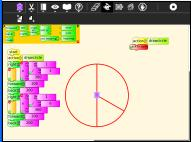
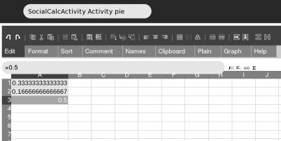
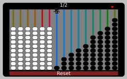
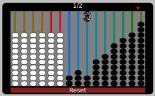
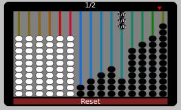
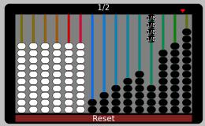
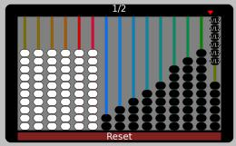
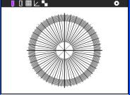
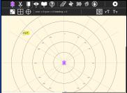

:orphan:

.. _abacus-worksheet-answersheet:

Answers to the Abacus Worksheet
===============================

Ways to make 1/2
----------------

Ways to make 1/2 just using one string

|Abacus1of2.jpg|\ |Abacus2of4.jpg| |Abacus3of6.jpg| |Abacus4of8.jpg|
|Abacus5of10.jpg| |Abacus6of12.jpg|

To make 1/2 just using one string, the fraction denominator must be
divisible by 2. The string must contain an even number of beads, 2 4 6 8
10 12

Ways to make 1/2 with more than one string

1/3 + 1/6 = (2+1)/6 = 3/6 = 1/2

1/3 + 2/12 = (4+2)/12 = 6/12 = 1/2

1/4 + 1/6 + 1/12 = (3+2+1)/12 = 6/12 = 1/2

1/4 + 2/8 = (2+2)/8 = 4/8 = 1/2

1/4 + 3/12 = (3+3)/12 = 6/12 = 1/2

3/9 + 2/12 = (12+6)/36 = 18/36 = 1/2

2/8 + 3/12 = 1/4 + 1/4 = 1/2

1/6 + 4/12 = (2+4)/12 = 6/12 = 1/2

1/6 + 3/9 = (3+6)/18 = 9/18 = 1/2

1/6 + 2/8 + 1/12 = (4+6+2)/24 = 12/24 = 1/2

2/6 + 2/12 = (2+1)/6 = 3/6 = 1/2

1/5 + 3/10 = (2+3)/10 = 5/10 =1/2

2/5 + 1/10 = (4+1)/10 = 5/10 =1/2

Is this all of the possibilities?

See `Diophantine
equations <http://en.wikipedia.org/wiki/Diophantine_equation>`__,
computer programs `including ones written in
TurtleArt <http://tonyforster.blogspot.com/2010/09/turtle-diophantine.html>`__
can find all the solutions by trial and error.

You can paste `this code <../images/Turtle_Art_Activity_fraction_diophantine.ta>`__ into Turtle Art to calculate all the
possibilities

Ways to make 1/3
----------------

This program can be modified for 1/3 and 2/3 (and with more work it
could be used for the Caacupé abacus). Circled below, the program above
has 0.5 replaced with 1/3 to find the ways of making 1/3

4/12

3/9

2/8 + 1/12

1/6 + 2/12

2/6

1/4 + 1/12

1/3

Other representations of fraction addition
------------------------------------------

Paint
~~~~~

You need to guess the centre of the circle and angles of the pie slice
lines. The full circle or 360 degrees represents '1' so the 1/3 and 1/6
pie slices are

| ``360/3 =120 degrees``
| ``360/6 = 60 degrees``

You can use either the polar grids of Ruler |Polarruler.jpg| or
TurtleArt |Polarturtle.jpg| to help visualise the angles

Turtle Art
~~~~~~~~~~

Copy `this code <../images/Turtle_Art_Activity_pie.ta>`__ into TurtleArt to generate the pie for 1/3 + 1/6

It can be modified for other pie slice sizes. The fill command does not
work on line arcs, so the pies are not coloured. Here is another
solution for coloured pie slices `Turtle\_Art\_Activity\_pie\_chart.ta <../images/Turtle_Art_Activity_pie_chart.ta>`__

Socialcalc
~~~~~~~~~~

Spreadsheets are powerful tools for representing numbers. The Socialcalc
Activity (V5) is a little buggy, the menu bars are very cramped. If you
have access to Gnumeric in Gnome, it is recommended

Enter the data 1/3, 1/6 and 1/2 into 3 cells, select (grey highlight)
the 3 cells

Click the graph tab, select 'Pie Chart'

.. figure:: ../images/Fractionpiesocialcalc.jpg
   :alt: Fractionpiesocialcalc.jpg

The Caacupé abacus
------------------

We have not given answers here for the Caacupé abacus. There are a lot
more solutions. Trial and error could take a long time. The TurtleArt
program above could be modified to generate solutions.

.. |Abacus5of10.jpg| image:: ../images/Abacus5of10.jpg

