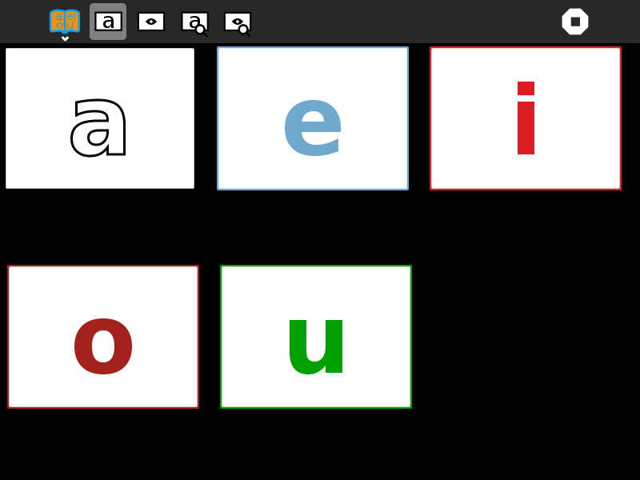

.. _aeiou:

======
AEIOU
======

About AEIOU
===========

AEIOU is an activity for introducing the Spanish vowels. It displays
letters and images and associated sound files, such as 'A as in ave'.
There are four modes:

#. click on the letter to hear its name
#. click on the picture to hear the name of the first letter in the word
   represented by the picture
#. hear a letter name, then click on the corresponding letter
#. hear a letter name, then click on the corresponding picture

(Also see :ref:`I Can Read <icanread>`, :ref:`I Know My ABCs <iknowmyabcs>`, and :ref:`Letter Match <lettermatch>`)

Where to get AEIOU
==================

The AEIOU activity is available for download from the `Sugar Activity
Library <http://activities.sugarlabs.org>`__:
`AEIOU <http://activities.sugarlabs.org/en-US/sugar/addon/4626>`__

The source code is available on `Github <https://github.com/sugarlabs/AEIOU>`__.

Using AEIOU
===========

+-------------+--------------+
| |AEIOU.png| | |AEIOU2.png| |
|             |              |
| letter game | picture game |
+-------------+--------------+

Toolbars
--------

.. figure:: ../images/AEIOUToolbar.png
   :alt: AEIOUToolbar.png

**Activity toolbar**
  change the activity name; add notes to the Sugar Journal

**Letter mode**
  listen to letter names

**Picture mode**
  listen to letter names associated with pictures

**Find the letter 1**
  hear a letter spoken and then find it

**Find the letter 2**
  hear a word spoken and then find the first letter

**Stop button**
  exit the activity

Learning with AEIOU
===================

While far from contructionist, this activity does provide a mechanism
for learning the alphabet.

Modifying AEIOU
===============

As of Version 1, only a Spanish version is included. In order to add
other languages, we need:

-  audio recordings of the letter names
-  audio recordings of the picture names
-  perhaps additional pictures, in order ensure there is a picture for
   each letter of the alphabet

There is a language-specific database file maintained in
./lessons/??/alphabet.csv where ?? is the 2-digit language code. The
format of the CSV file is:

+----------+-----------+-------------------+--------------+----------------------+-----------------------+
| letter   | word      | color (#RRGGBB)   | image file   | sound file (image)   | sound file (letter)   |
+==========+===========+===================+==============+======================+=======================+
| R        | (r)atón   | #F08020           | raton.png    | raton.ogg            | r.ogg                 |
+----------+-----------+-------------------+--------------+----------------------+-----------------------+

Extending AEIOU
===============

It would, of course, be fun to let the learner add their own pictures
and sound recordings.

Where to report problems
========================

You are welcome to leave comments/suggestions on
`AEIOU/issues <https://github.com/sugarlabs/AEIOU/issues>`__.

Credits
=======

AEIOU was written and is maintained by `Walter <https://wiki.sugarlabs.org/go/User:Walter>`__. He was inspired in
part by the work of Maria Perez, Fundación Zamora Terán

