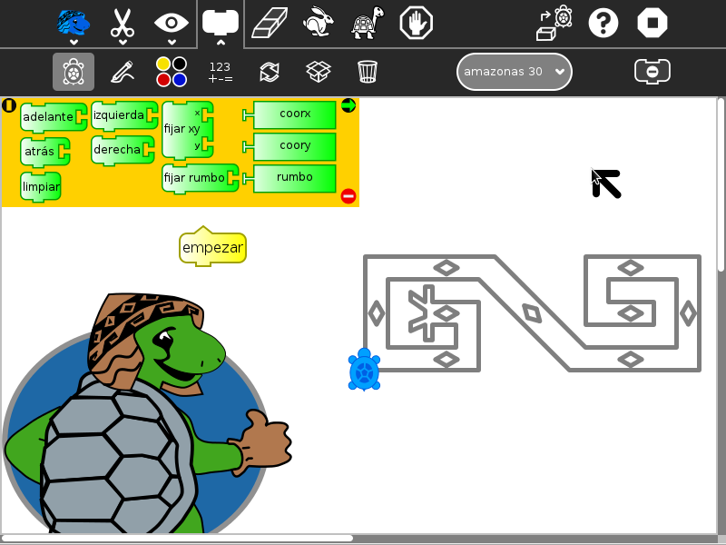
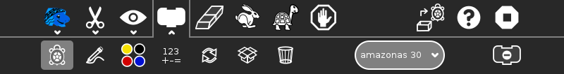
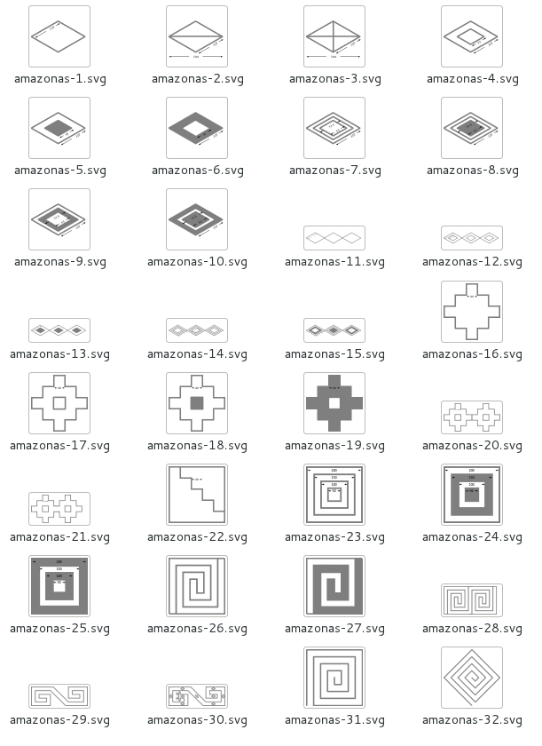
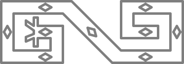

.. _amazonas-tortuga:

================
Amazonas Tortuga
================

Amazonas Tortuga presents more than 30 shape challenges to the learner
that must be completed using basic Logo-blocks. The challenges are based
on artwork of the Amazonas Region in Peru.

Amazonas Tortuga is a fork of :ref:`Activities/Turtle Confusion <turtle-confusion>` that presents :ref:`40 shape challenges <turtleart-challenges>` to be programmed by
moving the Logo turtle.

Additional features:

-  You can import challenges from the Sugar Journal (save them as an
   image file)
-  You can save your results as: (1) a Turtle Art program; (2) a UCB
   Logo project; or (3) a PNG image
-  You can overlay Cartesian and polar coordinate grids
-  Additional blocks can be added through the Turtle Blocks plugin
   mechanism

Where to get Amazonas Tortuga
-----------------------------

Amazonas Tortuga activity is available for download from the `Sugar Activity Library <http://activities.sugarlabs.org/en-US/sugar/>`__:
`Amazonas Tortuga <http://activities.sugarlabs.org/en-US/sugar/addon/4585>`__

The source code is available on `GitHub <https://github.com/sugarlabs/AmazonasTortuga>`__.

How to play Amazonas Tortuga
----------------------------

#. Select a challenge from the Combo Box (Shown above: 'amazonas 30').
#. Use blocks from the various palettes to instruct the Logo turtle to
   replicate the pattern.

--------------

Please refer to the :ref:`Activities/Turtle Art <turtleart>`
pages for basic instructions on how to use the block interface and the
details of various toolbars.

The shape challenges are loaded from the Combo Box on the Project
(Palette) toolbar. When you select a shape, it will be loaded onto the
canvas. When you use the Erase button, the current shape is reloaded.

The available blocks are small subset of the Turtle Block blocks: the
basic turtle blocks; a reduced palette of pen and color blocks; some
basic arithmetic operators; the repeat block; and the action and box
blocks.

The Export palette includes save as Logo; save as image; and save as
Turtle Art.

What are the challenges?
------------------------

The challenges are problems of symmetry and geometry which typically can
be solved by using a combination of rotations and repeat blocks.

+--------------+---------------+---------------+---------------+
| |Challenge4| | |Challenge17| | |Challenge30| | |Challenge32| |
+--------------+---------------+---------------+---------------+
| Challenge 4  | Challenge 17  | Challenge 30  | Challenge 32  |
+--------------+---------------+---------------+---------------+
|              |               |               |               |
+--------------+---------------+---------------+---------------+

Where to report problems
------------------------

Please report bugs and make feature requests at `AmazonasTortuga/issues <https://github.com/sugarlabs/AmazonasTortuga/issues>`__.

Credits
-------

-  Walter Bender wrote and maintains the code.
-  Brian Silverman is the first author of Turtle Art.

