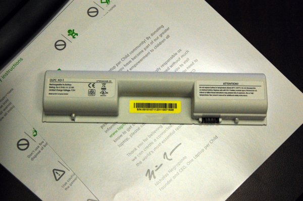
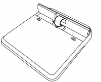

====================
Charging the Battery
====================

Using battery power
-------------------

The XO needs its battery or to be plugged into a wall directly. The laptop will run from either source of power. When you get your battery it should come with some amount of charge. Use the following instructions to install your battery and charge your laptop.

This is the XO battery. The battery goes on the back of your XO.

Installing the battery
----------------------

- Line up the four tabs on the new battery with the long edge furthest from the catches.
- Drop the battery into place. 

- Slide the left-hand side catch to the left, and press the battery gently into place.
- Slide the right-hand side catch to the left, to lock the battery in place. 

.. image:: ../images/resized_200x162_4Battery.png

Charging the battery
--------------------

- Ensure that the battery is in the back of the XO's case.
- Plug the power cord into your XO.
- Plug the other end of the power cord into the nearest power source, such as the one connected to the school's generator or a 12 Volt car battery. 

Plugging in your XO
-------------------

You can use your XO while it is plugged in, when you are charging the battery or when you have a good source for power. For power sources, you can use the generator supplied by your school, the electrical grid, or another source of electricity. 

When to charge the battery
--------------------------

The battery icon in the Frame fills with color, showing you the current charge, or amount of power in the battery. Move the pointer over the battery icon to see how full the battery is. While the battery charges, the battery light near the power button (shaped like a battery) should display yellow, turning to green when the battery is fully charged. A red light tells you that the battery is running very low and you should charge it soon.

Troubleshooting
---------------

If your battery charge gets extremely low during shipping, your XO may not start up. Plugging in external power may not charge the battery.

The solution is to remove the battery, power up the laptop on external power and then insert the battery. Then it will charge and the charging light will be on.

If you're the tinkering type, several more advanced battery troubleshooting tips are at: http://wiki.laptop.org/go/XO_Troubleshooting_Battery.

Locating a battery for replacement
----------------------------------

Refer to http://wiki.laptop.org/go/Directory_of_repair_centers to get to the most recent directory of repair centers, and ask for a replacement battery for your XO.
