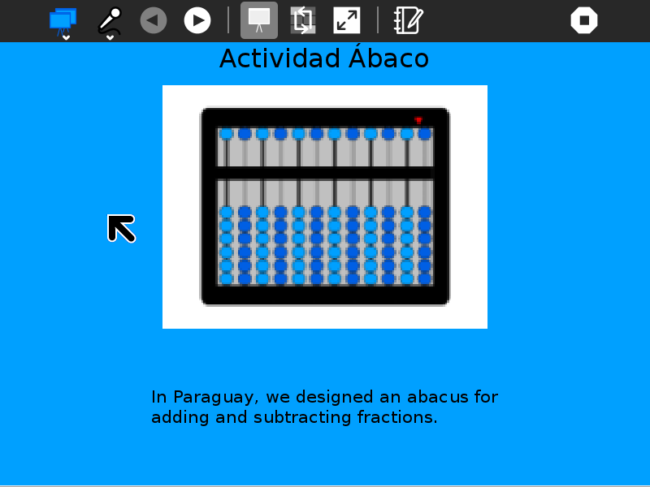
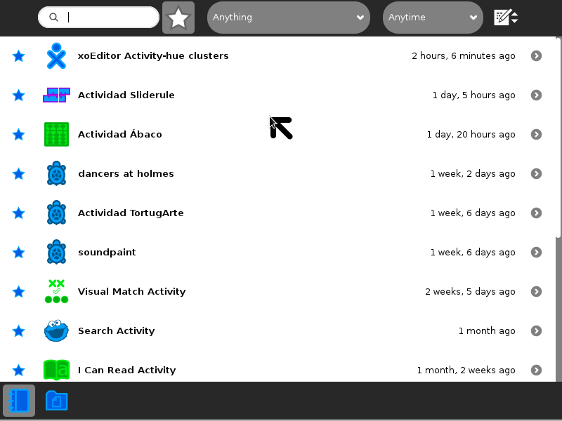
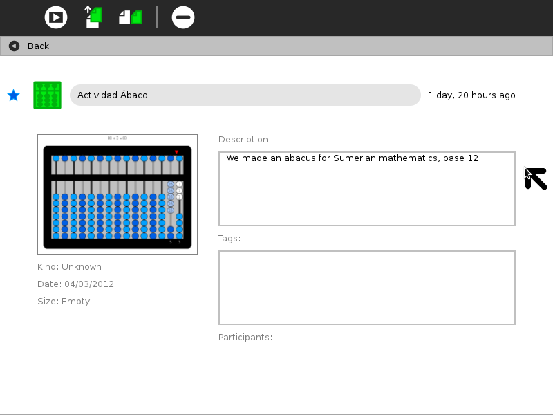
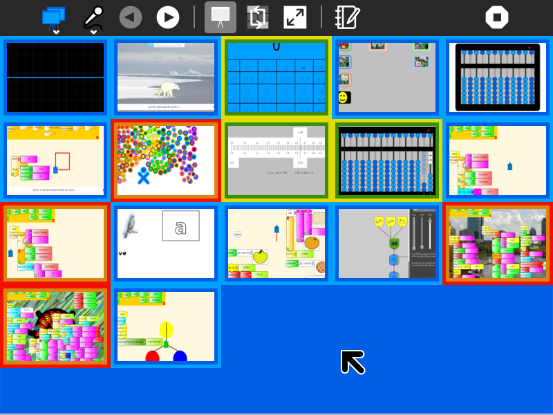
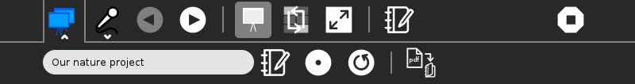
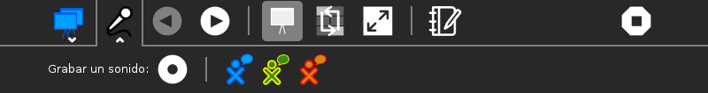
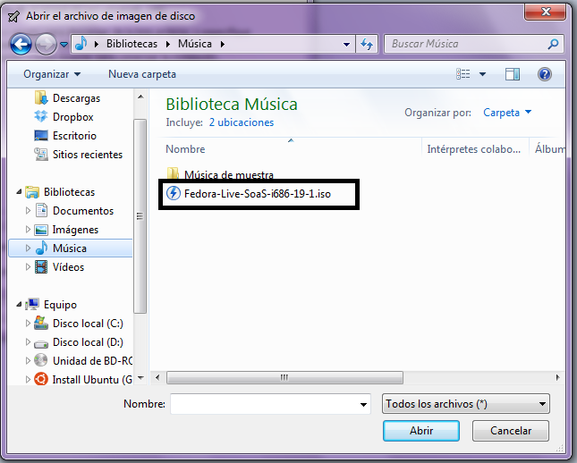

.. _bulletinboard:

==============
Bulletin Board
==============

.. figure:: ../images/Bulletinboard-icon.svg
   :alt: Bulletinboard-icon.svg

Similar to :ref:`portfolio`, the Bulletin Board Activity creates a slide show from Sugar Journal entries that have been 'starred'.
But here the idea is to share Journal entries that are part of group projects. Each member of a project team stars entries and collectively they are shared in a slide show.
Each team member can contribute an audio annotation for the slide show.

Where to get Bulletin Board
===========================

The Bulletin Board activity is available for download from the `Sugar Activity Library <http://activities.sugarlabs.org>`__: `Bulletin Board <http://activities.sugarlabs.org/en-US/sugar/addon/4588>`__

The source code is available on `GitHub <https://github.com/walterbender/bulletinboard>`__.

Using Bulletin Board
====================

Before you launch the activity, use the ☆ on the left of each Journal
entry to mark that entry for inclusion on the Bulletin Board. The
Bulletin Board Activity will use the entry title as well as the preview
image and description.

The title text, the preview image, and the description text from Journal
entries is used in the presentations.

One team member should launch Bulletin Board and enable sharing from the
palette on the Activity toolbar. Other team members should join the
shared instance. Once everyone has joined, starred items for each team
member will appear.

In the Thumbnail View, each team member can reorder the slides by
dragging. (The frame around each thumbnail takes on the colors of the
user who shared that item.)

When running the activity, use the ◀ and ▶ buttons to step one-by-one
through the slide show.

**Did you know that:**

-  each team member can record an audio note; the notes are played back
   from the record toolbar;
-  the colors used in the background are taken from *the XO colors of
   each user*;
-  a warning is displayed if there are *no starred entries* in your
   Journal;
-  the slide show can be *saved as an PDF document* that can also be
   shared;
-  in the thumbnail view, you can *reorder your slides* (by dragging
   them); and
-  you can edit the descriptions for each slide (and save your edits to
   the Journal).

The Toolbars
------------

from left to right

**Activity-toolbar Button**
  (toolbar described below)

**Previous-slide Button**
  returns to the previous slide shown (also activated by typing <Ctrl-p>)

**Next-slide Button**
  goes to the next slide in the sequence (also activated by typing <Ctrl-n>)

**Record-toolbar Button**
  (toolbar described below)

**Portfolio-view Radio Button**
  used to switch to portfolio view (default)

**Thumbnail-view Radio Button**
  used to switch to thumbnail view, where you can reorder the sequence of the slides by dragging them

**Full-screen-view Button**
  hides the toolbars (Return from full-screen by hitting the Esc key.)

**Update-description Button**
  Used to edit the description of the entry currently being viewed (Note: use the Save-annotations Button to make these edits permenant).

**Stop Button**
  used to exit the activity

--------------

**Activity Toolbar**

**Activity name field**
  used to change the name of the activity (The name is used by the Save-to-PDF Button.)

**Reflection Button**
  used to write descriptions for the Journal entry of this instance of Portfolio

**Share Button**
  disabled (Portfolio Activity does not support sharing)

**Refresh Button**
 Used to make sure each team member has a copy of each slide

**Save-to-PDF Button**
  used to save a copy of your presentation to the Sugar Journal as an PDF document

**Record Button**
  Used to record an audio note associated with the presentation
**Playback Buttons**
  A separate button for each team member is displayed.

Saving to PDF
-------------

Each time your launch the Bulletin Board activity, it will update to
reflect the current contents of your Journal. If you want to save a
presentation that represents a particular moment in time (or you want to
share your presentation with someone other than your project team), you
need to save it as a PDF document. Click on the “Save as PDF” Button
from the Activity toolbar menu and the content of the portfolio will be
saved as a document in the Journal.

    **Tip:** Open your Journal to make sure the presentation has been saved.
    
    **Tip:** You may want to copy the PDF file to a USB to open it in a different XO, or any other computer, using the Browse or Read activity.

Learning with Bulletin Board
============================

Most education experts agree that the best approach to learning involves
doing and then stepping back to reflect on the doing: What did I learn?
How can I use that? What questions do I have?1 By helping children to
ask good questions about the things they’ve done, as opposed to
remembering the right answers, we are helping them to build the critical
thinking skills that enable them to be independent problem solvers.
Without reflection, learning is an open loop, and an open-loop system
can neither identify and correct errors nor adapt to change.

Sugar facilitates reflective learning by ensuring that everything a
child does is recorded in an electronic journal which includes screen
capture of a child’s work. After every activity, children are encouraged
to share their observations, which are recorded in an electronic
portfolio. From this record of activities, children can expand their
portfolio into a multimedia narrative that shows what they have done,
how they have done it and what their thoughts are on what they have
created—children essentially become curators of their own work. The
child’s process of telling about what they have learned as a “story” is
a simple way to help reflection become a norm in their education.

By building upon the automatic accumulation of work in the Sugar
Journal, the portfolio process can readily be integrated into the
classroom routine. It can be used as an assessment tool to help
teachers, parents, and school administrators understand better the depth
and breadth of what a child has learned.2 At a “portfolio social”,
parents could be invited to view presentations and ask children about
their learning. The classroom teacher can add additional assessment
slides to the portfolio addressing themes such as work habits and
personal growth. This can become part of an archive that travels with a
child across grade levels. Through juxtaposition, the child and teacher
can see what has changed over the course of the years, trends, and areas
for improvement.

It is recommended that periodically (once per week, month, semester)
that the children are asked to select and edit items for a portfolio
presentation. For example, a weekly presentation could be made to
classmates; a monthly one to parents; and perhaps once per semester, a
school-wide presentation that makes all of the learning visible to
administrators and community members during a social event.

Periodic PDF snapshots are also a great way to preserve a record of each
child's work, and as a vehicle for assessing progress.

Extending Bulletin Board
========================

In addition to using Bulletin Board as a tool for reflection, it can be
used as a more general-purpose presentation tool. For example, a
collection of photographs can be annotated (by using the title and
description fields in the Journal detail view for each photo) and then
made into a slide show. The order of the slides can be modified from the
Thumbnail view.

Where to report problems
========================

You can report bugs and make feature requests at `bulletinboard/issues <https://github.com/walterbender/bulletinboard/issues>`_.

Credits
=======

Bulletin Board was written and is maintained by `Walter <http://wiki.sugarlabs.org/go/User:Walter>`__. He was inspired in part by the `Teamup project <http://teamup.aalto.fi/>`__ at Aalto University.