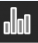

.. _chart:

=====
Chart
=====

About
-----

|Chart_icon|

Chart lets you do graphical representation of simple tabular data, in the form "label: value". It can draw Horizontal/Vertical bar charts, line charts and pie charts.

.. image :: ../images/chart-img1.png

.. image :: ../images/chart-img2.png

.. image :: ../images/chart-img3.png

.. image :: ../images/chart-img4.png

Where to get Chart
------------------

Chart activity is available for download from the `Sugar Activity Library <http://activities.sugarlabs.org>`__: 
`Chart <http://activities.sugarlabs.org/en-US/sugar/addon/4534>`__

The source code is available on `GitHub <https://github.com/sugarlabs/chart>`__.

Using chart
-----------

Basic Usage
:::::::::::

First you need to add data to create the graph

* You can add data with |add_icon| button

* ... or remove data wih |remove_icon| button

To change the graph title, just change the activity title

Next, you can change the type of the graph

* Vertical Bars |ver_icon|

* Horizontal Bars |hor_icon|

* Lines |line_icon|

* Pie |pie_icon|

Configs
:::::::

You can change the colors or the horizontal and vertical labels in the configs toolbar |set_icon|

Full Screen Mode
::::::::::::::::

To enter full screen mode press ``Alt+Return`` or click the |FullScreen_Icon| Icon.

.. image :: ../images/640px-Chart5.png

Development
-----------

* Chart uses `PyCHA library <https://bitbucket.org/lgs/pycha>`_

Ideas for future releases
:::::::::::::::::::::::::
 
* Show a help tutorial when activity is started from scratch

* Share, edit the data with your friends

Where to report problems
------------------------

Please report bugs and make feature requests at `chart/issues <https://github.com/sugarlabs/chart/issues>`__.

You may also send an e-mail to aguz@sugarlabs.org
