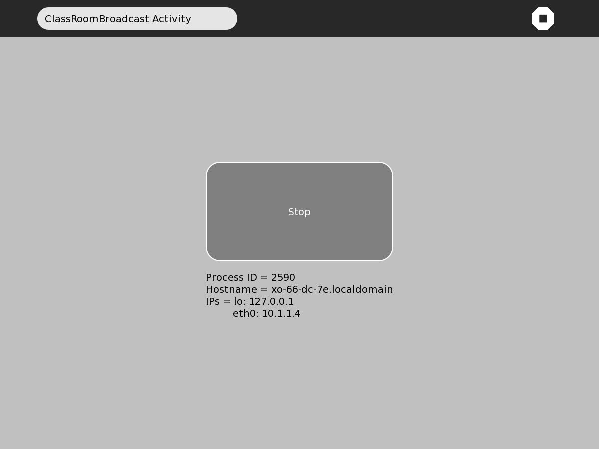
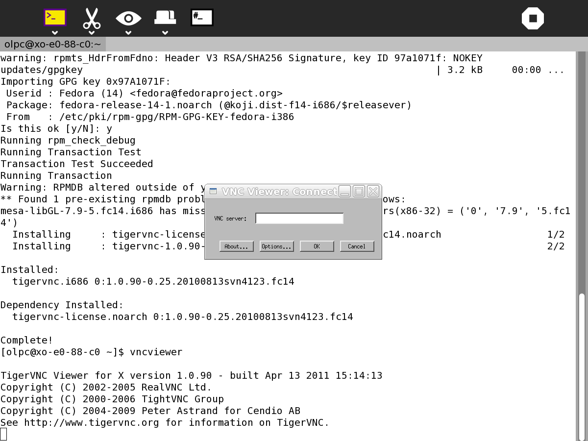

.. _classroom-broadcast:

===================
Classroom Broadcast
===================

Description
===========

ClassroomBroadcast transmits the screen of the 'server' laptop to the
screens of a number of 'client' laptops. Typically the teacher's laptop
would be the server and the students' laptops the clients.
ClassroomBroadcast is a low cost alternative to using a data projector.
ClassroomBroadcast runs on the server laptop and a VNC client 
runs on the client laptops.

Where to get Classroom Broadcast
================================

Classroom Broadcast activity is available for download from the `Sugar Activity Library <http://activities.sugarlabs.org/en-US/sugar/>`__:
`Classroom Broadcast <http://activities.sugarlabs.org/sugar/addon/4507>`__

The source code is available on `GitHub <https://github.com/sugarlabs/classroombroadcast>`__.

Installing
==========

Install ClassroomBroadcast on the 'server' laptop from

-  http://activities.sugarlabs.org/addon/4507

ClassroomBroadcast also requires some additional software - x11vnc

To install **x11vnc** enter the following in Terminal:

``sudo yum install x11vnc``

Install a VNC client on all the client laptops, in Terminal enter:

``sudo yum install vnc``

Running
=======

Check that all laptops are connected to the same network. Start
ClassroomBroadcast on the server laptop. Press the button in the centre
of the screen and note the IP address, eth0:, below the button.

Start the VNC client on the client laptops by entering the following in
Terminal

``vncviewer``

Enter the IP address eth0: from the server into the dialog box.

Alternatively you can specify the IP address in the command and skip the
dialog box

``vncviewer 10.1.1.4``

Fullscreen mode allows the client to see the full screen but the client
cannot quit till transmission stops

The fullscreen mode can be selected in options in the dialog box or
specified from the commandline

``vncviewer 10.1.1.4 -fullscreen``

The screen of the sending laptop is mirrored on the receiving laptops.
It takes a few seconds for the screens to update.

To stop transmitting, click the centre screen button in
ClassroomBroadcast. ClassroomBroadcast can be closed like any regular
Sugar Activity. When you are finished with the clients, you can close
them by clicking the X in the screen upper right which returns you to
Terminal. Terminal can then be closed like any regular Sugar Activity.

Where to report problems
========================

Please report bugs and make feature requests at `classroombroadcast/issues <https://github.com/sugarlabs/classroombroadcast/issues>`__.

