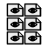
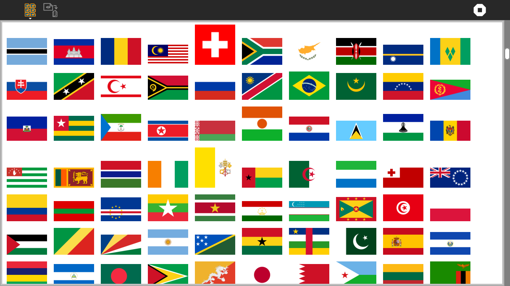

.. _clipart:

=======
ClipArt
=======

About ClipArt
=============

ClipArt is a tool for moving artwork found in other Sugar activities
into the Sugar Journal.

Where to get ClipArt
====================

The ClipArt activity is available for download from the `Sugar Activity
Library <http://activities.sugarlabs.org>`__:
`ClipArt <http://activities.sugarlabs.org/en-US/sugar/addon/4687>`__

The source code is available on `Github <https://github.com/sugarlabs/clipart>`__.

Using ClipArt
=============

ClipArt scans Sugar activities for artwork (png, svg, jpg, and gif). It
presents these artworks in a viewer, allowing the user to select images
that are then copied to the Sugar Journal. Once the artwork is in the
Sugar Journal, it is available for use in other Sugar activities.

For example, bundled with the Turtle Flags
activity are images of national flags. Individual flags can be
transferred to the Sugar Journal and used with Write, Fototoons, et al.

The Toolbars
------------

from left to right

**Activity-toolbar Button**
  opens standard Sugar activity toolbar

**Save-image Button**
  saves the selected image to the Journal

**Stop Button**
  used to exit the activity

Learning with ClipArt
=====================

ClipArt is a utility for expanding the set of graphics resources
available to other Sugar activities.

Modifying Story
===============

-  Add new images to ClipArt by putting them in the images folder of the
   activity.

Where to report problems
========================

Please report bugs and make feature requests at `clipart/issues <https://github.com/sugarlabs/clipart/issues>`__.

Credits
=======

ClipArt was written and is maintained by Walter. He was inspired in part by Laura Ewing.
