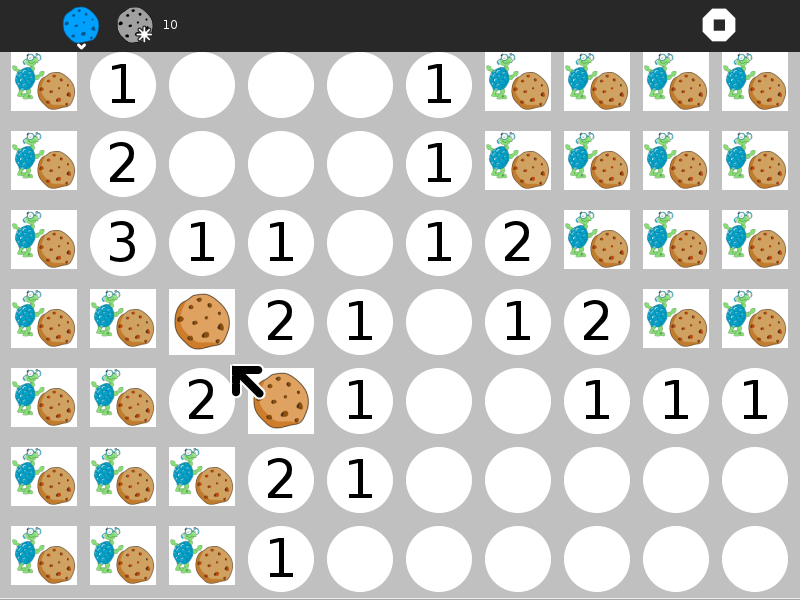
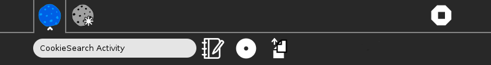
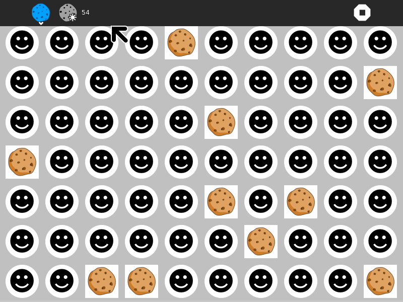
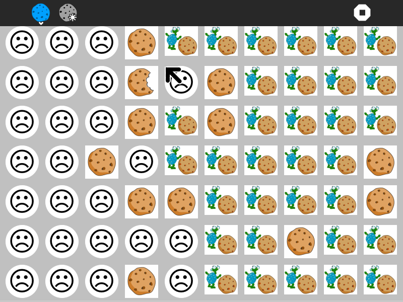
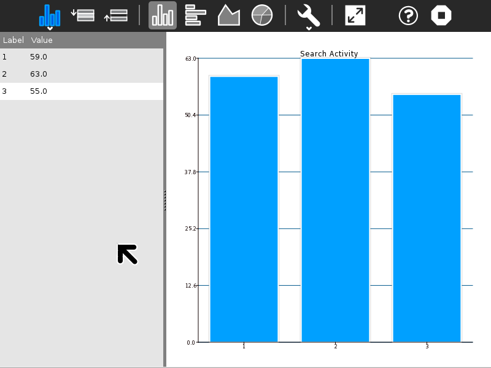

.. _cookie-search:

================
Cookie Search
================

About Cookie Search
===================

.. figure:: ../images/CookieSearch-icon.svg
   :alt: CookieSearch-icon.svg

Most recent release: version 10.

The Cookie Search Activity is a simple
`mine-sweeper <http://en.wikipedia.org/wiki/Minesweeper_%28video_game%29>`__-type
game.

Where to get Cookie Search
==========================

The Cookie Search activity is available for download from the `Sugar
Activity Library <http://activities.sugarlabs.org>`__: `Cookie
Search <http://activities.sugarlabs.org/en-US/sugar/addon/4578>`__.

The source code is available on
`GitHub <https://github.com/sugarlabs/cookie-search-activity>`__.

Using Cookie Search
===================

**Activity Button**
  Opens Activity Toolbar

**New Game Button**
  Launches new game

**Stop Button**
  Exit activity

--------------

**Activity title**

**Write to Journal**

**Share Button**

**Copy Scores Button**
  Copies score history to Clipboard (to be loaded into :ref:`Activities/Chart <chart>`.

How to play
-----------

Hidden cookies are under the cells.

Clear the board by clicking on the cells.

You can click on either the turtle or the red cookie. If a turtle is
clicked, and the cell contains a hidden cookie, you lose the game.
Otherwise, a number is shown; how many surrounding cells contain hidden
cookies. If there are no surrounding cookies, the cell is blank, and the
surrounding cells are revealed. When you determine that a cell contains
a hidden cookie, click on the red cookie to mark it as such. When you
change your mind, right-click to mark it as unknown.

After all cookies have been marked, and all turtles clicked on, the game
will be won.

The game starts with one hidden cookie, and each win the number of
cookies is increased.

+------------------------+-------------------------+---------------------------+
| |CookieSearch-win.png| | |CookieSearch-lose.png| | |CookieSearch-scores.png| |
|                        |                         |                           |
| You win :)             | You lose :(             | History of scores         |
+------------------------+-------------------------+---------------------------+

YouTube tutorials

--------------

Winning Game: http://youtu.be/NKRKTm-w0Ig

Losing Game: http://youtu.be/RgCx4vgYx78

Learning with Cookie Search
===========================

Cookie Search is a exercise in logic.

Modifying Cookie Search
=======================

-  Replace the artwork with your own designs. (Note that the way in
   which the program distinguishes between the turtle and the cookie is
   by looking at the red component of the image. Pixels with red values
   between 190 and 210 are “cookie”; all other values are considered
   turtle.)

--------------

Your suggestions for enhancements and/or use cases...

Where to report problems
========================

You can report bugs and make feature requests at `cookie-search-activity/issues <https://github.com/sugarlabs/cookie-search-activity/issues>`__

You are also welcome to leave comments/suggestions.

Credits
=======

Cookie Search was written and is maintained by `Walter Bender <https://wiki.sugarlabs.org/go/User:Walter>`__.

