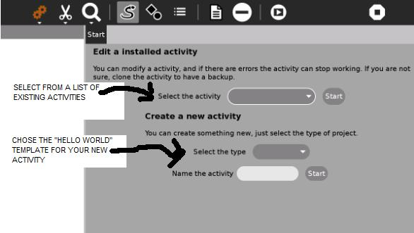
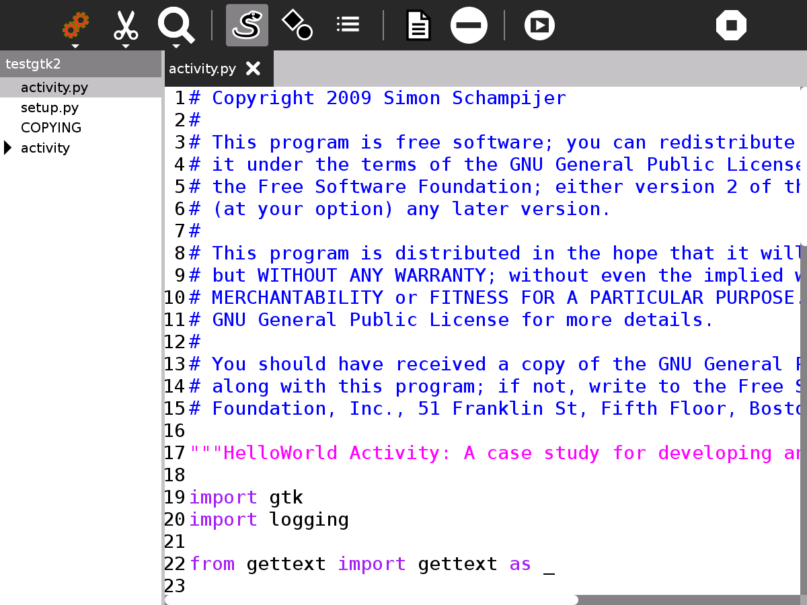
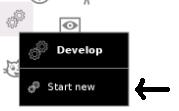
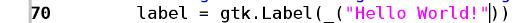
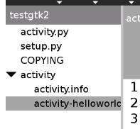
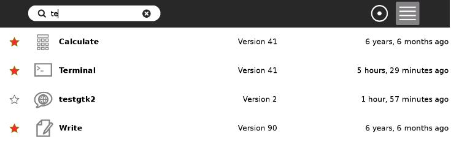
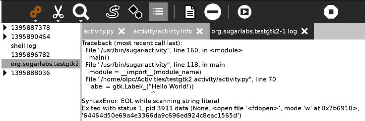
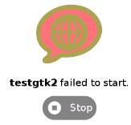

.. _develop:

=======
Develop
=======

About Develop
=============

Develop allows you to edit existing Activities or create new ones. It
allows the viewing and editing of multiple files and gives easy access
to error logs. It includes templates for a number of sample “Hello
World!” Activities.

Where to get Develop
====================

Develop activity is available for download from the `Sugar Activity Library <http://activities.sugarlabs.org>`__:
`Develop <http://activities.sugarlabs.org/en-US/sugar/addon/4058>`__

The source code is available on `GitHub <https://github.com/godiard/develop-activity>`__.

Using Develop
=============

You get the screen below the first time you start Develop and every time
you Start New but not if you resume a project. It gives the option of
editing an existing Activity or creating a new one from a “Hello World!”
template. It is recommended that beginners create a new Activity.

There are 4 “Hello World!” templates to choose from:

-  Gtk2
-  Gtk3 (requires Sugar 0.96 or above to run the Activity you create)
-  Sugargame
-  Web (requires Sugar 0.100 or above to run the activity you create)

The main screen is shown below. In this case, a new Activity called
testgtk2 has been created from the gtk2 template. The left pane shows
the files and directories that comprise the Activity and the right pane
shows the contents of its main file, activity.py

Toolbars
--------

From left to right, the toolbar buttons have the following functions:

**Home**

-  The title of the project
-  Edit the Journal description
-  Sharing (disabled)
-  Create a bundle, use the bundle to install your Activity on other
   laptops

**View**

-  Switch to dark or light theme
-  Zoom in
-  Zoom out

**Edit**

-  Undo
-  Redo
-  Copy
-  Paste

**Search**

-  Search box
-  Search previous
-  Search next

**Show source**

-  The left hand pane shows the files and directories that comprise your
   Activity.

**Show file symbols**

-  The left hand pane shows the classes, functions and variables in the
   file on the right.

**Show log files**

-  The left pane shows the log files which contain error messages from
   running your Activity.

**Create an empty file**

-  Your Activity already comprises a number of files, this adds an
   additional empty file in the current directory.

**Remove file**

-  Deletes the most recently viewed file, the one displayed in the right
   pane.

**Run activity**

-  Runs your activity.

**Stop**

-  Quits the Develop Activity.

Tutorial - creating your Activity
=================================

Open Develop, start new

Create a new Activity, this is safer than editing an existing Activity.
You are offered 4 Activity templates, Gtk2, Gtk3, Sugargame and Web,
some of these templates are not compatible with all Sugar versions, Gtk2
should be compatible.

Select the type Gtk2

Name the Activity testgtk2

Start

Press the Run activity button on the toolbar, your testgtk2 Activity
will run, it prints Hello World!. (If you look at your Home screen you
have a new Activity called testgtk2.)

Editing your Activity
---------------------

Stop testgtk2 and return to Develop. Edit line 70 of activity.py. It
contains the text “Hello World!”, change this text but be careful only
to change the text within the quotation marks. Press the Run activity
button, the Activity now displays the new text.

Changing the icon
-----------------

Shown in the left hand pane is the directory activity with a triangle
next to it pointing right. Click on it, the triangle points down and you
can see its contents, open activity-helloworld.svg

Line 11 defines the circle of the world in the icon. Change stroke-width
to “6.5”. You need to restart the laptop to see the changes, the circle
is now thicker. |Altered-icon.jpg|

Changing the version number
---------------------------

The Home view, List view shows the version number of all the installed
Activities. The version number discriminates between older and newer
versions of an Activity. It is used to tell if you are using the latest
version. Sometimes the latest version has a bug and you want to go back
to an earlier known good version.

Look in your Home view List view and you will see that testgtk2 is
version 1. To alter the version number, edit activity.info line 6 which
shows the activity\_version=1 , change it to 2.

You may need to restart the laptop to see the changes.

Installing your Activity on another computer
--------------------------------------------

Press the Create bundle button on the home toolbar\ |Save-bundle.jpg|,
this creates a .xo bundle in the Journal. Copy this to another laptop to
install your Activity.

Using the Log files to find errors
----------------------------------

Log files are created when Activities run, they also are created by
other processes. They list software errors among other data and can help
diagnose software problems.

Assume you made a typing error, you accidentally deleted the closing
quote mark " in activity.py line 70 when you were editing “Hello
World!”. The activity would not run, you might get an error like
this:\ |Failedtostart.jpg|

Click on the Show log files button |Show-logfiles.jpg| , the left hand
pane will show the list of logfiles. Because our Activity is named
testgtk2, we are looking for the file org.sugarlabs.testgtk2. If you
have started testgtk2 multiple times then there are multiple logfiles.
Click on org.sugarlabs.testgtk to read the logfile. The error message
tells that it is line 70 of activity.py , in the string "Hello World!,
it got confused at the opening quote. It got to the end of line (EOL)
while scanning the string.

The :ref:`Log Activity <log>` can also be used to
view log files.

Sugargame
---------

Sugargame, based on Pygame makes it easy to create games. See pygame.org

To create a game, start a new Develop project but select Sugargame
rather than Gtk2. If you run the Activity created, it prints Hello World
on a black background.

Look at the file game.py, there are a number of simple changes you can
make:

::

    BLANCO =(255, 255, 255)  #this sets the red, green and blue values for the white text``
    NEGRO = (0, 0, 0) #this sets the R G B of the black background``
    fuente = pygame.font.SysFont(None, 48) #48 is the text size``
    texto = fuente.render('Hello world!', True, BLANCO, NEGRO)  # change Hello world``
    pantalla.blit(texto, ((x / 2) - (x / 10), (y / 2) - (y / 10))) #the location on the screen``

Read the documentation at pygame.org, there are lots of exciting things
to try. For example, change the line that starts with pantalla.blit to:

::

   pantalla.blit(texto, pygame.mouse.get_pos())``

the text will follow the mouse. Or change this line to:

::

   pygame.draw.circle(pantalla,BLANCO, pygame.mouse.get_pos(),20,0)``

and a circle follows the mouse.

Going further
-------------

For more on making Sugar Activities see the ebook
http://en.flossmanuals.net/make-your-own-sugar-activities/

For editing icons use Inkscape http://www.inkscape.org

Pygame http://www.pygame.org/docs

Videos
======

Demo of Develop version 40: https://www.youtube.com/watch?v=SChweH6snvw

Where to report problems
========================

Please report bugs and make feature requests at `develop-activity/issues <https://github.com/godiard/develop-activity/issues>`__.

