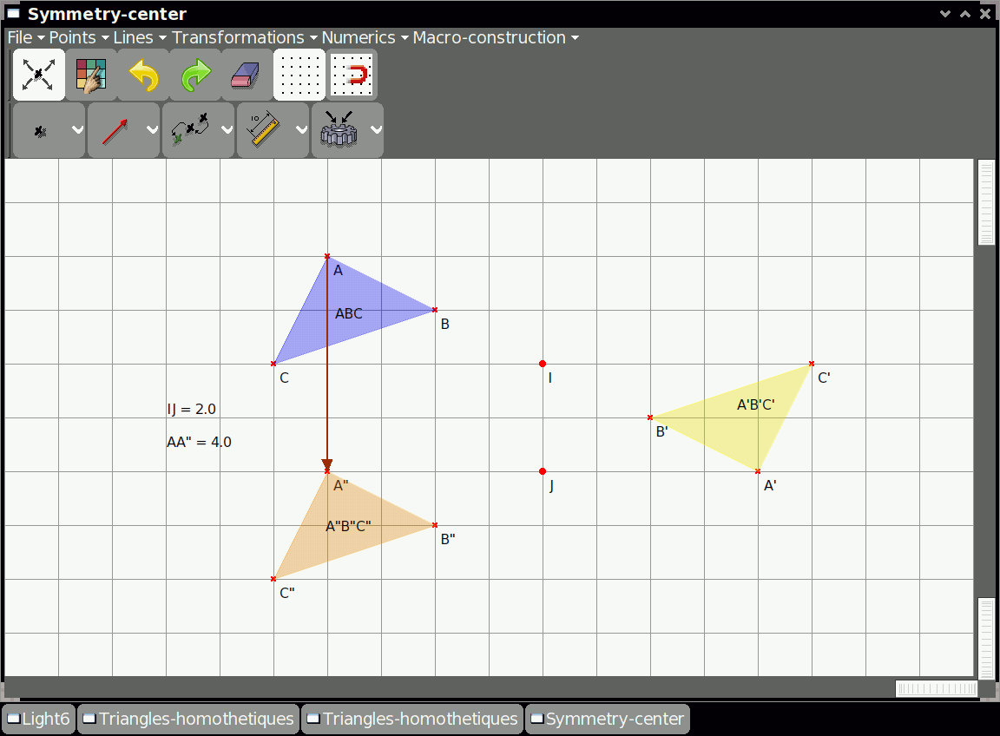

.. _dr-geo:

======
Dr Geo
======

Dr. Geo is an award-winning **interactive geometry** software for Sugar.
It also runs under GNU/Linux, Windows, Mac OS X and Android. Visit its
home page http://drgeo.eu to know more about it.

Written entirely in Pharo Smalltalk, Dr. Geo allows one to create a
geometric sketch and to manipulate it according to its constraints. It
is usable at home or at school, in primary or secondary education level.
It is simple and effective with some unique features as scripting and
programming.

**Why a free Dr. Geo software?**

Because equality of access should be granted to the kids all around the
world! This is why Dr. Geo runs on Sugar, the system first designed for
the XO, the laptop designed for the kids of developing countries.

Where to get Dr Geo
-------------------

Dr Geo activity is available for download from the `Sugar Activity Library <http://activities.sugarlabs.org/en-US/sugar/>`__:
`Dr Geo <http://activities.sugarlabs.org/sugar/addon/4561>`__

The source code is available on `GitHub <https://github.com/sugarlabs/DrGeo>`__.

Where to report problems
------------------------

Please report bugs and make feature requests at `DrGeo/issues <https://github.com/sugarlabs/DrGeo/issues>`__.
