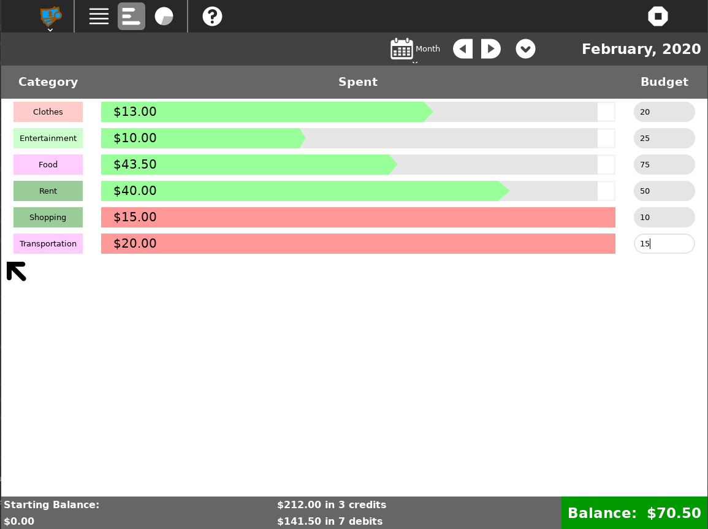
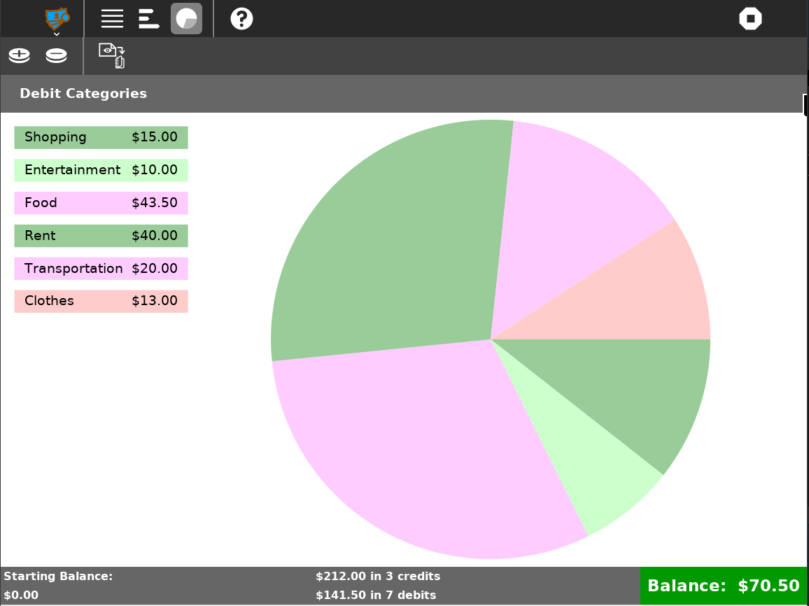

=======
Finance .. image:: ../images/finance_logo.PNG
=======

About
-----

Finance is a simple financial planning activity. It can be integrated into classroom assignments, or else used to track finances for a school club. It might also be useful for students who wish to help their parents with home finances.

Finance is designed to be extensively localized. The user interface is translatable, and local conventions are used to display monetary values.

Features
-----

Register
~~~~~~~~

In the register view, you are able to sort by time frame (Day, Week, Month, Year, Forever); add, delete, and modify new credits and debits; and categorize you're spendings!

.. image :: ../images/finance_register.PNG

Budget
~~~~~~

In the budget tab, we are able to see how we are doing in each category and assign budgets to each one. This is great and simple way for tracking spending.

Chart
~~~~~

In the chart tab, we can see a pie chart of how much we spent on each category. We have the ability to save the image and put it in our journals.

Download and Install Finance!
-------

Git Link: https://github.com/sugarlabs/finance-activity

Get it in the app store: http://activities.sugarlabs.org/

References
----------

* `Sugar Wiki Activity Page <http://activities.sugarlabs.org/sugar/addon/4040>`_

* `Source <https://github.com/sugarlabs/finance-activity>`_
