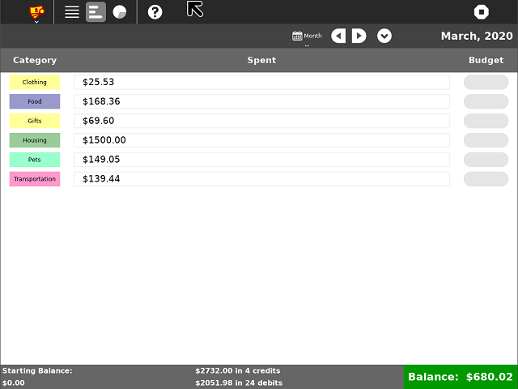
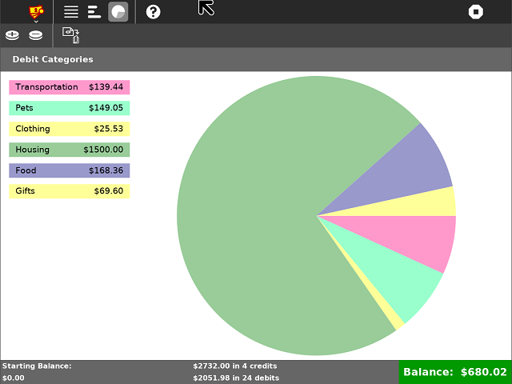

=======
Finance
=======

.. image :: ../images/finance-logo.png

About
-----

Finance is a simple financial planning activity. It integrates well with classroom assignments, works to track finances for a school club, and does much more. It is also useful for students to help their parents keep track of home finances.

Finance is extensively localized as the user interface is translatable and local conventions display monetary values.

Features
-----

There are three main views: Register, Budget, and Chart.

Register
~~~~~~~~

The register view allows users to show many different time frames (Day, Week, Month, Year, Forever). It comes with features such as add, delete, and modify new credits and debits. Furthermore, there is easy categorization of spendings!

.. image :: ../images/finance-register.png

Budget
~~~~~~

The budget tab shows each category and is useful for assigning a budget to each one. This is a great and simple way for tracking spending.

Chart
~~~~~

The chart tab creates a pie chart of the debits in each category. There is also the ability to save the image and put it in journals.

Download and Install Finance!
-------

Git Link: https://github.com/sugarlabs/finance-activity

Get it in the app store: http://activities.sugarlabs.org/

References
----------

* `Sugar Wiki Activity Page <http://activities.sugarlabs.org/sugar/addon/4040>`_

* `Source <https://github.com/sugarlabs/finance-activity>`_
