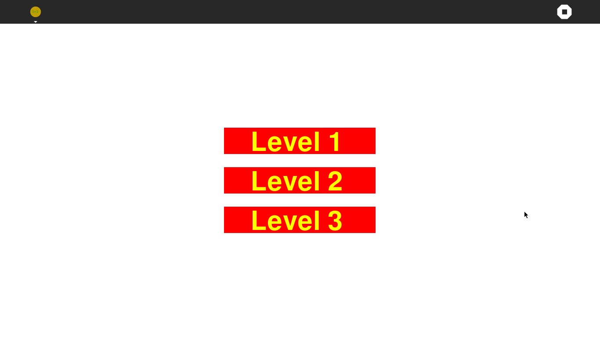
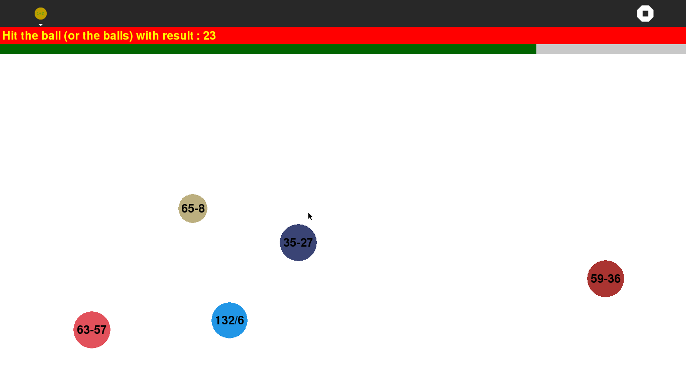
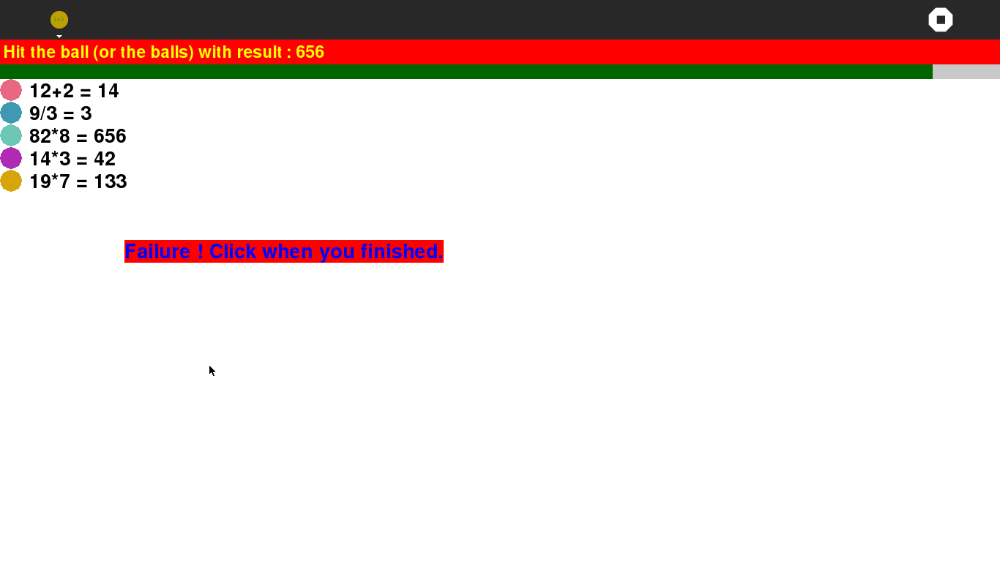

.. _hittheballs:

===========
HitTheBalls
===========

Goal
====

In HitTheBalls activity :

-  you are given a target result
-  there are some balls with operations moving across the screen
-  and you must click on the good ball (or the good balls).

Where to get HitTheBalls
========================

HitTheBalls activity is available for download from the `Sugar Activity Library <http://activities.sugarlabs.org/en-US/sugar/>`__:
`HitTheBalls <http://activities.sugarlabs.org/sugar/addon/4709>`__

The source code is available on `GitHub <https://github.com/sugarlabs/hittheballs-activity>`__.

Game phases
===========

Menu screen
-----------

The menu screen, where you select the game level : as soon you click on
one level, the game starts.

Main game screen
----------------

The balls are moving across the screen, and the time bar is running
down. The game may have several good balls, in which case all of them
must be clicked.

Answers screen
--------------

Whenever you win or loose, the answers are resumed on a screen. Just
click in order to return to the menu.

Where to report problems
------------------------

Please report bugs and make feature requests at `hittheballs-activity/issues <https://github.com/sugarlabs/hittheballs-activity/issues>`__.

