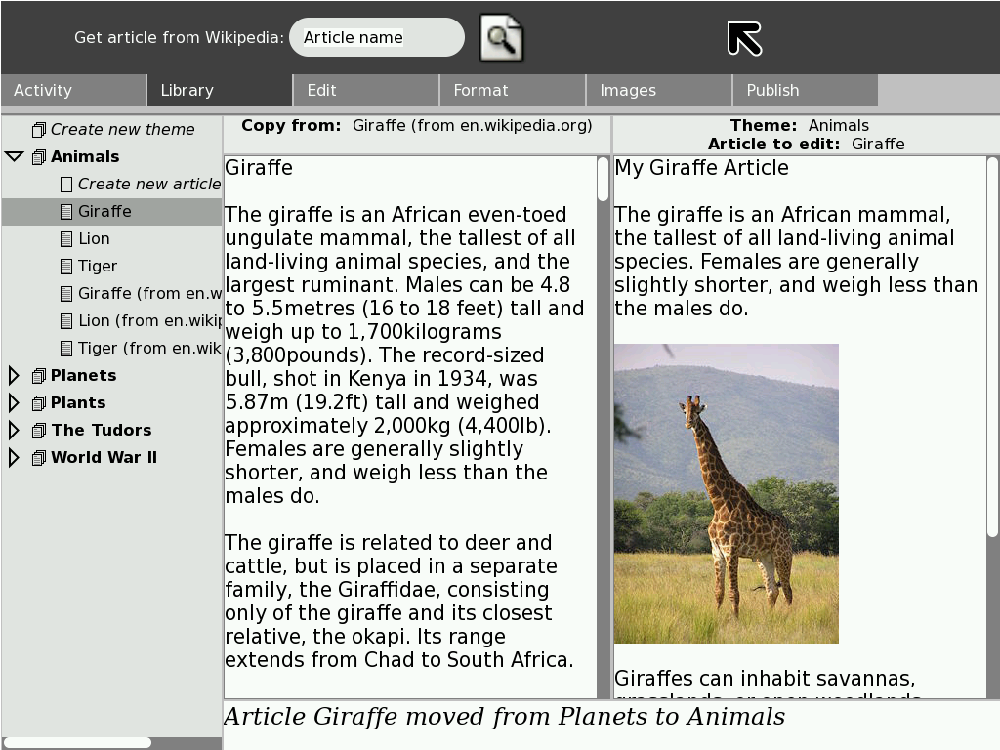
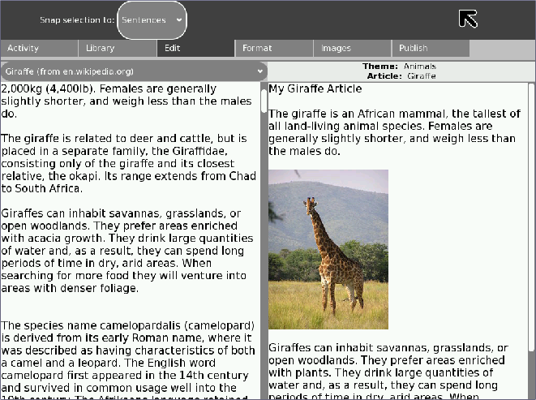
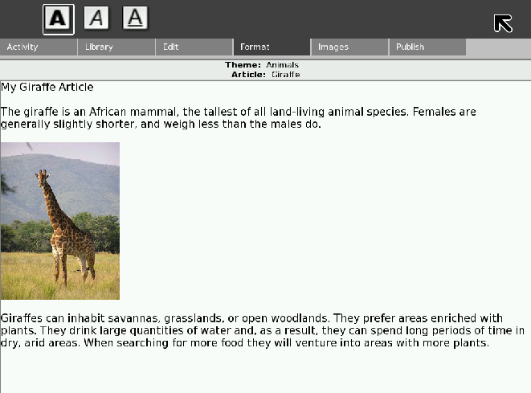
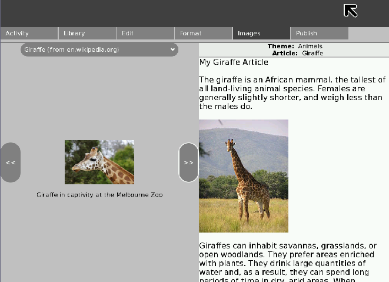
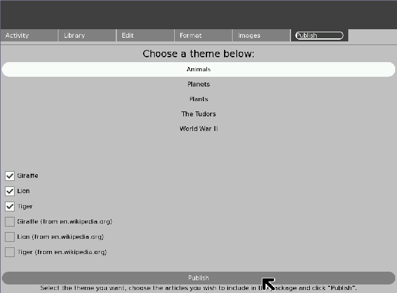
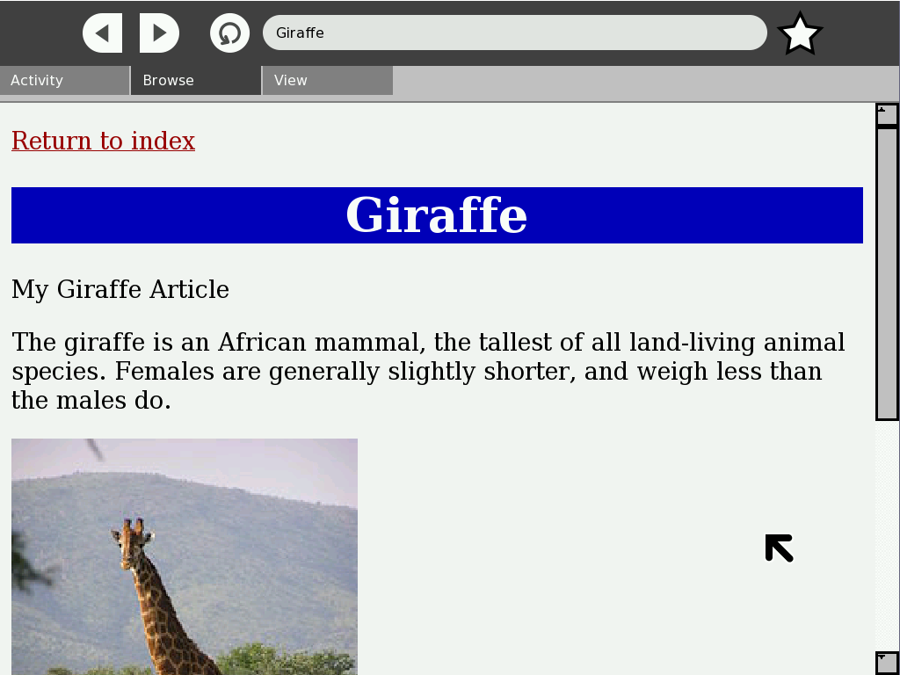
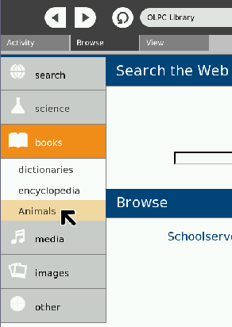

.. _info-slicer:

===========
Info Slicer
===========

*InfoSlicer is an open source tool to enable teachers to quickly and
easily select web-based content to edit, package, and distribute as
teaching materials.*

Info Slicer: an overview
========================

InfoSlicer is a tool for aggregating content off of the Internet,
rearranging and creating new content, and then publishing this content.
The basic element of InfoSlicer is an article. This can correspond to
anything: a page from Wikipedia; a news article; or a story downloaded
from the WWW. Any content which can be displayed online could be
represented as an article.

The prototype version of InfoSlicer gives users the option of
downloading articles from Wikipedia. There are a number of stages during
which users can slice content from these articles into their own
articles. They can format the article and insert images. Articles can
then be arranged into themes. (A theme is a collection of articles all
based around the same topic. For example, a theme entitled “Animals”
could contain articles on “Lion”, “Tiger”, “Giraffe” etc.)

Once the user has created their own content and arranged it into themes,
they can publish this content as a Sugar library package (.xol file)
which automatically gets picked up by the Browse activity on the same
laptop and added to the off-line content available. The .xol file is
also available in the Journal so that the user can copy it to a USB
stick for sharing on other laptops or uploading to a server.

The Sugar interface is the GUI originally designed for the
One-Laptop-per-Child XO-1 laptop. Sugar is bundled with most major
GNU/Linux distributions and hence it is possible to run Sugar on almost
any computer. Sugar has a very distinct look and feel, and some specific
interaction style guidelines. When the user is running the Sugar
environment, publishing creates an entry in the sugar Journal, and adds
a “Book” to the Browser application.

Where to get Info Slicer
========================

Info Slicer activity is available for download from the `Sugar Activity Library <http://activities.sugarlabs.org/en-US/sugar/>`__:
`Info Slicer <http://activities.sugarlabs.org/sugar/addon/4042>`__

The source code is available on `GitHub <https://github.com/sugarlabs/infoslicer>`__.

The Info Slicer User Interface
==============================

All of the screenshots are based on the Giraffe Wikipedia article at
http://en.wikipedia.org/wiki/Giraffe in September 2008.

The screenshots have not been updated for recent versions of InfoSlicer,
such as InfoSlicer 8, and have more tabs. Use these screenshots as a
guide only.

The Library Pane
----------------

The Library pane deals with the creation, saving, loading and organising
of articles.

The tree-view on the left hand side of the diagram shows the articles
and themes. The article that is highlighted is the “Giraffe” article,
which is in the “Animals” theme. There is a status bar at the bottom of
the page.

In the toolbar at the top of the page, there is a search dialog, which
will download and save articles from Wikipedia into the currently
selected theme.

Users can drag articles from the tree on the left into the two main text
boxes in the middle of the screen. The two text boxes represent a
“source” article, from which content can be copied, and the user's
version of the article.

The user selects which article is to be used as the source, and which
article is to be edited. They would then proceed to the edit pane.

The Edit Pane
-------------

The edit pane is the first place the user would go after selecting
articles in the library pane. It allows dragging and dropping from the
source article into the destination article. There are various levels of
selection snapping available to make the copying as simple as possible.

The source article is displayed on the left, and the user's editing
version is displayed on the right. The user can select text on the left
but editing is disabled. There is a drop-down menu for users to select
different source articles from the theme they are currently working in.

The Format Pane
---------------

The format pane only deals with the user's working version. It gives
them a standard formatting toolbar and they can apply formatting like
they would in any regular text editor. Most of the formatting options
are disabled in the prototype InfoSlicer tool.

The Images Pane
---------------

The images pane loads the images associated with an article. In the
prototype tool, when articles are downloaded from Wikipedia, the
associated images are also downloaded. The user is presented with a view
very similar to the Edit pane, except instead of viewing the text of the
source article, they see the images.

Much like the Edit pane, there is a drop-down menu for users to change
article to other articles in the current theme. Clicking and dragging an
image from the left will allow users to insert the image and caption
into their article. The example shows that an image of a giraffe has
been inserted.

The Publish Pane
----------------

The Publish pane allows users to select articles within a theme to
publish. Clicking the publish button will then perform the
platform-specific publishing action, as detailed in the InfoSlicer
overview.

Output
------

On the Sugar platform, publishing content results in a book being added
to the browse application.

|The index in the Browse homepage|

Clicking on the book brings up the index web page. In a Windows or Linux
environment, the user would double-click on the output file, which would
open the same page below but in their default browser.

Future directions
=================

Here are some of the ideas we had for features that would make
InfoSlicer better.

Content sources
---------------

For testing purposes, we have been using MediaWiki-based websites as our
primary data source. This has been useful because it reduces licencing
issues and presents data in a uniform format. However, particularly in
more developed countries, there are already established teaching
resources websites which teachers would prefer to use as their primary
data source. As such, the tool could be extended to take from these
sources.

Similarly, teachers already possess and distribute materials in other
data formats such as PDF and Word documents. The tool could also be
extended to process these data formats.

If the generic HTML parser could be improved, it would be useful to
provide browser integration whereby teachers could perform a 1-click
download using a plug-in to their favourite browser. The plug-in would
automatically process and store the data ready for off-line use in the
application.

Adding images from the Journal
------------------------------

You can include any of the images in the downloaded Wikipedia pages in
the articles you create. It would be handy to be able to pull in images
from your own library (i.e. the Journal, in the Sugar environment).

Language
--------

Given the variation in the number of articles available in the different
language Wikipedia sites, providing automatic translation into the
teacher's language would greatly increase the range of data available.
For example, the Afrikaans Wikipedia has around 10,000 articles, whereas
the English Wikipedia has around 2,500,000 articles.

Thesaurus and spell-check
-------------------------

It would also be useful to incorporate a thesaurus to make it easier for
teachers to substitute complex language with words more suited to the
children’s level. Spell-checking is also an obvious inclusion that would
be welcomed.

Content distribution
--------------------

At the moment, the tool does not utilise the mesh networking available
on the One Laptop Per Child laptops. This would be an easy and effective
way of distributing the teachers' content in a peer-to-peer fashion,
without relying on other devices such as USB sticks, school servers, or
web sites.

Collaboration
-------------

The application could be enhanced with the use of collaboration tools
such as comment posting, in order to allow students to share their
thoughts and views on the published material. This could also allow
teachers to collaborate on content both on a local network and on the
internet as a whole.

Deleting files when no longer required by the user
--------------------------------------------------

Deleting downloaded image files presents a problem, as they may be
referenced by several user-generated articles. As such it is not
feasible in the current implementation to remove images and guarantee
link integrity. In future versions of the application, this could be
solved by implementing more advanced data-tracking tools.

Attribution
-----------

Currently the article meta-model includes meta data about the source of
the content that is used in an article, even as you cut-and-paste and
chop and change. However, this attribution does not appear in the
published articles. This would be an enhancement to the publishing part
of the application, and could either be done as footnotes in the
articles, or as a separate HTML page in the .xol, which would be
distributed with the package and can be linked-to from the articles.

Interaction with the Library
----------------------------

The Library has no real precedent in the Sugar environment and feedback
from users suggested that that part of the application would benefit
from some re-design work to make it more intuitive.

Where to report problems
========================

Please report bugs and make feature requests at `infoslicer/issues <https://github.com/sugarlabs/infoslicer/issues>`__.

