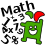

.. _jamath:

=======
JAMath
=======

About
-----

|Jamath_icon| Answer math questions quickly for the highest score.

JAMath is a numbers game where the game tells you an addition, subtraction, multiplication or division and you have to click the results in the numbers that are falling down.

.. image :: ../images/jamath-image1.png

Where to get JAMath
--------------------

JAMath activity is available for download from the `Sugar Activity Library <http://activities.sugarlabs.org/en-US/sugar/>`__:
`JAMath <https://activities.sugarlabs.org/en-US/sugar/addon/4595>`__

The source code is available on `GitHub <https://github.com/sugarlabs/jamath-activity>`__.

How to play
-----------

.. image :: ../images/jamath-image2.png

* the game starts up with numbers being added, substracted, multiplied or divided.

* there will be balls falling with different numbers on them, one of them would be the answer to the question.

* you can use the mouse pointer to click on the answer or you can type it using your keyboard.

* after every right answer a new question will be provided. 

* You have to answer the question as quickly as possible and get the highest score.

Where to report problems
------------------------

Please report bugs and make feature requests at `jamath-activity/issues <https://github.com/sugarlabs/jamath-activity/issues>`__.