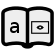
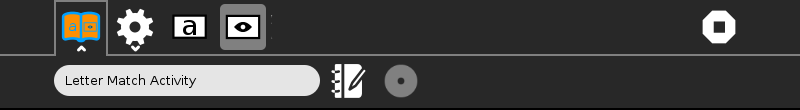
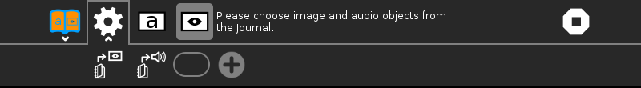
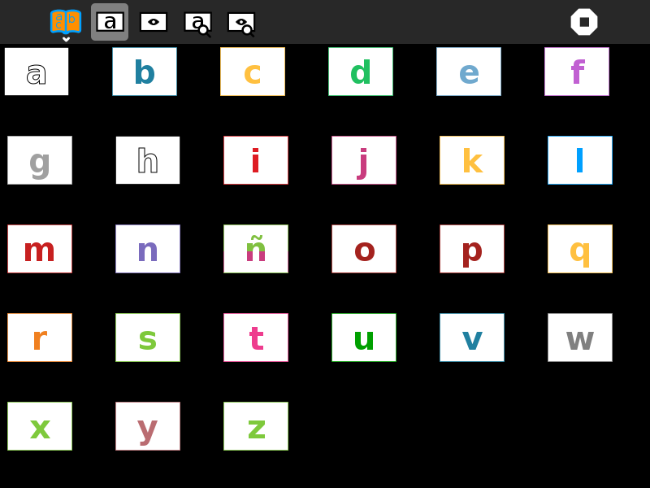
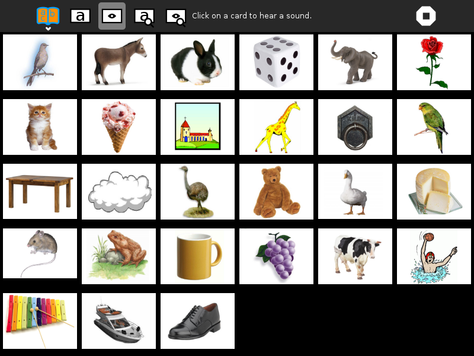

.. _lettermatch:

============
Letter Match
============

About Letter Match
==================

Letter Match is an activity for introducing the Spanish vowels. It
displays letters and images and associated sound files, such as 'A as in
ave'. There are two modes:

#. see a letter, then click on the corresponding picture
#. see a picture, then click on the corresponding letter

(Also see :ref:`AEIOU <aeiou>`, :ref:`I Can Read <icanread>`, and :ref:`I Know My ABCs <iknowmyabcs>`)

Where to get Letter Match
=========================

The Letter Match activity is available for download from the `Sugar
Activity Library <http://activities.sugarlabs.org>`__: `Letter
Match <http://activities.sugarlabs.org/en-US/sugar/addon/4627>`__

The source code is available on `Github <https://github.com/sugarlabs/lettermatch>`__.

Using Letter Match
==================

+-------------------+--------------------+----------------------+
| |LetterMatch.png| | |LetterMatch2.png| | |LetterMatch3.png|   |
|                   |                    |                      |
| letter game       | picture game       | Ccustomization panel |
+-------------------+--------------------+----------------------+

Toolbars
--------

**Activity toolbar**
  change the activity name; add notes to the Sugar Journal

**Custom toolbar**
  used to add new pictures and sounds

**Letter mode**
  see a letter and choose a picture

**Picture mode**
  see a picture and choose a letter

**Stop button**
  exit the activity

**Load picture**
  Load a new picture from the Sugar Journal

**Load sound**
  Load a new sound from the Sugar Journal

**Letter entry**
  Enter the letter of the alphabet associated with these pictures and sounds

**Add button**
  Add the picture and image to the database

Learning with Letter Match
==========================

While far from contructionist, this activity does provide a mechanism
for learning the alphabet.

Modifying Letter Match
======================

As of Version 3, only a Spanish version is included. In order to add
other languages, we need:

-  audio recordings of the letter names
-  audio recordings of the picture names
-  perhaps additional pictures, in order ensure there is a picture for
   each letter of the alphabet

There is a language-specific database file maintained in
./lessons/??/alphabet.csv where ?? is the 2-digit language code. The
format of the CSV file is:

+----------+-----------+-------------------+--------------+----------------------+-----------------------+
| letter   | word      | color (#RRGGBB)   | image file   | sound file (image)   | sound file (letter)   |
+==========+===========+===================+==============+======================+=======================+
| R        | (r)atón   | #F08020           | raton.png    | raton.ogg            | r.ogg                 |
+----------+-----------+-------------------+--------------+----------------------+-----------------------+

Extending Letter Match
======================

Using the customization toolbar, it is possible for the learner to add
their own pictures and sound recordings.

Where to report problems
========================

You are welcome to leave comments/suggestions on
`lettermatch/issues <https://github.com/sugarlabs/lettermatch/issues>`__.

Credits
=======

Letter Match was written and is maintained by `Walter <https://wiki.sugarlabs.org/go/User:Walter>`__. He was
inspired in part by the work of Maria Perez, Fundación Zamora Terán.
`Aneesh Dogra <https://wiki.sugarlabs.org/go/User:Aneesh_Dogra>`__ added the customization toolbar.

