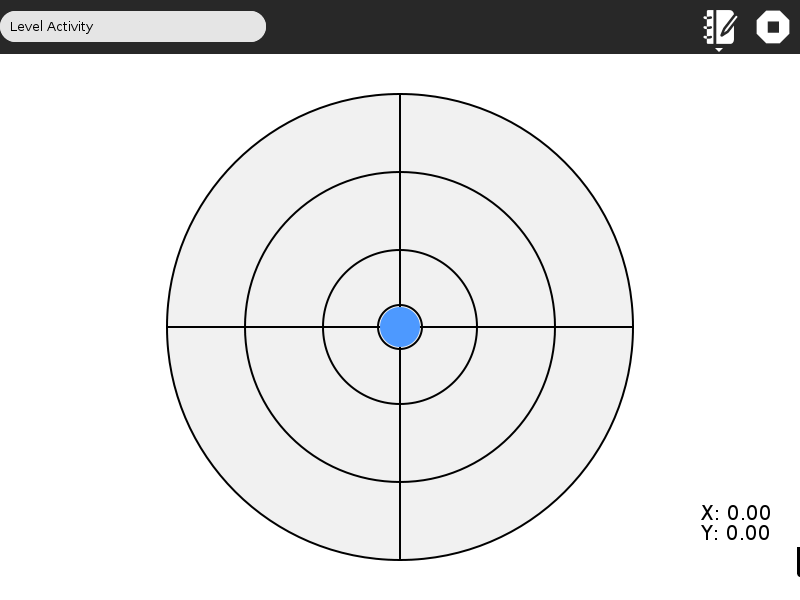

.. _level-tool:

==========
Level Tool
==========

Level Tool Activity
===================

Level Tool is an activity to check the inclination of a surface with respect to ground.

**Note: You need an OLPC XO-1.75 or XO-4 laptop to use Level Tool.**

How does Level Tool work
------------------------

Level Tool uses an accelerometer to detect the inclination of your laptop with respect to ground and displays it in a well defined circular grid.

Level Tool can also share with other laptops using collaboration, so that the inclination of a set of laptops can be seen at the same time.

Where to get Level Tool
-----------------------

The Level Tool activity is available for download from the `Sugar
Activity Library <http://activities.sugarlabs.org>`__: `Level
Tool <http://activities.sugarlabs.org/en-US/sugar/addon/4628>`__

The source code is available on `GitHub <https://github.com/sugarlabs/level-activity>`__.

Where to report problems
------------------------
You can report bugs and make feature requests at `level-activity/issues <https://github.com/sugarlabs/level-activity/issues>`__

Author
------

Level Tool was written by `Aneesh Dogra <http://wiki.sugarlabs.org/go/User:Aneesh_Dogra>`__
