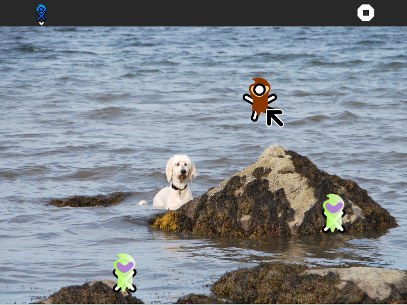
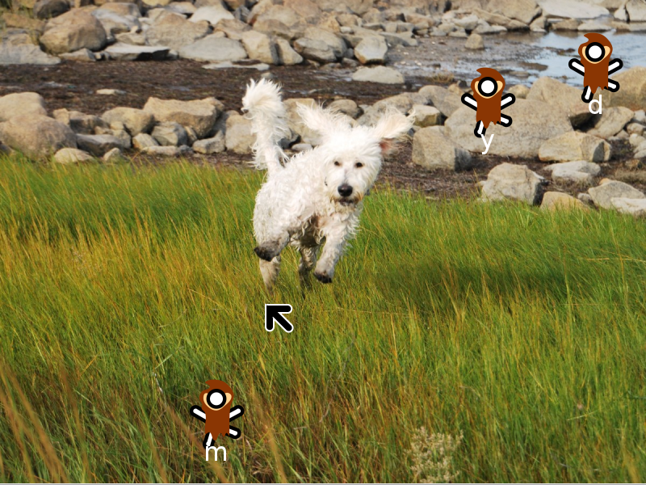

.. _locosugar:

=========
LocoSugar
=========

About LocoSugar
===============

The LocoSugar Activity is a simple game to introduce the keyboard and mouse to those new to computers.

Where to get LocoSugar
======================

The LocoSugar activity is available for download from the `Sugar
Activity Library <http://activities.sugarlabs.org>`__:
`LocoSugar <http://activities.sugarlabs.org/en-US/sugar/addon/4576>`__

The source code is available on `GitHub <https://github.com/sugarlabs/locosugar>`__.

Using LocoSugar
===============

Simply launch the activity and you will be walked through a series of
games:

#. Move the cursor to track a moving target
#. Move the cursor and click the left mouse button
#. Move the cursor and click the right mouse button
#. Drag and drop with the left mouse button
#. Type lower-case characters
#. Type upper-case characters
#. Use Enter and Backspace (Erase)

Learning with LocoSugar
=======================

LocoSugar is a fun way to get acquainted with the keyboard and mouse.

Modifying LocoSugar
===================

-  Replace the artwork in the image subdirectory with artwork you
   design.
-  Replace the sounds
-  Add new levels of play.

--------------

Your suggestions for enhancements and/or use cases...

Where to report problems
========================

You can report bugs and make feature requests at `locosugar/issues <https://github.com/sugarlabs/locosugar/issues>`__

You are also welcome to leave comments/suggestions.

Credits
=======

LocoSugar was written and is maintained by `Walter Bender <https://wiki.sugarlabs.org/go/User:Walter>`__. He was inspired
in part by CucoXO. Ignacio Rodriguez came up with the name for the
activity. The dog in the pictures is named Clementine. She is a
goldendoodle and belongs to my daughter and son-in-law. She is very
friendly, but also very bouncy. She loves to swim and chase XOs.
