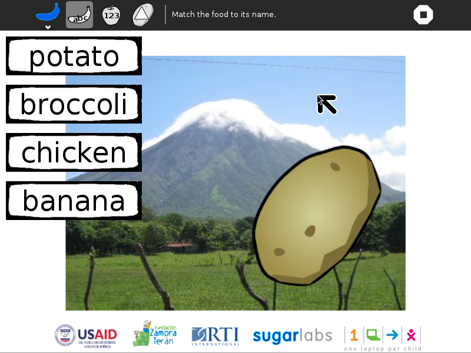
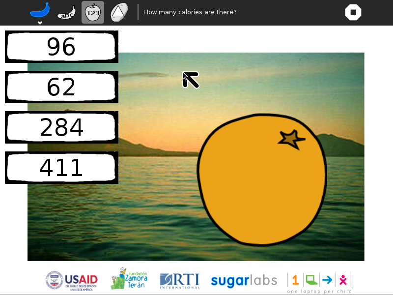
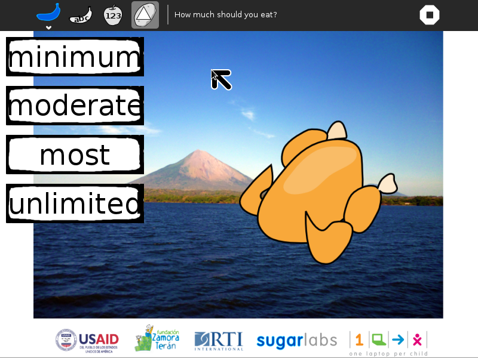
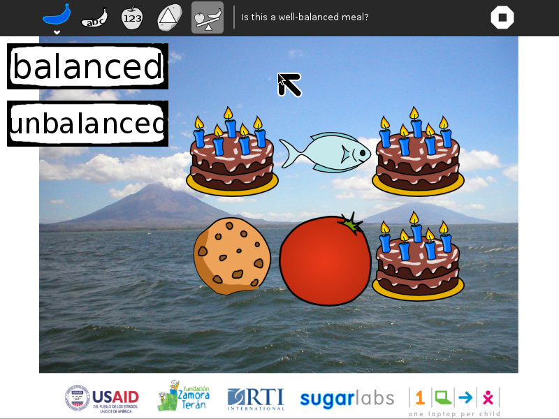
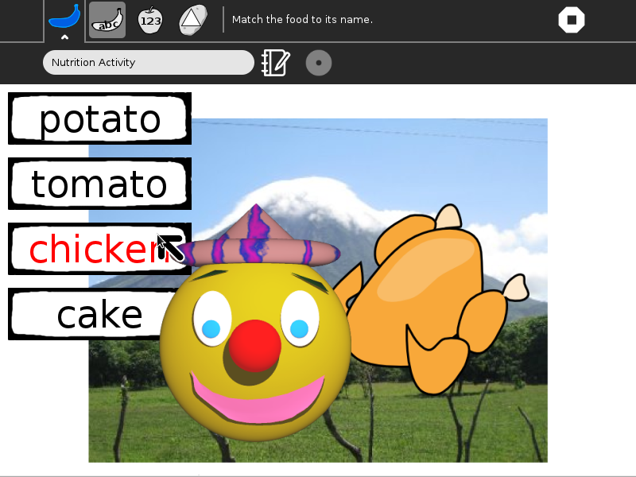
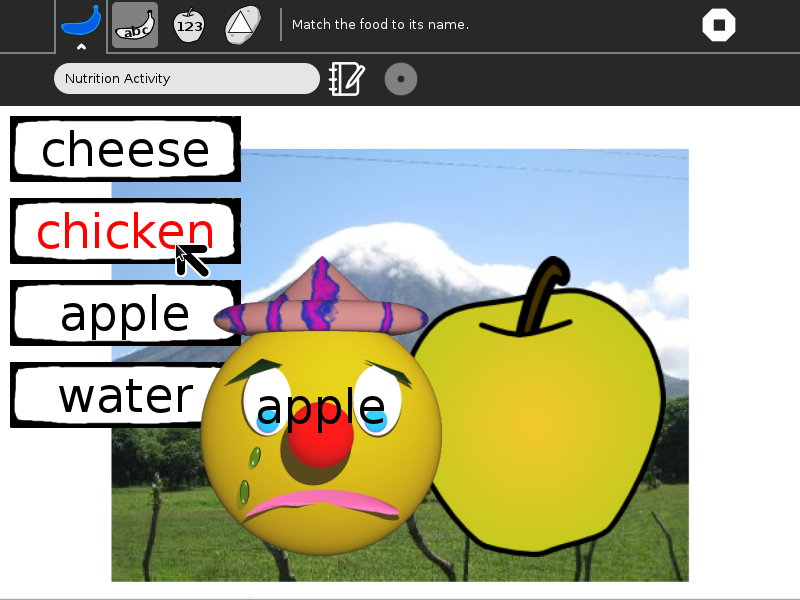
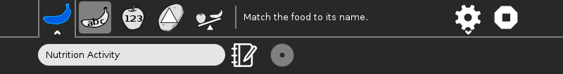
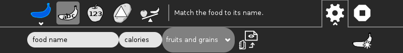

.. _nutrition:

=========
Nutrition
=========

About Nutrition
===============

.. figure:: ../images/Nutrition-icon.svg
   :alt: Nutrition-icon.svg

A series of four nutrition games: *Name That Food*; *How Many
Calories?*; *How Much to Eat?*; and *Is This a Balanced Meal?*

Where to get Nutrition
======================

The Nutrition activity is available for download from the `Sugar
Activity Library <http://activities.sugarlabs.org>`__:
`Nutrition <http://activities.sugarlabs.org/en-US/sugar/addon/4555>`__

The source code is available on `GitHub <https://github.com/sugarlabs/nutrition>`__.

Using Nutrition
===============

Name That Food
--------------

In the *Name That Food game*, a picture of a food is shown; four
different names are shown as well, only one of which is correct. Click
on the correct name and a smiley face will appear, along with the number
of calories in that food. Click on the incorrect name, and a frowny face
will appear, along with the correct answer.

How Many Calories?
------------------

In the *How Many Calories?* game, again, a picture of a food is shown.
Now the goal is to identify how many calories are in the food.

How Much to Eat?
----------------

In the *How Much to Eat?* game, the goal is to identify how little or
much of the shown food should be consumed per day. Relative quantities
are based on the Food Pyramid: a few sweets, a modest amount of meat and
dairy, more grains and fruit.

Is This a Balanced Meal?
------------------------

In the *Is This a Balanced Meal?* game, six food items are shown. The
goal is to determine if they constitute a well-balanced meal; e.g., not
too many sweets or too much meat and dairy.

Did you know?
-------------

-  If you get the correct answer, a smiley face is shown.

-  If you get a wrong answer, the correct answer is shown on a frowny
   face.

The Toolbars
------------

from left to right

**Activity-toolbar Button**
 (toolbar described below)

**Name-that-food Button**
  Launches a new *Name That Food* game

**How-many-calories Button**
  Launches a new *How Many Calories?* game

**How-much-should-I-eat Button**
  Launches a new *How Much to Eat?* game

**Is-this-a-balanced-meal Button**
  Launches a new *Is This a Balanced Meal?* game

**Custom-toolbar Button**
  Used to load custom food items (toolbar described below)

**Stop Button**
  used to exit the activity

--------------

**Acitivity Toolbar**

**Activity name field**
  used to change the name of the activity (The name is used by the save-to-PDF Button.)

**Share Button**
  disabled (Portfolio Activity does not support sharing)

**Reflection Button**
  used to write descriptions for the Journal entry of this instance of Portfolio

--------------

from left to right

**Name Entry field**
  Used to enter the name of a new food item

**Calories Entry field**
  Used to enter the calories of a new food item

**Food Pyramid Combobox**
  Used to select the level in the Food Pyramid for a new food item

**Image-load Button**
  Used to open a Chooser for selecting an image of a new food item from the Sugar Journal

**Create-new Button** Used to create a new food item

Learning with Nutrition
=======================

Each of the nutrition games presents a different learning opportunity.

**Name That Food**
  This game is about literacy, but also provides some nutritional information about the foods as they are presented.

**How Many Calories?**
  This game introduces the concept that different foods have different nutrition value. The focus here is on calories.

**How Much to Eat?**
  This game is based upon the Food Pyramid. It introduces the concept that not all foods should be consumed in equal quantities. E.g., high-sugar-content foods should be eaten in small quantities, while grains and fruits can be eaten in larger quantities.

**Is This a Balanced Meal?**
  This game is also based on `Choose My Plate <http://www.choosemyplate.gov/>`__, a nutrition program that has recently replaced the Food Pyramid. It generates meals and asks if they are nutritionally balanced. More cookies and cake than fruit and grains?

Extending Nutrition
===================

Have the children take pictures of the foods that they eat at home. Use
the Nutrition acitvity to explore caloric intake and the degree to which
they are eating a balanced meal.

Have the children find a food item not in the database and add it using
the **gear icon**. They will need make a picture of the food (using
Paint or Record) and look up the nutritional content of their food.
(https://www.choosemyplate.gov/SuperTracker/foodapedia.aspx is a good
resource.)

Modifying Nutrition
===================

Add your own foods by adding images to the images directory and adding
to the table in game.py

::

    # ChooseMyPlate.gov
    LEVELS = [_('minimum'), _('moderate'), _('more'), _('most'), _('unlimited')]
    MYPLATE = [[_('sweets'), 0], [_('dairy'), 1], [_('fruits'), 2],
               [_('meat'), 2], [_('grains'), 3], [_('vegetables'), 3],
               [_('water'), 4]]

    # Food name; calories; myplate category, image file name
    FOOD = [[_('banana'), 105, 2, 'banana.png'],
                 [_('apple'), 72, 2, 'apple.png'],
                 [_('fish'), 58, 3, 'fish.png'],
                 [_('corn'), 96, 4, 'corn.png'],
                 [_('broccoli'), 55, 5, 'broccoli.png'],
                 [_('chicken'), 262, 3, 'chicken.png'],
                 [_('cheese'), 114, 1, 'cheese.png'],
                 [_('orange'), 62, 2, 'orange.png'],
                 [_('potato'), 159, 5, 'potato.png'],
                 [_('water'), 0, 6, 'water.png'],
                 [_('tomato'), 150, 5, 'tomato.png'],
                 [_('cookie'), 68, 0, 'cookie.png'],
                 [_('beef'), 284, 3, 'beef.png'],
                 [_('egg'), 77, 3, 'egg.png'],
                 [_('sweetpotato'), 169, 5, 'sweetpotato.png'],
                 [_('tamale'), 126, 5, 'nacatamal.png'],
                 [_('bread'), 69, 4, 'bread.png'],
                 [_('rice and beans'), 411, 4, 'rice-and-beans.png'],
                 [_('cake'), 387, 0, 'cake.png']]

--------------

Your suggestions for enhancements and/or use cases...

Where to report problems
========================

You can report bugs and make feature requests at `nutrition/issues <https://github.com/sugarlabs/nutrition/issues>`__

You are also welcome to leave comments/suggestions.

Credits
=======

Nutrition was written and is maintained by `Walter <https://wiki.sugarlabs.org/go/User:Walter>`__. He was assisted by Claudia Urrea and Felix Garrido of Fundación Zamora Terán.

The smiley and frowny face and birthday cake artwork comes from the GCompris suite.
