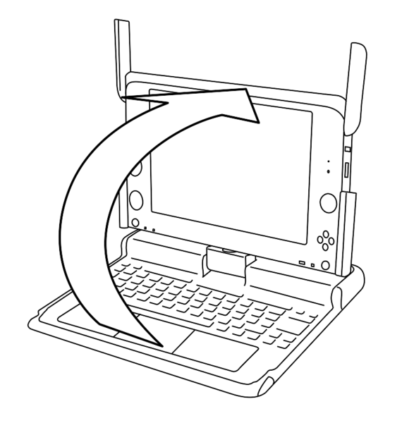

==============
Opening the XO
==============

Opening the XO
--------------

You can open, flip, and close the XO to position it in different ways. 

To open the XO

- Position the laptop with the handle away from you, and then rotate both of the antennae towards you. 

.. image:: ../images/resized_570x322_415_600w.png 

- Lift the front edge of the top of laptop, and then move the top upward away from you. You can hear and feel a slight click as you first lift the top. 

To flip the XO
--------------

You can switch the XO so that the screen lies flat and covers the keyboard. This lets you handle the gamepad buttons more easily or read electronic books (ebooks), using the arrow buttons to page forward and backward.

.. image:: ../images/resized_600x150_spin_xo.jpg

- Bring the display up to a 90-degree angle and rotate the antennae down.
- Rotate the display 180 degrees until it is facing backwards.
- Fold the display down onto the keyboard.
- Press the rotate key to orient the display. 
