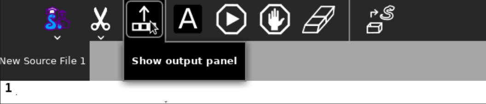
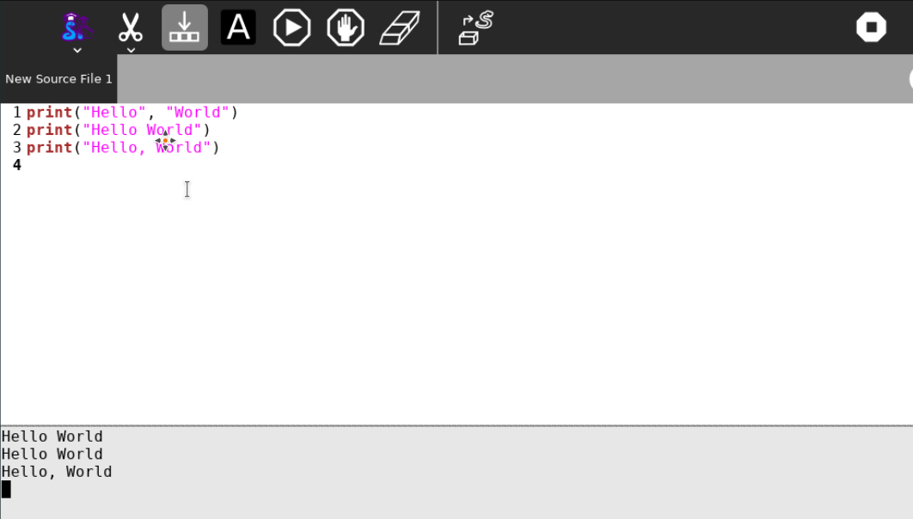
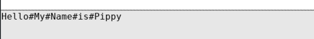
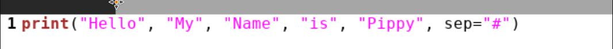
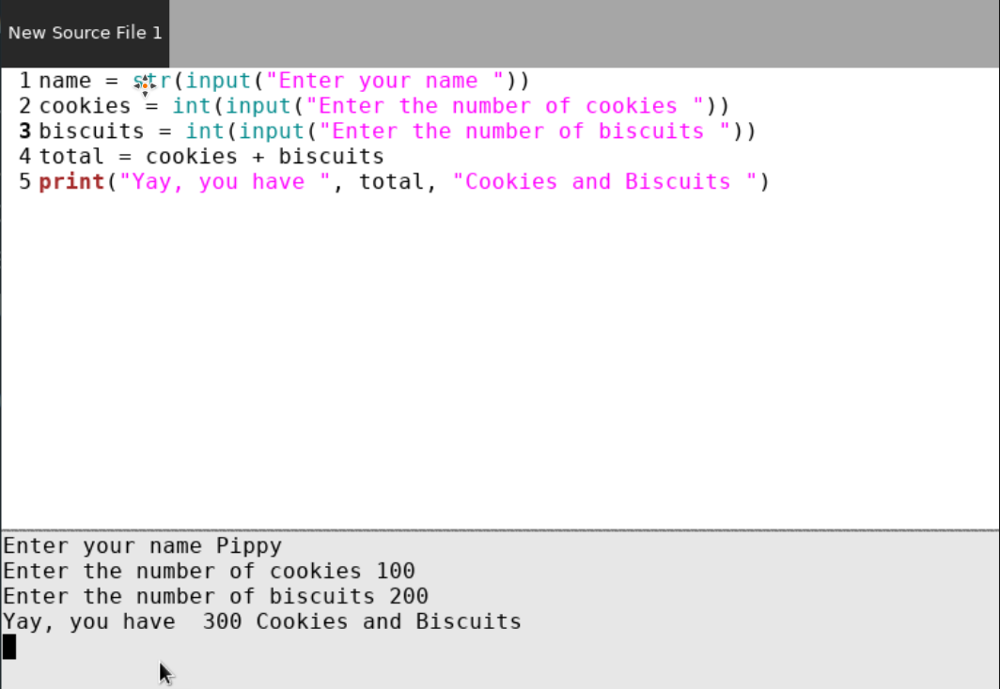
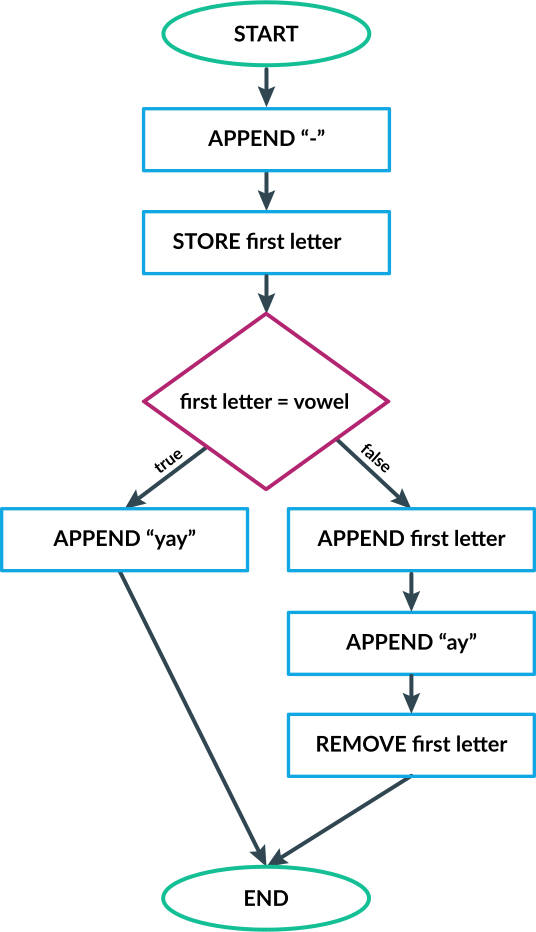

=====================
Lesson Plan for Pippy
=====================

Requirements
============
- Sugar 0.116 
- Python3.6 or later
- Pippy Activity v74 or later

Need Statement
==============

Pippy Activity currently includes the provision to :

-  Write Python scripts
-  Run the code

It is important to explain the fundamentals of Python scripting in the
form of lessons or modules. This is proposed in timed interactive
explanation.

Lessons
=======

**Module 0: Whetting your appetite (for teachers)**
---------------------------------------------------

*TIME TAKEN : 5-10 MINUTES*

*A lesson abstract
from*\ `https://docs.Python.org/3/tutorial/appetite.html <https://docs.python.org/3/tutorial/appetite.html>`__

This page helps to create an abstraction for what Python is and how easy
an approach is to be.

**Module 1: Hello World**
-------------------------

*DURATION : 30 MINUTES*

*AGE CATEGORY: 10+*

*OBJECTIVE: Learn the very basics of Python syntax by a ‘Hello World’.*

**PREREQUISITES**

In order to have a successful attempt, a student should know:

-  What a colon is
-  Differentiating parenthesis ‘(‘ from bracket ‘[‘
-  Commas
-  Spaces

**TASK**

A Hello World statement can be explained as the fundamentals in the
Python3 programming basics.

>>> print(‘Hello World’)

Notice, ‘Hello World’ is enclosed in ‘’ or “”, this is what makes it a
string. All sequences of letters, words are strings. string can be
recognised by Python and will be shown in output.

The print command helps to \`print\` anything on the output. The
language which Python understands is called Python syntax. Upon entering
print(), Python shows whatever is in parenthesis, in the output.

-  Show the student name in output.
-  Show the student’s favorite item in the output.
-  Execute his/her name in the output.

NOTE:

Numbers are called integers in Python. See *Module 6* for more
information on integers. It is possible to enter numbers in Python
without quotes:

>>> print(‘1’)

And

>>> print(1)

Both of them show the same output, but are different in terms of complex
operations. It will be extensively discussed in later modules.

**MILESTONES**:

-  A student successfully learns how to display a string on the console.

**EXERCISES**:

1. Write a Python script to show your name as output.
2. Write a Python script to display your age.

**Module 2: Print using multiple values**
-----------------------------------------

*DURATION: 5-10 MINUTES*

*AGE CATEGORY: 10+*

*OBJECTIVE: Understanding arguments in a built in function, print() to
display many items.*

Open the Pippy Activity and toggle the ‘output panel’.

|image1|

The print command can be extended with commas to separate many values.
Examples can be given to show the similarity between;

print(‘Hello World’) and print(‘Hello’, ‘World’)

The student should be able to see that the output produced is without
quotes.

|image2|

At the end of the task, the student should understand:

-  Whatever is within the quotes is displayed as it is.
-  If a comma or a number is within quotes, it will be shown like that
      (see third \`Hello World`)
-  In ‘Hello’, ‘World’, Python automatically inserts a space in between
      them, This is done with the ‘sep=’ arguments.
   -  Example:

.. code-block:: python

      print(“Hello”, “My”, “Name”, “Is”, “Pippy”, sep=”#”)

OUTPUT:

|image3|

You will notice that the sep argument is colored differently in Pippy:

|image4|

Here, in the light theme, strings are given pink color, args are given
black and functions are given a brown color. This helps to differentiate
the working of each type of syntax.

**MILESTONES**:

-  THis module creates the base for displaying formatted data in the output.

**EXERCISES**:

1. Write a Python script to display Hello World with hyphens between
      each character

..

   Eg: H-e-l-l-o-W-o-r-l-d

2. Write a Python script to display all your details, in a line
      separated by ‘@’

.. _section-1:

**Module 3: Interactive Mode: Using Python as a calculator**
------------------------------------------------------------

*DURATION: 5 MINUTES*

*AGE CATEGORY: 10-13*

*OBJECTIVE: Learning the arithmetic use of Python, using operators and
syntax*

**Python Interpreter** can be introduced to the students and how they
can use it as a calculator. Providing them with questions on how to
solve the sums, difference, multiplication etc., day-to-day problems and
their solutions using Python can be introduced to the students.

Examples:

-  Find the sum of 258 chocolates and 600 toffees using the *Python Interpreter*.

>>> 258 + 600
858
>>>

**MILESTONES**:
-  Helps the students to understand that a Python interpreter can do
      pretty much anything we do in the normal calculator.

**EXERCISES**:

1. Find the sum of 8626 and 4566 using Python interprete
2. Find the product of 4862 and 15674
3. **HOTS**: Find the answer of the following mathematical expression

..

   15 x 6 + 25 / (30 + 3)

**Module 4: Interactive Mode: Variables**
-----------------------------------------

*DURATION: 10-15 MINUTES*

*AGE CATEGORY: 11+*

*OBJECTIVE: Understanding variables*

Explain how the Python literals can be assigned to value. Use day to day
examples intuitive for a student. Also include the examples from Guiddo
Van Rossum’s official Python examples as they are fun to learn.

Examples:

>>> toffees = 15
>>> icecream = 20
>>> sweets = toffees + icecream
>>> sweets 
35
>>>

**MILESTONES**:

-  Learn how to declare a variable.
-  Learn the benefits of defining a variable, such as removing the need
      for doing it again and again, changing input from time to time.

**EXERCISES**:

1. Write a Python program which assigns the sum of 600 and 500 to a
      variable.

2. What will the following script give as output:

.. code-block:: python

      A = “Hello”
      B = “ABC”
      C = A + B
      print(C)

.. _section-2:

**Module 5: Script Mode: Displaying variables**
-----------------------------------------------

DURATION: 15 MINUTES

*AGE CATEGORY: 11+*

*OBJECTIVE: Displaying variables in the output panel*

The same variable implementation can be shown in the script mode or a
**Jupyter Notebook**. This can be re-shown with the interactive and
script examples. Plus, with this module, a student should know how to
format his answer with strings and the print statement.

**Examples**:

(i)

.. code-block:: python

      toffees = 15
      icecream = 20
      sweets = toffees + icecream
      print(sweets) # gives 35

(ii)

.. code-block:: python

      toffees = 15
      icecream = 20
      sweets = toffees + icecream
      print(“I have “, sweets, “sweets with me”)

**MILESTONES**:

-  The script mode can be made intuitive by providing meaningful results.

-  A student realizes that a number can not only be the output but also
      a text or string item.

**Module 6: Data types [A] Numerical Data Types**
-------------------------------------------------

DURATION: 45 MINUTES

*AGE CATEGORY: 10+*

*OBJECTIVE: Understanding the difference between integer and float*

Decimal systems can be demonstrated to the students, known by a new
name, ‘Floating Point Literals’. This includes the use of float and int
data types in declaring variables.

**MILESTONES**:

-  A student understands that a number can be shown as an integer (int)
      or a decimal (float) and vice-versa.

**FURTHER READING**:

-  Explicit and Implicit type conversions.

-  Using infinite values in float

-  Converting \`string\` to integers.

-  Use in the input() statement to get values

**EXERCISES**:

1. Write a Python script to show the sum of ‘5’ and ‘3’ and show the sum
      again in decimal values.

2. HOTS: What will be the output of

.. code-block:: python

   num1 = 5
   num2 = 6.0
   sum = num1 + num2
   print(sum)

.. _section-3:

**Module 7: Arithmetic Operations**
-----------------------------------

*DURATION: 30 MINUTES*

*AGE CATEGORY: 10+*

*OBJECTIVE: Understanding the use of Arithmetic Operators in Python
Syntax*

The idea on different types of arithmetic operations allowed in Python
can be comprehensively explained.

**MILESTONES**:

-  Learn the use of +, -, \*, /, \*\* (power), % (modulus), etc.

**FURTHER READING**:

-  Using the math module to use functions like sqrt, log, sin,cos, tan,
      pi, euler’s constant

**EXERCISES**:

1. Find a square root of 6250000 using the Python interpreter.

2. HOTS: Find the circumference of a circle with radius as 25 units
      using Python’s built-in math module **π**.

.. _section-4:

**Module 8: Data types [B] String Data Types**
----------------------------------------------

*DURATION: 30 MINUTES*

*AGE CATEGORY: 12+*

*OBJECTIVE: Understanding string Data Types*

The **str** built-in function and <class ‘str’> are to be introduced.
Explicit conversion of integers into strings can also be possible. Give
a simple intuitive definition, such as string is a sequence of letters
enclosed in a string. Make sure the student understands the difference
between “3.0” and just 3.0. Understand that a string is only and only a
string if it is enclosed in single, double or triple quotes

An important task to be covered is to make the user display his name
three times. This task will be beneficial in solving upcoming tasks.

Examples:

>>> str(3.0)
3.0
>>> int(“5”)
5
>>>int(“Hello”)
Traceback (most recent call last):
File "<stdin>", line 1, in <module>
ValueError: invalid literal for int() with base 10: 'Hello'
>>>

**MILESTONES**:

-  Learn the use of str as explicit conversion

-  Understand the foundation of explicit type conversion for the next
      module

**FURTHER READING**:

-  Learn about immutability; how memory is allotted by Python and how it
      accesses them.

-  Learn why strings cannot be changed, even though they can be.
      Understand the basics of addresses in RAM.

-  Understand how Python handles immutable objects as compared to C, C++

**EXERCISES:**
--------------

1. Write a program to convert a user input into integer

2. Write a program that calculates the sum of two custom numbers.

.. _section-5:

**Module 9: String Functions**
------------------------------

*DURATION: 1 DAY to 7 DAYS*

*AGE CATEGORY: 14+*

*OBJECTIVE: How to modify a string, concatenation and replication*

The string function helps to make the user understand the various fun
features like concatenation and replication string parts. A user may
also learn of string Indexing, backward forward indexing may be covered
only for students above the age of 14. Tasks include, adding “Hello” and
“World” from two variables, and show the output, Making many
*HelloWorld* \’s so as to fill the screen, e.g., “Hello World”\*100 ,
display the name of the user five times, etc.

Finally a descriptive lesson on Indexing is necessary as Indexing will
be covered in future data types like lists, Tuples, and Dictionaries.
Teaching indexing is beyond the scope of this module, and it requires a
bit more expertise to develop an interactive module to teach indexing.
Although a variable and a string looks the same, it should be made clear
that, strings are enclosed by quotes.

**MILESTONES**:

-  Learn how to add texts

-  Learn a better way to show text many times (See task compared to
      *Module 8*)

-  Learn assigning a string to a variable

-  How a variable and a string are different

.. _exercises-1:

**EXERCISES:**
--------------

1. Write a program to display “Python” fifty times

2. Write a code fragment to display “Pippy” thirty times between “Sugar”
      at the beginning and the end.

3. Write a program to get the first character of the string

4. Write a program to get the length of the user input string using the
      len() built in function

5. Write a program to reverse a string and print it.

.. _section-6:

**Module 10: Input() statement**
--------------------------------

*DURATION: 1 DAY*

*AGE CATEGORY: 10+*

*OBJECTIVE: Understand how to get user input*

Input statements are one of the key features that help the student
understand the difference between variables and literals. Instead of
using literal values in the previous tasks, an input statement, can be
used to provide a user defined values. Learn how input() built-in
functions can be made to use, in doing daily homework tasks like
multiplying two numbers, showing the factors of a number, etc.

|image5|

*NOTE FOR MENTORS*:

-  Note the use of int before input to check integer values

-  Note the use of str before input to check string values. The input
      function returns a string, but however, it would be better to make
      the students understand this in the right order. Otherwise this
      might create confusion on why it was only used as int before input
      in second line, but not in the first one.

-  Try this

.. code-block:: python

   import this

In your terminal. This would return a poem covering all the details
on how to write a successful Python program. The use of str before
input, is corresponds to the line

**Explicit is better than Implicit**

.. _exercises-2:

**EXERCISES:**
--------------

1. Write a program to get the name and age of the user and print it

**Module 11: Lists**
--------------------

*DURATION: 1 DAY to 2 DAYS*

*AGE CATEGORY: 15+*

*OBJECTIVE: Understanding Mutable Arrays*

Lists can be made to understand as a sticky note listing a mixture of
items. The Python list also offers the same a similar approach.

Examples

>>> a = [1, 2, 3]
>>> a[0]
1
>>> a = [‘Hello’, 1, 2, [3,4]]

List Indexing and string Indexing has to compared in contrast. Examples
can include comparing [‘Hello’, ‘World’] and “Hello World”, and using
the same key values can give significantly different values. It can also
be made to notice that string indexing returns only a single character,
however list indexing gives the element corresponding to the current
character

**MILESTONE**:

-  Indexing can be understood more in this module

**FURTHER READING**:

-  How to Slice a string or a list. A good article by Sergii Boiko, on
      railwire,
      `https://railsware.com/blog/Python-for-machine-learning-indexing-and-slicing-for-lists-tuples-strings-and-other-sequential-types/ <https://railsware.com/blog/python-for-machine-learning-indexing-and-slicing-for-lists-tuples-strings-and-other-sequential-types/>`__
      explains indexing in dept, as a first step for Machine Learning
      and Data Sciences

.. _exercises-3:

**EXERCISES:**
--------------

1. Write a program to convert a string to a list

2. Give a detailed description on what factors are a ‘tuple’ different
      from the ‘list’

3. **HOTS**: Learn about dictionaries, and create a number reader, eg:
      user input 1 gives ‘one’

**Module 12: Getting list , string Elements,** 
----------------------------------------------

*DURATION: 1 DAY to 2 DAYS*

*AGE CATEGORY: 15+*

*OBJECTIVE: Understanding Indexing of lists and strings*

Lists and string can be accessed with their index numbers in square
brackets beside the variable name

>>> a = [1,2,3]
>>> b = “Hello”
>>> a[0]
1
>>> b[0]
H
>>>a[-1] # gives the last value
3
>>>

**MILESTONES**:

-  The difference between strings and lists can be conceptually made
      correct.

-  Strings can be more related to a list with each element as each
      character. Comparison with list(“Hello”) will help to show this
      similarity.

.. _exercises-4:

**EXERCISES:**
--------------

1. Write a program to reverse a list

2. What is the builtin function that converts a tuple to a list and a
      list to a tuple?

3. HOTS: Write a program to get a list as a user input by using eval()
      function

.. _section-7:

**Module 13: Setting values to list , string Elements,** 
--------------------------------------------------------

*DURATION: 1 DAY to 2 DAYS*

*AGE CATEGORY: 15+*

*OBJECTIVE: Understanding Mutability and Indexing in lists*

In previous module, it was clearly shown how each element of string or a
list can be accessed using [<index>]. The same applies for setting the
values

>>> a = [1, 2, 3]
>>> a[0] = 2
>>> a
[2, 2, 3]
>>>

But for strings, something different happens.

>>> a = “123”
>>> a[0] = “2”
TypeError: 'str' object does not support item assignment.
>>>

TypeError shows that item cannot be showed to a string. This
establishes, the idea behind immutability.

**MILESTONES**:

-  Mutability can be made more clear.

**FURTHER READING**:

-  Slicing in Python strings

.. _section-8:

**Module 14: Flowcharts and Pseudocode**
----------------------------------------

*DURATION: 1 WEEK*

*AGE CATEGORY: 11+*

*OBJECTIVE: Code Development Tools like Flowcharts and Pseudocode*

Tasks include learning how to use flow charts, how to write pseudocode,
draw flowcharts, converting daily life situations to flowcharts.

|image6|

LICENSED UNDER CC-BY-SA: khanacademy.org

A pseudocode can be as simple as this:

.. code-block:: 

      If Alice sends a message to Bob
      Bob writes a message to Alice
      Otherwise
      Bob goes to the park to play

A pseudocode doesn’t follow any sort of syntax. It is just a way to
express our ideas in words. It is easier to convert a pseudocode or
flowchart into a Python code

Example

PSEUDOCODE:

.. code-block::

      If it is raining today,
      Remember to take an umbrella
      If it's sunny,
      Take sunglasses

REAL Python CODE:

.. code-block:: python

      if raining == True:
            print(“Remember to take an umbrella”)
      elif sunny == True:
            print(“Remember to take sunglasses”)

If, elif and else is covered in Module 15

.. _exercises-5:

**EXERCISES:**
--------------

1. Write a pseudocode to show your activities at school starting from
      breakfast

2. Write a pseudocode to show how you would get a red ball from a bag of
      red, blue and yellow balls if you can’t see the color while they
      are in the bag.

3. Draw a flowchart for switching on and off your PC

.. _section-9:

**Module 15: Conditional Statements.**
--------------------------------------

*DURATION: 1 WEEK*

*AGE CATEGORY: 12+*

*OBJECTIVE: Learn how Python uses its logic to choose what happens when
using if, elif, and else*

Conditional statements can be explained using flow charts. Daily tasks
of going to school, coming back, or doing some tasks, for example if
homework is there, do it, else go to play. Many tasks can be picturized
in a Python syntax. See previous flow chart example.

Examples

.. code-block:: python

      homeworkdone = True
      if homeworkdone == True:
            print(“Hurray”)
      else:
            print(“You should do the homework”)

**MILESTONES**:

-  Understand Python’s keywords in decision making

-  Student learns about ‘and’, ’or’, ‘boolean operators’

-  Student knows how to write a proper conditional program for any real
      life instance

**FURTHER READING**:

-  Boolean Logic: History of Boolean

-  Boolean Logic Diagrams (for age 16 and above)

-  De Morgan’s Law

-  The concept of computer binary language 0s, and 1s

-  Understanding elif and else statements

.. _exercises-6:

**EXERCISES:**
--------------

1. Convert your previous pseudocode of taking the red ball (Q2) to a
      simple Python if statements

2. HOTS: Write a program to check if the user input year is a leap year

**Module 16: Iteration using While Loop.**
------------------------------------------

*DURATION: 1 WEEK*

*AGE CATEGORY: 14+*

*OBJECTIVE: Use while loop to iterate while condition is true*

Iteration may look complicated. Iteration, again can be explained using
a loop flowchart of repeating tasks. For example, the working of a
weather forecast can be explained using while loop

Example:

.. code-block:: python

      while raining:
            print(“Take an umbrella”)
      else:
            print(“Take your sunglasses”)

For example, a weather provider continuously checks for the current
weather, and updates you with this information. The script cannot be
executed once and then quit, we need to repeat the process of checking
the information again and again.

Example 2:

.. code-block:: python

      Number = 0
      while Number < 100:
            Number += 1
            print(Number)

This will give the output of numbers from 1 to 100.

**MILESTONES:**

-  Student understands about loops, while loop, and its application in
      day to day life

**FURTHER READING :**

-  Infinite Loops, applications

.. _exercises-7:

**EXERCISES:**
--------------

1. Write a while loop to display the numbers from 100 to 200

2. Write a while loop to increase the number continuously without
      stopping (infinite loop)

3. **HOTS**: Write a while loop to display the Fibonacci sequence.

.. _section-10:

**Module 17: Iteration using for Loop**
---------------------------------------

*DURATION: 1 WEEK*

*AGE CATEGORY: 15+*

*OBJECTIVE: Learning the fundamentals of for loop*

For loop is a complicated loop, which may not be intuitive for the
student on the first attempt. A teaching methodology may include showing
script first and then demonstrating it.

.. code-block:: python

      for each in [1,2,3]:
            print(each)

This code takes *\*each\** value from this list having three numbers.
First it takes the first element, i.e., 1 and then prints it. Next it
takes the second element from the list [1,2,3] and then prints it, i.e.,
2 and so on.

**MILESTONES**:

-  The use of code blocks can be made more intuitive for students

-  For loop to solve real issues

-  Comparison between while loop and for loop.

**FURTHER READING:**

-  `https://www.datacamp.com/community/tutorials/loops-Python-tutorial <https://www.datacamp.com/community/tutorials/loops-python-tutorial>`__

**Module 18: Functions**
------------------------

*DURATION: 1 WEEK*

*AGE CATEGORY: 15+*

*OBJECTIVE: Reusing code using Functions*

Understand the reusability of code. The same code needn’t be rewritten
each time we have to do something.

**MILESTONES**:

-  Understanding positional arguments, named arguments, relate with
      print function, positional argument

.. _exercises-8:

**EXERCISES:**
--------------

1. Print each value of the list [“I”, “use”, “Pippy”] using a for loop.

2. HOTS: Draw a right triangle using asterisks and a for loop. Example :

.. code-block:: 

   *
   **
   ***
   ****

**Module 19: Classes, Object Oriented Programming.**
----------------------------------------------------

*DURATION: 1 WEEK*

*AGE CATEGORY: 16+*

*OBJECTIVE: Using classes as a base for Object Oriented Programming*

Learn how to make classes. Classes are complicated and to be only to be
given as a supplementary module, presumably for age 16+. Classes can
only be learned with hands-on experience, described in the next module.

Basic idea about \__init__, \__add__, and other builtin attributes can
be mentioned to the students. Task is included in the next module.

**Task 20: Write a Sugar Activity**
-----------------------------------

*DURATION: 1 WEEK to 1 MONTH*

*AGE CATEGORY: 16+*

*OBJECTIVE: Understand Object Oriented programming with hands-on
experience by creating a sugar activity*

At last, the best task to completely learn Python is experience .
Writing the first activity for Sugar would enrich the students with a
better idea on Python.

See
https://github.com/sugarlabs/sugar-docs/blob/master/src/desktop-activity.md

To use some templates and develop your logic, get the Develop Activity
from sugarlabs.

.. _exercises-9:

**EXERCISES:**
--------------

1. HOTS: Write your own computer language using Object Oriented
      Programming

2. Write a CLI based Tic-Tac-Toe Game

.. _section-11:

.. _section-12:

**Module 21: Writing Configuration Files**
------------------------------------------

*DURATION: 1 WEEK*

*AGE CATEGORY: 16+*

*OBJECTIVE: Learn how to use open()built-in function and write and read
JSON files*

.. _exercises-10:

**EXERCISES:**
--------------

1. Write a Python program that reads and writes your details into a
      config.json file.

2. Rewrite the tic-tac-toe game to save the scores of the user into a
      JSON file

**Module 20: Extending CLI to GUI: GTK, PyQT5, Kivy**
-----------------------------------------------------

*DURATION: 1 MONTH*

*AGE CATEGORY: 16+*

*OBJECTIVE: Learn how to use Python to build GUIs*

**Module 21: Machine Learning and Data Sciences**
-------------------------------------------------

*DURATION: 1 MONTH - 6 MONTHS*

*AGE CATEGORY: 17+*

*OBJECTIVE: Use Python for statistics and machine learning*

.. _exercises-11:

**EXERCISES:**
--------------

-  Learn TensorFlow for Python Artificial Intelligence Development

-  Create your first chat bot in Python

**Module 22: Making Games: pygame**
-----------------------------------

*DURATION: 1 MONTH*

*AGE CATEGORY: 15+*

*OBJECTIVE: Make your first game with pygame*

**Module 23: Open Source: Contributing to Python Repositories**
---------------------------------------------------------------

*DURATION: NO TIME LIMIT*

*AGE CATEGORY: 15+*

*OBJECTIVE: Contribute to Open source organizations and repositories by
using your knowledge to solve critical issues and gain coding experience
.*

.. _exercises-12:

**EXERCISES:**
--------------

1. Open your first pull request at Sugarlabs

2. Get more information on the issues with Python repositories

Implementation in Pippy
=======================

Python programming is not something to be read from books. It requires
hands on experience. This can be automated in the Pippy Activity, by
creating a set of lessons. One of the important platforms where Python
is interactively taught is SoloLearn (https://www.sololearn.com/) and
Codecademy (https://www.codecademy.com/) . This will be useful resources
for learning. However, all developers recommend the Python’s Official
Tutorial as the base of learning.

Pippy Activity can launch an interactive bot, to teach the students to
learn Python where a student can alter the pace of their learning. Each
module can be provided to students as resources or tasks to be
completed. It would be easier to check the output created by the
students is correct (as has been done in Google Code Jam), than to
create a bot.

.. |image0| image:: ../images/pippy_lesson_plan_0.png
   :width: 3.58333in
   :height: 3.58333in

