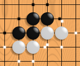
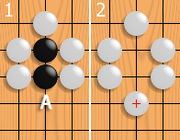
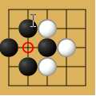

.. _playgo:

======
PlayGo
======

Where to get PlayGo
===================

PlayGo activity is available for download from the `Sugar Activity Library <http://activities.sugarlabs.org/en-US/sugar/>`__:
`PlayGo <http://activities.sugarlabs.org/sugar/addon/4083>`__

The source code is available on `GitHub <https://github.com/sugarlabs/playgo-activity>`__.

The Ancient Game of Go (derived from WikiPedia)
===============================================

The olpc PlayGo activity implements **Go** a strategic board game for
two players. Go originated in ancient China, centuries before its
earliest known references in 5th century BC writing. It is mostly
popular in East Asia but has nowadays gained some popularity in the rest
of the world as well. Go is noted for being rich in strategic complexity
despite its simple rules.

Go is played by two players alternately placing black and white stones
on the vacant intersections of a line grid. The standard size of this
grid is 19 × 19, although the rules of Go can be freely applied to any
size: 13 × 13 and 9 × 9 are also popular choices for simpler and more
tactic-oriented games as well as a way to introduce Go to new players.
The objective of the game is to control a larger part of the board than
the opponent. To achieve this, players strive to place their stones in
such a way that they cannot be captured, while mapping out territories
that cannot be invaded by the opponent without being captured. A stone
or a group of stones is captured and removed if it has no empty adjacent
intersections, the result of being completely surrounded by stones of
the opposing color. Generally, placing stones close together helps them
avoid capture, whereas placing them far apart allows a player to
surround more territory. Part of the strategic difficulty of the game
stems from finding a balance between these two conflicting interests.
The game ends, and the score is counted when both players consecutively
pass on a turn, indicating that neither side can increase its territory
or reduce its opponent's.

`Basic rules from WikiPedia <http://en.wikipedia.org/wiki/Go_(board_game)#Rules>`__
===================================================================================

   One black chain and two white chains, their liberties shown with
   dots. Note that liberties are shared among all stones of a chain.

Two players, *Black* and *White*, take turns placing a *stone* (game
piece) of their own color on a vacant *point* (intersection) of the grid
on a Go board. Black moves first. Normally, the grid measures 19×19
lines, though the rules can be freely applied to all grid sizes. Grid
sizes 9×9 and 13×13 are often used to teach beginners and still offer a
challenging game to experienced players. Once played, a stone may not be
moved to a different point. [1]_ [2]_

Orthogonally adjacent stones of the same color form a *chain* (also
called a *group*) that shares its liberties (see
below) in common, cannot subsequently be subdivided, and in effect
becomes a single larger ston. Only stones connected to one another by
the lines on the board create a chain; stones that are diagonally
adjacent are not connected. Chains may be expanded by playing additional
stones on adjacent intersections or connected together by playing a
stone on an intersection that is adjacent to two or more chains of the
same color.

   If white plays at A, the black chain loses its last liberty. It is
   captured and removed from the board.

A vacant point adjacent to a stone is called a *liberty* for that
stone. [3]_. Chains of stones share their liberties. A chain of stones
must have at least one liberty to remain on the board. When a chain is
surrounded by opposing stones so that it has no liberties, it is
*captured* and removed from the board.

Generally, it is not allowed to play a stone in such a way that one of
your own chains is left without liberties. Such a move is dubbed
*suicide*. An exception to this rule occurs if doing so captures one or
more of the opponent's stones. In this case, the opponent's stones are
captured first, leaving the newly played stone at least one liberty.

   An example of a situation in which the ko rule applies.

Players are not allowed to make a move that returns the game to the
position before the opponent's last previous move. This rule, called the
*ko rule*,
prevents unending repetition. See the example to the right: Black has
just played the stone marked **1**, capturing a white stone at the
intersection marked with a circle. If White were now allowed to play on
the marked intersection, that move would capture the black stone marked
**1** and recreate the situation before Black made the move marked
**1**. Allowing this would result in an unending cycle of captures by
both players. The ko rule therefore prohibits White from playing at the
marked intersection. Instead White must play elsewhere; Black can then
end the ko by filling at the marked intersection, creating a five-stone
Black chain. If White wants to continue the ko, she will try to find a
play that Black must answer; if Black answers, then White can retake the
ko. A repetition of such exchanges is called a *ko fight*.

Instead of placing a stone, a player may *pass*, indicating that he sees
no way to increase his territory or reduce his opponent's territory.
When both players pass consecutively, the game ends and is then
scored.

Scoring Rules
=============

There are two basic ways to count the score at the end of the game. The
oldest of these is called *territory scoring* and is used in Japan,
Korea and most Western nations. The other scoring rules —invented in
15th-century China — are called *area scoring* and are used in China and
some other countries. The US uses a scoring system that is a hybrid of
these two systems.

With territory scoring, a player's score is the number of empty points
enclosed by his stones, plus the number of prisoners he has. Prisoners
are opposing stones which he has captured during the game or those that
are still on the board but cannot avoid capture.

With area scoring, a player's score is the number of stones he has on
the board, plus the number of empty intersections he has surrounded.
Prisoners do not count toward the score under these rules.

Given the fact that the number of stones a player has on the board is
directly related to the number of prisoners his opponent has taken, the
resulting score under both rules is often identical and is rarely more
than one point different. Under US rules, players hand over a prisoner
when they pass, called a *pass stone*. Combined with the requirement
that White makes the last pass, this system guarantees that the *net*
score under territory scoring will be the same as that under area
scoring.

Each of these scoring methods has advantages and disadvantages. There
have been some efforts to agree on a standardized set of international
rules.

Optional rules
==============

Optional Go rules may set the following:

-  compensation points, almost always for the second player; 
   Tournaments commonly use a compensation in
   the range of 5-8 points, generally including a half-point to prevent
   draws.
-  compensation stones placed on the board before alternate play,
   allowing players of different strengths to play competitively
-  *superko*: Although the basic ko rule described above covers over 95%
   of all cycles occurring in games, there are some complex situations
   —*triple ko*, *eternal life*, etc.— that are not covered by it but
   would allow the game to cycle indefinitely. To prevent this, the ko
   rule is sometimes extended to disallow *any* previous position. This
   is called *superko*.

Where to report problems
========================

Please report bugs and make feature requests at `playgo-activity/issues <https://github.com/sugarlabs/playgo-activity/issues>`__.

External Links
==============

-  `Gobase <http://gobase.org/>`__ Including multilingual Internet Go
   Dictionary, game database, tutorials, and other material and links
-  `No Name Go Server <http://sourceforge.net/projects/nngs/>`__ Go
   server software under GPL.
-  `The KGS Go Server <http://www.gokgs.com>`__ A good place for kids to
   play.

.. [1]
   `How to place Go
   stones <http://www.nihonkiin.or.jp/lesson/school-e/okikata-e.htm>`__
   Retrieved March 4, 2007

.. [2]
   `The Go Board <http://gobase.org/studying/rules/?id=1&ln=uk>`__
   Retrieved March 4, 2007

.. [3]
   `Why do I keep getting captured? <http://www.telgo.com/#liberties>`__
   Retrieved March 4, 2007
