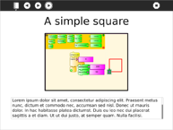
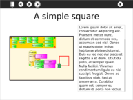
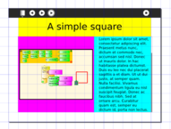
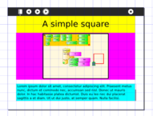

.. _portfolio-activity:

=========
Portfolio
=========

About
-----

.. image :: ../images/55px-Portfolio-icon.svg.png

The Portfolio Activity creates a slide show from Sugar Journal entries that have been 'starred'.

.. image :: ../images/Portfolio-Tool.png

Where to get Portfolio
----------------------

The Portfolio activity is included in OLPC images and available for download from the `Sugar Activity Library <http://activities.sugarlabs.org/en-US/sugar>`_:
`Portfolio <http://activities.sugarlabs.org/en-US/sugar/addon/4437>`_.

The source code is available on `GitHub <https://github.com/sugarlabs/portfolio-activity>`_.

Using
-----

Before you launch the activity, use the ☆ on the left of each Journal entry to mark that entry for inclusion in the portfolio. The Portfolio Activity will use the entry title as well as the preview image and description.

.. image :: ../images/300px-Starred-Journal-Entries.png

The title text, the preview image, and the description text from Journal entries is used in the portfolio presentations.

.. image :: ../images/300px-Abacus-detail.png

In the Thumbnail View, you can reorder the slides in your presentation by dragging.

.. image :: ../images/300px-Portfolio-thumbs.png

With the Edit-description Button, you can directly edit a Journal entry's description field.

.. image :: ../images/300px-Portfolio-edit-description.png

When running the activity, use the ◀ and ▶ buttons to step one-by-one through the slide show. Use the auto-play button to start/pause a slide show. The delay between slides can be controlled by the interval chosen in the combo box. (The default is 10 seconds.)

**Did you know that:**

*  you can record audio notes for each slide; the notes are played back whenever the slide is viewed;
*  the colors used in the background are taken from the XO colors of the user;
*  a warning is displayed if there are no starred entries in your Journal;
*  the slide show can be saved as an PDF document that can be shared;
*  in the thumbnail view, you can reorder your slides (by dragging them); and
*  you can edit the descriptions for each slide (and save your edits to the Journal).
*  for group projects, try using the Bulletin-board Activity. 

The Toolbars
------------

Main toolbar
::::::::::::

.. image :: ../images/Portfolio_toolbar-1.png

from left to right 

**Activity-toolbar Button**
    (toolbar described below) 
**Previous-slide Button**
    returns to the previous slide shown (also activated by typing <Ctrl-p>) 
**Next-slide Button**
    goes to the next slide in the sequence (also activated by typing <Ctrl-n>) 
**Auto-play Button**
    starts a slide show with a user-settable pause between each slide 
**Customize-toolbar Button**
    (toolbar described below) 
**Record-toolbar Button**
    (toolbar described below) 
**Portfolio-view Radio Button**
    used to switch to portfolio view (default) 
**Thumbnail-view Radio Button**
    used to switch to thumbnail view, where you can reorder the sequence of the slides by dragging them 
**Full-screen-view Button**
    hides the toolbars (Return from full-screen by hitting the Esc key.) 
**Update-description Button**
    Used to edit the description of the entry currently being viewed (Note: use the Save-annotations Button to make these edits permanent). 
**Stop Button**
    used to exit the activity 

Activity Toolbar
::::::::::::::::

**Activity name field**
    used to change the name of the activity (The name is used by the save-to-PDF Button.) 
**Share Button**
    as shown, disabled (Portfolio Activity version since v27 support sharing: joiners can add comments) 
**Reflection Button**
    used to write descriptions for the Journal entry of this instance of Portfolio 
**Save-to-PDF Button**
    used to save a copy of your presentation to the Sugar Journal as an PDF document 
**Save-annotations Button**
    used to save updates to the Journal entry descriptions 

Options Toolbar
:::::::::::::::

.. image :: ../images/Portfolio_toolbar-2.png

**Timer Combo-box**
    lets you select a delay time between slides when using auto play (Choose two-seconds, ten-seconds, thirty-seconds, or one-minute delay). 
**Refresh Button**
    scans the Journal to pull in any changes made since the Portfolio activity was launched. 

Recording Toolbar
:::::::::::::::::

.. image :: ../images/Portfolio_toolbar-3.png

**Record Button**
    used to record an audio note associated with the current slide 
**Playback Button**
    active when there is audio associated with the current slide 
**Save Button**
    active when there is a new recording to save 

Saving to PDF
-------------

Each time your launch the Portfolio activity, it will update to reflect the current contents of your Journal. If you want to save a portfolio that represents a particular moment in time (or you want to share your portfolio with someone else), you need to save it as a PDF document. Click on the "Save as PDF" Button from the Activity toolbar menu and the content of the portfolio will be saved as a document in the Journal.

.. image :: ../images/300px-Portfolio-saving-to-pdf.png

**Tip:** Open your Journal to make sure the portfolio has been saved. 

**Tip:** You may want to copy the PDF file to a USB to open it in a different XO, or any other computer, using the Browse or Read activity. 

.. image :: ../images/300px-Step2.png

Learning with Portfolio
-----------------------

Most education experts agree that the best approach to learning involves doing and then stepping back to reflect on the doing: What did I learn? How can I use that? What questions do I have?1 By helping children to ask good questions about the things they’ve done, as opposed to remembering the right answers, we are helping them to build the critical thinking skills that enable them to be independent problem solvers. Without reflection, learning is an open loop, and an open-loop system can neither identify and correct errors nor adapt to change.

Sugar facilitates reflective learning by ensuring that everything a child does is recorded in an electronic journal which includes screen capture of a child’s work. After every activity, children are encouraged to share their observations, which are recorded in an electronic portfolio. From this record of activities, children can expand their portfolio into a multimedia narrative that shows what they have done, how they have done it and what their thoughts are on what they have created—children essentially become curators of their own work. The child’s process of telling about what they have learned as a “story” is a simple way to help reflection become a norm in their education.

By building upon the automatic accumulation of work in the Sugar journal, the portfolio process can readily be integrated into the classroom routine. It can be used as an assessment tool to help teachers, parents, and school administrators understand better the depth and breadth of what a child has learned.2 At a “portfolio social”, parents could be invited to view presentations and ask children about their learning. The classroom teacher can add addition assessment slides to the portfolio addressing themes such as work habits and personal growth. This can become part of an archive that travels with a child across grade levels. Through juxtaposition, the child and teacher can see what has changed over the course of the years, trends, and areas for improvement.

It is recommended that periodically (once per week, month, semester) that the children are asked to select and edit items for a portfolio presentation. For example, a weekly presentation could be made to classmates; a monthly one to parents; and perhaps once per semester, a school-wide presentation that makes all of the learning visible to administrators and community members during a social event.

Periodic PDF snapshots are also a great way to preserve a record of each child's work, and as a vehicle for assessing progress.

Extending Portfolio
-------------------

In addition to using Portfolio as a tool for reflection, it can be used as a more general-purpose presentation tool. For example, a collection of photographs can be annotated (by using the title and description fields in the Journal detail view for each photo) and then made into a slide show. The order of the slides can be modified from the Thumbnail view.

Modifying Portfolio
-------------------

Manuq made some mock-ups of other layouts. It would be fun to add alternative layout options (or even add support for style sheets). 

+----------+----------+----------+----------+
| |image1| | |image2| | |image3| | |image4| |
+----------+----------+----------+----------+

Another idea would be to add the ability to export video from Portfolio. 

A word to developers
--------------------

Reflection is an important part of learning and a good habit to establish in general. An analog to writing descriptions in the Journal -- the text that is shown in the Portfolio presentations -- is writing commit messages in git. It forces you to stop, reflect, and then articulate to others what you have done and why.

Where to report problems
------------------------

Please report bugs and make feature requests at `portfolio-activity/issues <https://github.com/sugarlabs/portfolio-activity/issues>`_.

Credits
-------

Portfolio was written and is maintained by Walter. He was inspired in part by the work of BU Prof. Stefanakis.

