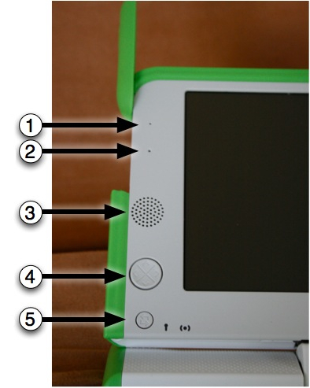
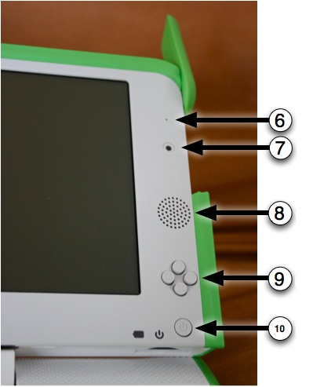
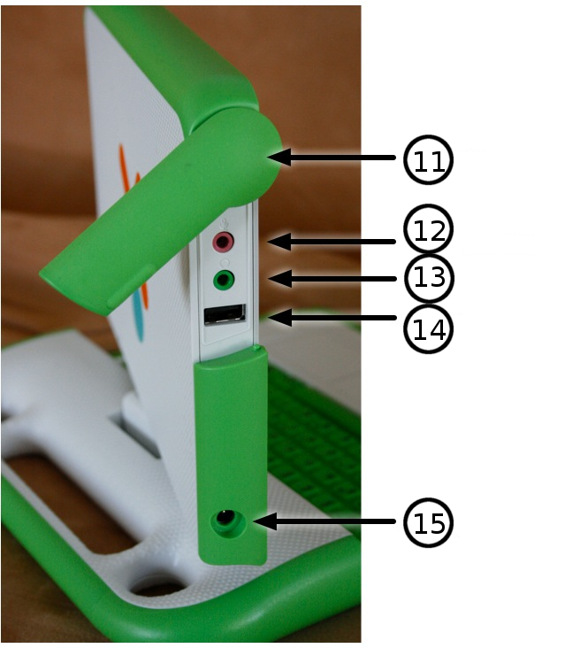

=================
Physical Features
=================

Features and Ports
------------------

The XO laptop has many built-in features. These include a camera, microphone, speakers and wireless antenna. In addition, the laptop allows for the attachment of other external devices. This is often done by plugging the devices into connectors (some are more commonly referred to as ports, jacks or slots).

Backlit screen
--------------

The display functions in a full-color mode similar to other laptop displays and in an ultra-low-power, ultra-high-resolution, black-and-white mode that is readable in direct sunlight.

1, 2 - Built-in microphone
::::::::::::::::::::::::::

There is both a built-in microphone (and an external microphone jack, which supports both AC and DC sources.) As a privacy measure, an LED above the microphone (1) lights up whenever the microphone is in use.

3, 8 - Built-in speakers
::::::::::::::::::::::::

Internal stereo speakers and an amplifier provide a way to play music, videos, and anything you have recorded yourself. There’s also a jack for external headphones or speakers.

4 - Game pad
::::::::::::

Two sets of four-direction cursor-control keys can be game controllers. Since they still function when the screen is folded down into e-book mode, the XO creates a self-contained game playing pad including a controller.

5 - Screen rotate button
::::::::::::::::::::::::

A button on the XO laptop’s display frame changes the orientation of the screen, so it can be viewed right-side-up from any direction.

6, 7 - Built-in camera
::::::::::::::::::::::

The XO laptop has a built-in color camera, enabling still photography and video recording. As a privacy measure, an LED above the camera (6) lights up whenever the camera is on.

9 - Game buttons
::::::::::::::::

The game buttons can be used when the screen is folded down into e-book mode, creating a self-contained game player. The buttons are labeled with a circle, a square, a check, and an ×. These buttons are often used by Activities. For example, the circle button can be used as the shutter for the camera in the Record Activity.

10 - Power button, indicator
::::::::::::::::::::::::::::

From left to right: the battery-level indicator; the power indicator; and the power button.

Along with offering unique connectivity options, the XO laptop can work with a wide range of external devices.

11 - Antennae ears
::::::::::::::::::

When the wireless antennae "ears" are rotated up, they provide the XO with a connection range vastly superior to those of conventional laptops. When down, they keep dirt out of the connectors and act as a latch.

12, 13 - External headphones and microphone jacks
:::::::::::::::::::::::::::::::::::::::::::::::::

Along with built-in speakers and microphone, the XO laptop features jacks for external headphones and an external microphone.

14 - USB/memory ports
:::::::::::::::::::::

The XO laptop features three external USB ports to support a variety of plug-in peripherals (one seen in the photo above, and two others under the other "ear"). Right side ports + battery

15 - Power jack
:::::::::::::::

The XO comes with a power cord that can be plugged into any 110-to-240-volt AC outlet for charging. The power jack also accepts DC power from a solar panel for charging the XO laptop’s battery.

SD memory card slot
:::::::::::::::::::

There is a slot underneath the display that accepts SD memory cards for photos, video, and other content. Rotate the display so that the left-hand edge is over the keyboard—the slot is then accessible from below.

Rechargeable battery
::::::::::::::::::::

Since many children, maybe even you, live "off the grid" (in places with poor or non-existent power infrastructure), the XO laptop is designed to be extremely power efficient.
