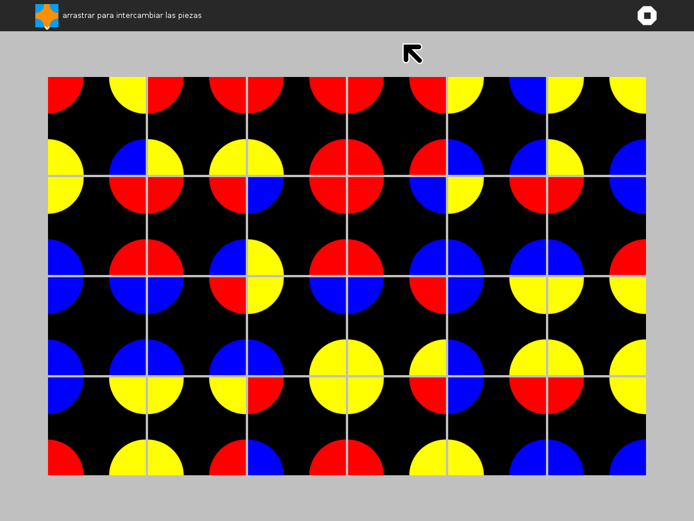

.. _pukllanapac:

===========
Pukllanapac
===========

|Pukallanapac.png| |Pukallanapac-triangle.png|
|Pukallanapac-hexagon.png|

Where to get Pukllanapac
========================

`Activity <http://activities.sugarlabs.org/en-US/sugar/addon/4320/>`__
\|
`Source <https://github.com/sugarlabs/pukllanapac>`__

About Pukllanapac
=================

Pukllanapac is a sliding-puzzle game; the objective is to rearrange
tiles so that all of the circles (and semicircles) are composed of
sectors of the same color. There are three different patterns: circles,
triangles, and hexagons. Drag tiles to swap their positions; click on
tiles to rotate them.

The circle puzzle has three levels of play:

-  beginner, which is a 2×2 arrangement of tiles;
-  intermediate, which is a 4×2 arrangement of tiles; and
-  expert, which is a 6×4 arrangement of tiles.

Warning: the first two levels are relatively easy, but the final level
is challenging.

Pukllanapac is an Incan (Quechua) word for 'picture'. Oscar Becerra was
the inspiration behind the activity.

Filing bug reports
------------------

You can report bugs and make feature requests at `pukllanapac/issues <https://github.com/sugarlabs/pukllanapac/issues>`__

