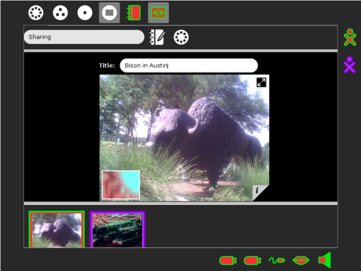

======
Record
======

About
-----

The Record Activity is used for recording audio and video and for taking pictures. You will need to have a built in, or an attached, microphone and/or camera to use Record.

If your computer has no built in camera, or an unsuitable camera attached, then Record, will open in *Record audio* mode only.

Quick start
-----------

There are three record or capture modes. Select **one** of these buttons to chose your Record mode.

.. image :: ../images/Record0.png

The image above shows the buttons of the three *Record* modes, they are:

   * Picture camera mode

   * Video camera mode

   * Audio, or sound mode

This is the *Record* or capture button |Capture| in the centre of the screen, below *main image*.

The main image shows what will be captured. Record will capture whatever is in front of the camera in *Picture camera* mode, or *Video camera* mode, and will capture whatever the microphone can detect, when in *Audio* mode.

  **Tip** As always in Sugar, if you are not sure what a button will do, hover the cursor over it, to reveal its function.

Record features in detail
-------------------------

.. image :: ../images/Record1still.png

**Toolbar and capture buttons explained**

1. Activity tab. In the first field name the page or project. The Description button allows you to add a description to the :doc:`/journal` entry. Thirdly select Private, or My Neighbourhood, see :ref:`Sharing Media`.

2. Picture camera mode is selected.

3. Video camera mode button. Press to switch to Video camera mode.

4. Audio recording mode button. Press to switch to Audio recording mode.

5. Select timer button. Press this button to engage a delay before taking a picture. Available delay options are, *Immediate*, *5 seconds*, or 10 secomds.

6. Timer duration button. Duration is grayed out in *Picture camera* mode. In *Video* mode and in *Audio* mode press to *Select duration*. Available duration options are 2, 4, 6 minutes.

7. Select quality button. The button is grayed out in *Picture camera* mode, and *Audio* mode. In Video camera mode, press this button to select low or high quality. Experiment and choose whichever gives the best results in your conditions.

8. This image represents an picture already taken. It is in the area of the screen called the *tray*, which contains thumbnail images.

9. The record or capture button. Once a picture, video, or Audio recording has been captured, it is automaticly saved in the Journal, and the saved image or clip is represented as a thumbnail in the tray.

10. When the tray is full of images, this button scrolls through the images.

11. Stop, or close the application.

The next section covers Video camera mode, and then Audio recording in more specific detail. However you might now prefer to follow on to :ref:`Viewing, saving and managing your work`.

Video camera
------------

.. image :: ../images/Record2video.png 

**Toolbar and capture buttons explained**

1. Activity tab. Here you can enter a name for the project, access the Journal, to provide a description, and select Private, or My Neighbourhood, see :ref:`Sharing Media`.

2. Picture camera mode button. Press to switch to Picture camera mode.

3. Video camera mode button is selected, and capture or record has been started.

4. Audio recording mode button. Press to switch to Audio recording mode.

5. Select timer button. Press this button to set a delay before capture, available delay options are, Immediate, 5 seconds, or 10 secomds.

6. Timer duration button. In *Video* mode and in *Audio* mode, press to *Select duration*. Available duration options are 2, 4, 6 minutes.

7. Select quality button. In Video camera mode, press this button to select low or high quality. Experiment and choose whichever gives the best reults in your conditions.

8. Record is in *Sharing* mode, and we have been joined by a collaborator.

9. The image, which the other party shared is in the tray, identified by their characteristic colours. See also :ref:`Sharing Media`.

10. Time remaining bar. This is the time remaining, from the *Timer duration*, set with **6**.

11. The button to stop capture and to save the video file. Once a recording has been captured, it is automaticly saved in the Journal.

12. When you finish recording, the saved video clip will be represented by a thumbnail.

13. When the tray is full of images, this button scrolls through the images.

14. Stop, or close the application.

The next section is Audio recording. However you might now prefer to follow on to :ref:`Viewing, saving and managing your work`.

Audio
-----

.. image :: ../images/Record3audio.png

**Toolbar and capture buttons explained**

The tool bar items are just as described above.

It is always a good idea to enter a name for your file **1** in the Activity tab, so that it is easier to find your work later.

If you have a camera, an image **2** appears in the picture window and looks like live video. As the audio file is saved, the image is saved as a snapshot to help identify your audio recording.

The Select timer and Timer duration buttons **3** are available, to set a delay before start of recording, and set the duration. You can either leave the audio recording to run for the set duration, or press the stop capture button **4** at any time.

As with the photo and video modes, you see an icon for your recording **5** show up in the tray once you are done.

.. _Viewing, saving and managing your work:

Viewing, saving and managing your work
--------------------------------------

Working clock wise from the top left, shows the sequence, to save, name, and inspect an image once it has been taken. This sequence is taken in *Picture camera* mode, but the features are similar in all modes.

.. image :: ../images/Record1composite.png

The first screen shot, top left, shows the main image in Picture camera mode, while a picture, just taken, has been automatically saved and named in the Journal. It shows up as a thumbnail on the tray. The cursor is hovering on the thumbnail. The automaticly given, temporary name, is “Photo by Sugar Learner” **1**.

When we click the thumbnail, the main image changes to *viewer* mode. Images are viewed and information can be updated.

A field, in which to enter a title for the photo appears **2**. The title “Cornish village” is entered. Also at this point **2** is the full screen mode button. This will switch the main image to full screen.

At the bottom right of the main image is a little tab, **3**, which allows you to find out more about the photo that was taken. Now pressing that tab **4** reveals the image information, author, date, and a space to add tags. A tag is a single word that helps categorize an item.

The tray displays a history of your previously taken photos. When you have more photos in the tray the *scroll button* **5** scrolls through the images.

To replay a video or audio recording, click the thumbnail of the recording in the tray. When viewing or listening to a clip, if you move your cursor in the main image area, you see small window **6**, representing the output of your camera or microphone. Click on that window to return from *viewer* mode to *capture* mode.

The final image is displayed full screen, and can be reduced to normal with the button **7**.

Record stores images and audio in the Journal, from which they can be used by other activities, such as Paint, Write, Etoys, and Browse, as well as Memorize and some other games. Images can be copied to a USB storage device from the Journal.

.. _Sharing Media:

Sharing Media
-------------

You can share photos, video and audio recordings (these can just be referred to as 'media') with your friends.

.. image :: ../images/Record4.png

To share media you must first have some media in the tray. We have the image of a Bison in the tray.

The Activity tab has been opened, the collaboraton button is pressed and "My Neighborhood" selected.

Share, and join Record
::::::::::::::::::::::

.. image :: ../images/Record5.png

Once you have made your Activity available to share, others, looking at their Neighborhood View, see your icon with the Record icon, an eye, close to it. They can now join your Activity by clicking on the Record icon next to your icon.

They must then select "Join" and their Record Activity opens with your images in their tray.

Now in Record, thumbnails of both parties are shared. The frame of the thumbnail is in the same colors as the XO icon of the person who took the photo.

Images shared
:::::::::::::

On your Frame, you can see the icons of all of the people with whom you are collaborating. You can also see their shared media.

You can exit a shared Activity at any time.

|more| :doc:`/collaborating` has more information on sharing work in Sugar.

.. |more| image:: ../images/more.png

Getting creative with Record
-----------------------------

Record can be used for :

* Taking pictures.
* Recording video.
* Recording audio.
* Stop-motion photography.
* Time-lapse photography.
* Creating 360° panoramas.
* Viewing slide shows.
* Storing extra information about audio, video, and pictures.

Things to Try with Record
-------------------------

You can easily take pictures and make videos by using a built-in, or connected, camera for still photography and video recording. You can also use the camera for video conferencing, which involves talking to others on a video screen knowing that the others can also view your video.

You can express yourself with sound, images, and video using the cameras and microphones. You are learning about light, observations, angle, and perspective. By recording the sights and sounds around you, others can learn about you, your culture, and environment. You can communicate with your voice and pictures. You can tell factual or emotional stories with film or pictures to help change perceptions or take action.

You could also try some of the following : 

* Use the Record Activity to record your voice with a built-in microphone.
* Take a photo of where you live by aiming the camera lens at your home, and then clicking the circle icon.
* Record sounds of your city or town.
* Record and leave messages for your family.
* Teachers - record a message for parents.
* Interview your friends and record it to audio or video.
* Make a video diary.
* Open your photos in the Paint Activity and draw on them.
* Add your pictures to a story using Write.
* Upload a picture to Flickr or Wikimedia Commons.
* Attach a picture to an e-mail you send to a friend or family member.
* Take a picture of a flower or plant from the same place every day to show how it changes.
* Take a picture of a baby animal every week to show how it grows.
