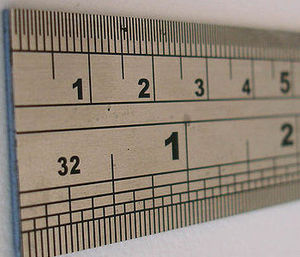
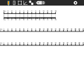
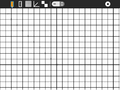
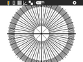
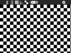

Ruler
=============================

Where to get Ruler
------------------

`Activity <http://activities.sugarlabs.org/en-US/sugar/addon/4192/%5D>`__
\| `Source <https://github.com/sugarlabs/ruler/>`__

About Ruler
-----------

Ruler is a simple collection of measurement tools that are displayed on
the screen.

+--------------------+--------------------+--------------------+--------------------+
| |120px-Ruler-fig1| | |120px-Ruler-fig2| | |120px-Ruler-fig3| | |120px-Ruler-fig4| |
+--------------------+--------------------+--------------------+--------------------+
| CM and MM scales   | CM and MM grid     | Angles             | Checkerboard       |
+--------------------+--------------------+--------------------+--------------------+

Since the OLPC XO computer has a 200 DPI display, the rulers are quite
accurate. One other hardware, where the display resolution is not known,
their is a spinner to let the user set the DPI. Ruler saves this value
to the Journal, so it need not be set on subsequent uses of the
Activity.

Toolbar
~~~~~~~

From left to right:

-  Activity menu button
-  CM and MM ruler
-  CM and MM grid
-  Angles (protractor)
-  Checkerboard
-  Dots per inch (DPI) spinner – used to set the display DPI – only
   appears when DPI is not known, e.g., non-OLPC-XO hardware
-  Stop button (not shown)

Reporting Bugs 
~~~~~~~~~~~~~~~~~~

-  `Submit an issue here <https://github.com/sugarlabs/ruler/issues/new>`__
-  `View all open issues <https://github.com/sugarlabs/ruler/issues/>`__

