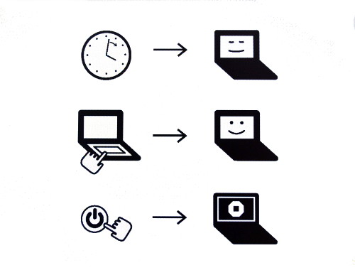
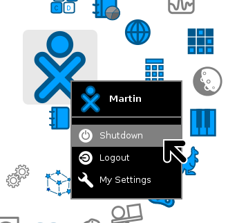

===============
Starting the XO
===============

Starting the XO
---------------

.. image:: ../images/417_600w.png

To start the XO, press the Power button, near the lower right corner of the screen. The XO takes about 30 seconds to start up.

If the battery needs charging, the light next to the power button glows red. Plug the AC adaptor into the left side of the XO and plug the power cord into an outlet if you see the red light or if the XO does not start up.

If you have difficulty starting your XO, refer to the Repairing chapter for ideas.

Starting for the first time
---------------------------

After you press the power button and the XO initially starts up, the XO screen asks for your first name. The next time you start it, it remembers your name and goes directly to the Home View. Later on you can learn how to change to a nick name of your choosing.

- Type your name.

.. image:: ../images/resized_400x300_Simple_Manual_01_Entering_Name.png

- After you enter your name, click Next. (Use a finger on the touchpad below the keyboard to move the arrow over the word "Next". Press the key below the touchpad on the left with an "X" on it to "click".)

- Next, you see a small O on top of an X. This symbol represents you when you use your XO. Use your finger on the touchpad to move the arrow over the person symbol. "Click" this person symbol by pressing the key with an "X" on the left below the touchpad to choose colors that you like.

.. image:: ../images/resized_400x300_Simple_Manual_03_Choosing_Color.png

- After you chose your colors, click "Done."

.. image:: ../images/resized_400x300_Simple_Manual_04_Chose_Color.png

Putting the XO to sleep
-----------------------

When you are ready to stop using your XO for a while, you can put it to sleep by pushing the power key you used to turn it on. The screen that appears when you push the power button shows the two reasons for sleeping; when you haven't been using it for a while, or when you push the power button.

Shutting down the XO
--------------------

When you have finished using the computer, click over the XO icon in the middle of the Home screen, and select the option Shutdown.

Forced Shutdown
---------------

Whenever the XO becomes unresponsive to the keyboard or to the touchscreen, you can make an emergency shutdown by pressing and holding the power button for a few seconds. Be careful that your power button does not get "stuck" in the down position. If it does get stuck, the XO does not detect the depression of the power button, and does not turn on. If this happens, refer to the Repairing chapter for information.
