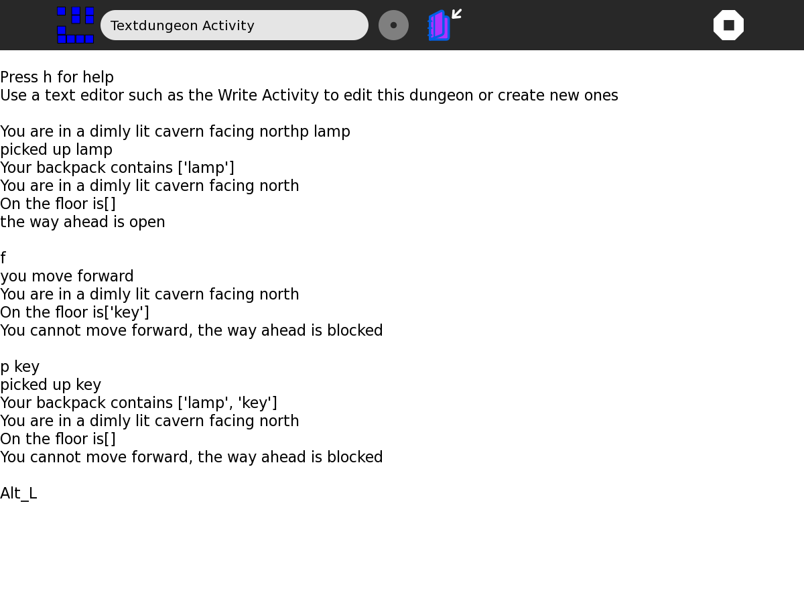
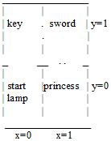

.. _text-dungeon:

============
Text dungeon
============

A text dungeon game for literacy and numeracy. The file describing the
dungeon is plain text, it can be edited with an editor such as Write. It
is purposefully unencrypted and easily edited. 'Cheating' by reading or
altering the dungeon is encouraged.

Where to get Text Dungeon
=========================

Text Dungeon activity is available for download from the `Sugar Activity Library <http://activities.sugarlabs.org/en-US/sugar/>`__:
`Textdungeon <http://activities.sugarlabs.org/en-US/sugar/addon/4471>`__

The source code is available on `GitHub <https://github.com/sugarlabs/dimensions>`__.

How to use
==========

The intention is that children would both play and create dungeons to
develop math, literacy and problem solving skills:

Playing the game

-  visualise 2D spaces (could extend to 3D or even 4D)
-  navigate compass directions N E S W and relationship to right, left
-  text literacy
-  can include subject related content
-  problem solving

Making/editing/reading a dungeon file

-  all the above plus
-  Cartesian coordinates
-  variables
-  word processing skills
-  programming like skills
-  create in any language

Dungeon file format
-------------------

<l,room x,room y> your location

<i, item, item ....> your inventory

<u,room x, room y, item, room x, .....> location of items

<d,room x, room y, direction, locked, room x, .....> status of wall/door
segments, unlisted segments are locked, doors can be asymmetric

<r,room x,room y,direction,item which unlocks,open text,closed text,text
when opening> one entry for each unlockable door

For example, the Sampledungeon represented above is described by these
strings (the comments # are not required)

<u,0,0,lamp,0,1,key,1,1,sword,1,0,princess> #key in room 0,1 , sword in
room 1,1 ,princess room 1,0

<d,0,0,0,0, 0,1,2,0, 0,1,1,1, 1,1,2,1, 1,1,3,0, 1,0,0,0> #room 0,0 north
door open, room 0,1 south open, room 0,1 east door locked etc

Editing example
---------------

For example, put a brick in the room just to the north of the one with
the key :

add the following to the <u command to put a brick in room 0,2 (just
north of room 0,1)

``,0,2,brick``

put open doors going north out of room 0,1 and back, south out of room
0,2 :

add the following to the [d command, (room 0,1 north open, room
0,2,south open)

``,0,1,0,0, 0,2,2,0``

Start in room 0,1 (the one with the key) (that reads el,zero,one)

``<l,0,1>``

Start with a parrot in your back pack

``<i,parrot>``

Resetting a dungeon
-------------------

Your progress through the dungeon is saved in the journal entry

your new location, inventory and item locations are appended to the
Journal entry

To restore the dungeon, remove these from the end of the file using
Write. The Sample dungeon has a marker line of text just before its end
to assist.

Keyboard commands
-----------------

h - help

f - forward

r - right

l - left

b - list backpack contents

p item - pick up item

d item - drop item

u item - use item

Where to report problems
========================

Please report bugs and make feature requests at `textdungeon/issues <https://github.com/sugarlabs/textdungeon/issues>`__.