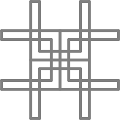
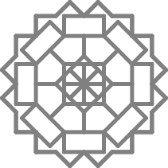
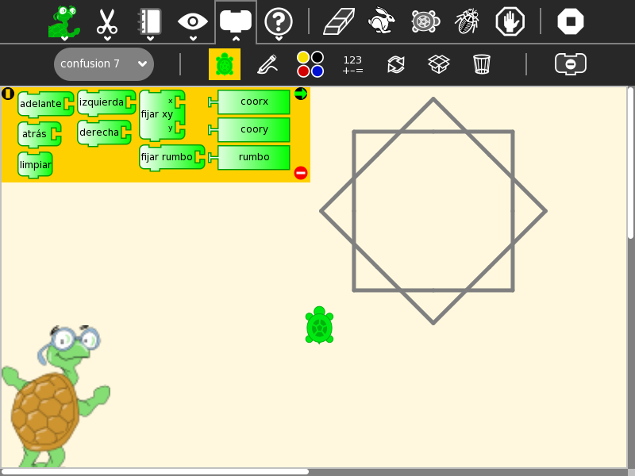
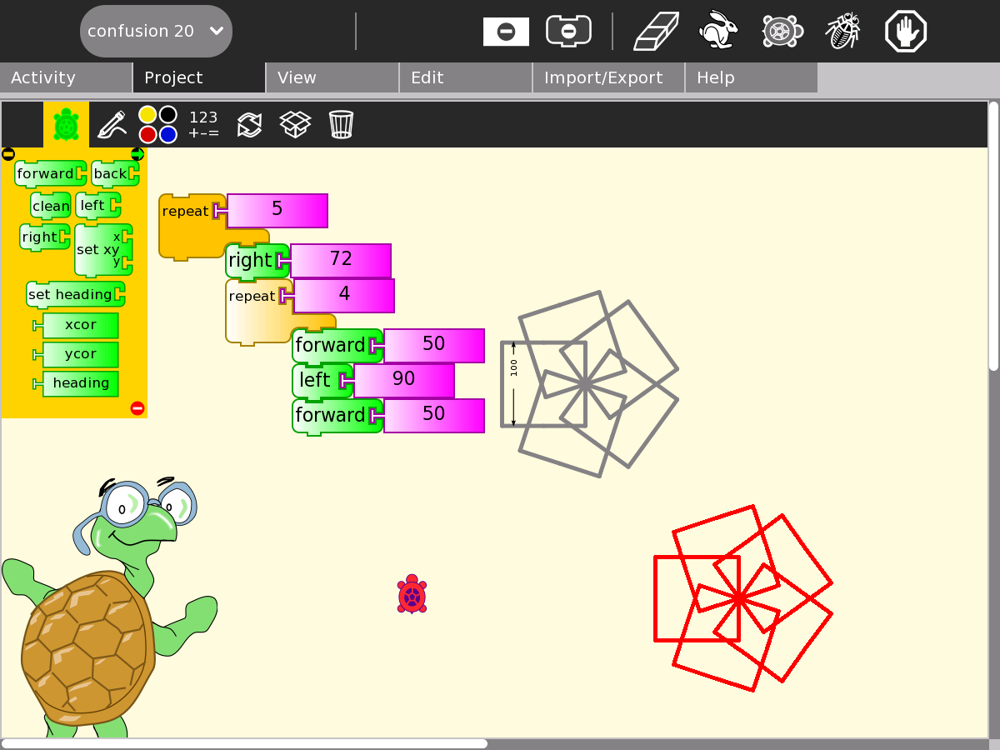
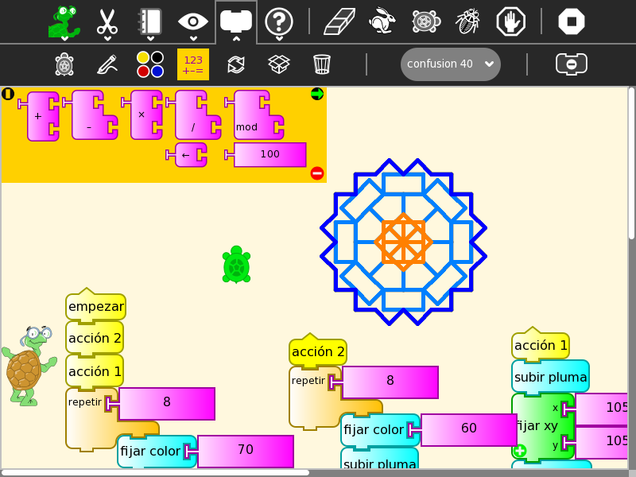

.. _turtle-confusion:

----------------
Turtle Confusion
----------------

.. image :: ../images/Turtle-a.png
    :width: 75
.. image :: ../images/Turtle-b.png
    :width: 75

What is Turtle Confusion
------------------------

Turtle Confusion presents 40 shape challenges to the learner that must
be completed using basic Logo-blocks. The challenges are based on Barry
Newell's 1988 book, *Turtle Confusion: Logo Puzzles and Riddles*. Gary
Stager has put a scan of Barry Newell's original book on line `here <http://constructingmodernknowledge.com/tcbook.pdf>`_ (with permission of the author). (`en español <http://github.com/downloads/humitos/turtle-confusion-es/la-confusion-de-la-tortuga.pdf>`_)

Turtle Confusion is a fork of :ref:`Turtle Blocks <turtleart>` that presents :ref:`40 shape challenges <turtleart-challenges>` to be programmed by moving the Logo turtle.

+-------------------+---------------------+----------------------+
| |TurtleConfusion| | |TurtleConfusion-5| | |TurtleConfusion-40| |
+-------------------+---------------------+----------------------+

Additional features:

-   You can import challenges from the Sugar Journal (save them as an
    image file)
-   You can save your results as: (1) a Turtle Art program; (2) a UCB
    Logo project; or (3) a PNG image
-   You can overlay Cartesian and polar coordinate grids
-   Additional blocks can be added through the Turtle Blocks plugin
    mechanism

**Where to get Turtle Confusion**

http://activities.sugarlabs.org/en-US/sugar/addon/4450

**How to play Turtle Confusion**

.. image :: ../images/Confusion-toolbar.png

1.  Select a challenge from the Combo Box (Shown above: 'confusion 40').
2.  Use blocks from the various palettes to instruct the Logo turtle to
    replicate the pattern.

------------------------------------------------------------------------

Please refer to the :ref:`Turtle Art <turtleart>` pages for basic instructions on
how to use the block interface and the details of various toolbars.

The shape challenges are loaded from the Combo Box on the Project
(Palette) toolbar. When you select a shape, it will be loaded onto the
canvas. When you use the Erase button, the current shape is reloaded.

The available blocks are small subset of the Turtle Block blocks: the
basic turtle blocks; a reduced palette of pen and color blocks; some
basic arithmetic operators; the repeat block; and the action and box
blocks.

The Export palette includes save as Logo; save as image; and save as
Turtle Art.

**What are the challenges?**

The challenges are problems of symmetry and geometry which typically can
be solved by using a combination of rotations and repeat blocks.

+--------------+--------------+---------------+---------------+
| |Challenge1| | |Challenge5| | |Challenge18| | |Challenge40| |
+--------------+--------------+---------------+---------------+

.. image :: ../images/Challenges-chart.png

Reporting problems
------------------
Please file bugs at `activity-turtle-confusion/issues <https://github.com/sugarlabs/activity-turtle-confusion/issues>`_.

Credits
-------

-   Walter Bender wrote and maintains the code.
-   Barry Newell is the creator of the 40 shape puzzles.
-   Brian Silverman is the first author of Turtle Art.

.. |Challenge5| image:: ../images/Challenge-5.svg
                :width: 125px

