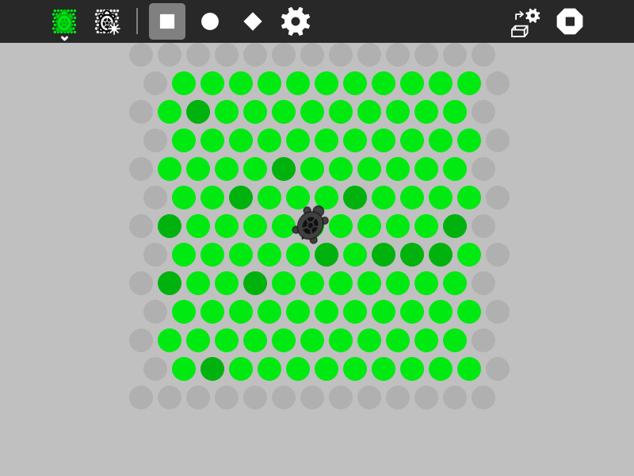
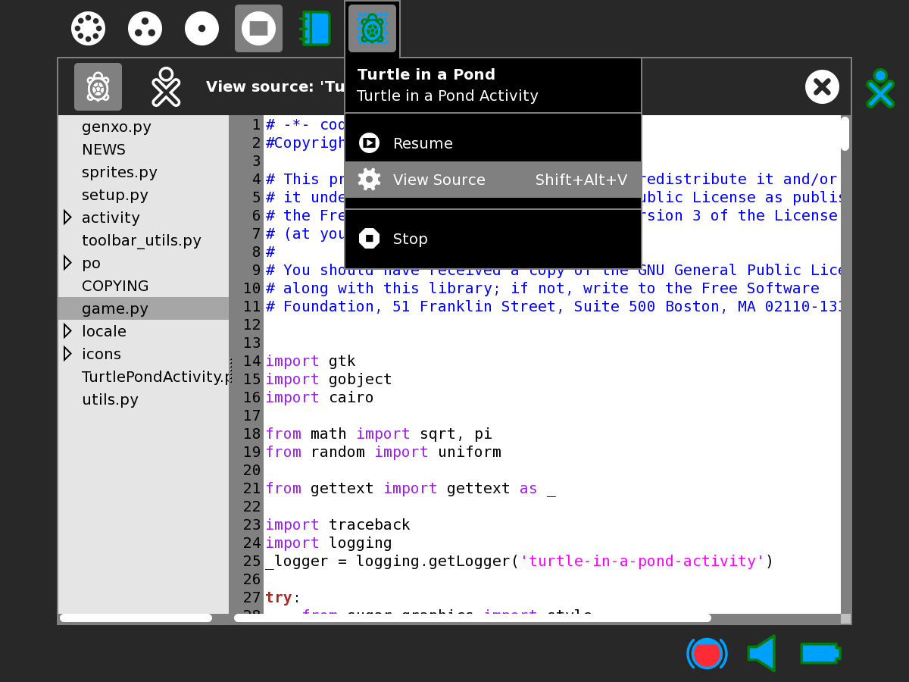
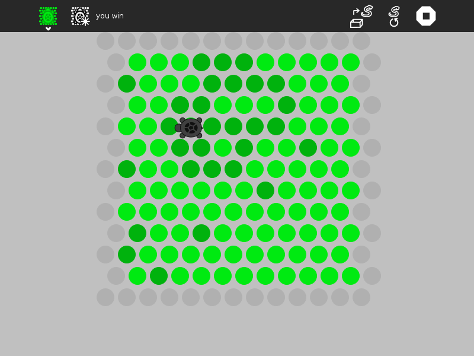
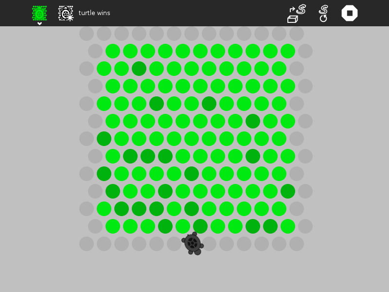

.. _turtle-in-a-pond:

================
Turtle in a Pond
================

Turtle in a Pond is a strategy game. The goal is to surround the turtle
before it runs off the screen. (Turtle in a Pond was inspired by the
game `Circle the
Cat <https://www.crazygames.com/game/circle-the-cat>`__.)

How to play Turtle in a Pond
----------------------------

Click on the dots to keep the turtle from escaping.

+----------------------------+-----------------------------+
| |Turtle-in-a-pond-win.png| | |Turtle-in-a-pond-lose.png| |
|                            |                             |
| The turtle is captured     | The turtle escaped          |
+----------------------------+-----------------------------+

Did you know that:

-  You can load your own `strategy <#turtle-in-a-pond-strategy>`_ for the turtle by
   importing Python code you can write with
   `Pippy <http://activities.sugarlabs.org/en-US/sugar/addon/4041>`__?

The Toolbars
~~~~~~~~~~~~

from left to right

#. the Activity toolbar button (shown in the open position)
#. the New-game button
#. the Beginner level (uses beginner strategy below)
#. the Intermediate level (uses intermediate strategy below)
#. the Expert level (uses expert strategy below)
#. the Custom level (uses user-designed strategy below)
#. an area for messages
#. the Load-new-strategy button
#. the Activity stop button

.. _turtle-in-a-pond-strategy:

Strategy
--------

Cut and paste these examples into Pippy and save then to your Sugar
Journal. Then use the Load-new-strategy button in the Turtle-in-a-Pond
Activity to try them. They are written in Python, you can learn about
Python by reading the `Python Documentation <http://docs.python.org>`__

In this strategy, the turtle moves down regardless of whether the dot is
open.

::

    def _turtle_strategy(self, turtle):
        turtle[1] += 1
        return turtle

In this strategy, the turtle moves down until it is blocked (i.e., when
the dot type is True).

::

    def _turtle_strategy(self, turtle):
        if not self._dots[self._grid_to_dot((turtle[0], turtle[1]+1))].type:
           turtle[1] += 1
        return turtle

In this strategy, the turtle searches for an open dot, looking
clockwise.

::

    def _turtle_strategy(self, turtle):
        dots = self._surrounding_dots(turtle)
        for i in range(6):  # search for an opening
            if not self._dots[dots[i]].type:
                return self._dot_to_grid(dots[i])
        return turtle

In this version, the turtle orientation is set as well.

::

    def _turtle_strategy(self, turtle):
        dots = self._surrounding_dots(turtle)
        for i in range(6):  # search for an opening
            if not self._dots[dots[i]].type:
                self._orientation = i
                return self._dot_to_grid(dots[i])
        return turtle

The turtle choose a random direction and goes there if the dot is open.
(This is the beginner strategy.)

::

    def _turtle_strategy(self, turtle):
        dots = self._surrounding_dots(turtle)
        n = int(uniform(0, 6))  # choose a random orientation
        for i in range(6):  # search for an opening
            if not self._dots[dots[(i + n) % 6]].type:
                self._orientation = (i + n) % 6
                return self._dot_to_grid(dots[(i + n) % 6])
        return turtle

In this strategy, the turtle will go off the edge if it can. (This is
the intermediate strategy.)

::

    def _turtle_strategy(self, turtle):
        dots = self._surrounding_dots(turtle)
        for i in range(6):  # search for an edge
            if self._dots[dots[i]].type is None:
                self._orientation = i
                return self._dot_to_grid(dots[i])

        n = int(uniform(0, 6))  # choose a random orientation
        for i in range(6):  # search for an opening
            if not self._dots[dots[(i + n) % 6]].type:
                self._orientation = (i + n) % 6
                return self._dot_to_grid(dots[(i + n) % 6])
        return turtle

In this version, it looks for a path to the edge in the direction it was
already heading.

::

    def _turtle_strategy(self, turtle):
        dots = self._surrounding_dots(turtle)

        for i in range(6):  # search for an edge
            if self._dots[dots[i]].type is None:
                self._orientation = i
                return self._dot_to_grid(dots[i])

        if self._daylight_ahead(turtle):
            return self._dot_to_grid(dots[self._orientation])

        n = int(uniform(0, 6))  # choose a random orientation
        for i in range(6):  # search for an opening
            if not self._dots[dots[(i + n) % 6]].type:
                self._orientation = (i + n) % 6
                return self._dot_to_grid(dots[(i + n) % 6])
        return turtle

A weighing function is used: preference is given to dots closer to the
edges.

::

    def _turtle_strategy(self, turtle):
        dots_ordered_by_weight = self._ordered_weights(turtle)
        if self._dots[dots_ordered_by_weight[0]].type is None:
            return self._dot_to_grid(dots_ordered_by_weight[0])
        elif not self._dots[dots_ordered_by_weight[0]].type:
            return self._dot_to_grid(dots_ordered_by_weight[0])
        else:
            return turtle

This is the expert strategy.

::

    def _turtle_strategy(self, turtle):
        dots = self._surrounding_dots(turtle)
        for i in range(6):
            if self._dots[dots[i]].type is None:
                self._orientation = i
                return self._dot_to_grid(dots[i])
        dots_ordered_by_weight = self._ordered_weights(turtle)
        for i in range(6):
            self._orientation = dots.index(dots_ordered_by_weight[i])
            if self._daylight_ahead(turtle):
                return self._dot_to_grid(dots[self._orientation])
        n = int(uniform(0, 6))
        for i in range(6):
            if not self._dots[dots[(i + n) % 6]].type:
                self._orientation = (i + n) % 6
                return self._dot_to_grid(dots[(i + n) % 6])
        self._orientation = (i + n) % 6
        return turtle

The dots are stored in a 13✕13 array. Each dot has an attribute, 'type',
that determines it status. The edges have a type=None. Occupied dots
have a type=True. Unoccupied dots have a type=False.

Your strategy should start with:

``def _turtle_strategy(self, turtle):``

The turtle argument is a tuple containing the column and row of the
current turtle position. That is, turtle[0] is the horizontal position
and turtle[1] is the vertical position.

Your strategy should return a tuple containing the column and row of the
new turtle position, e.g.,

``return [column, row]``

Resources
---------

There are some resources that you can use in your program, including:

**self.\_surrounding\_dots((column, row))**
  returns an array of dots surrounding a given position in the grid
  
**self.\_daylight\_ahead((column, row))**
  returns True if there is a clear path to the edge heading in the current direction
  
**self.\_ordered\_weights((column, row))**
  returns an array of surrounding dots ordered by their distance from the edge
  
**self.\_dots**
  the array of dots from which you can test the type attribute (self.\_dots[i].type==None → edge; self.\_dots[i].type==False → open; self.\_dots[i].type==True → blocked)

**self.\_orientation**
  you can set the orientation of your turtle by assigning a number from 0-5 (clockwise beginning with 30 degrees from north)

**self.\_set\_label('your message here')**
  you can write a message on the toolbar if you want to communicate what your turtle is thinking

**self.\_grid\_to\_dot((column, row))**
  returns the dot that is at a grid position (column, row)

**self.\_dot\_to\_grid(dot):**
 returns an array (column, row) representing the grid position of a dot

Digging deeper
--------------

To better understand how to use the above resources, view the program
source. Look at game.py for code relating to game strategy.
`View\_Source <https://wiki.sugarlabs.org/go/View_Source>`__

If your Sugar distribution includes the Gnome editor GEdit, you can use
it to view and edit the program source. In Terminal type

``gedit``

You will find the program source at

``/home/olpc/Activities/TurtleinaPond.activity``

See
`Activity\_Team/Modifing\_an\_Activity <https://wiki.sugarlabs.org/go/Activity_Team/Modifing_an_Activity>`__
for other methods for viewing and editing the source.

Where to get Turtle in a Pond
-----------------------------

The Turtle in a Pond activity is available for download from the `Sugar
Activity Library <http://activities.sugarlabs.org>`__: `Turtle in a
Pond <http://activities.sugarlabs.org/en-US/sugar/addon/4516>`__

The source code is available on `GitHub <https://github.com/sugarlabs/turtlepond>`__.

