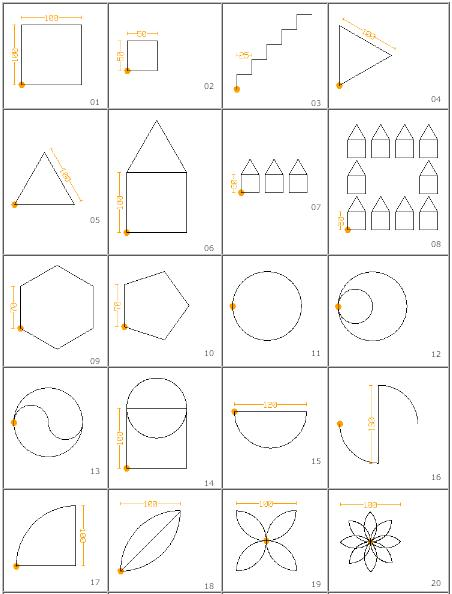
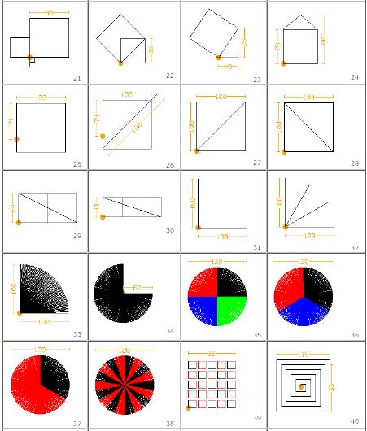
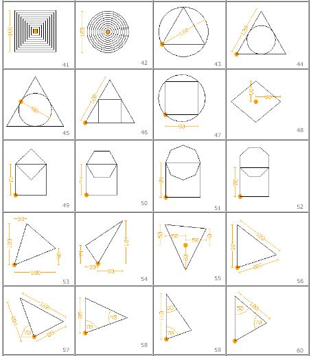
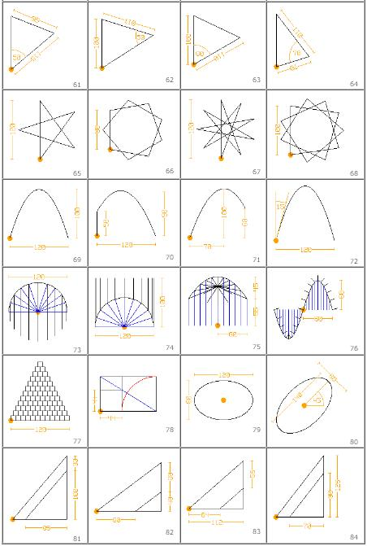

:orphan:

.. _turtleart-challenges:

Challenges
----------

Gary Stager has `some introductory challenges <http://stager.tv/blog/wp-content/uploads/2013/10/Early-Turtle-Art-activities.pdf>`_ he uses with 3rd Grade students.

Do Barry Newell's 40 shapes challenge `[1] <http://billkerr2.blogspot.com/2009/08/40-maths-shapes-challenges.html>`_ (The Turtle Confusion puzzles have been incorporated into a new activity (See :ref:`Turtle Confusion <turtle-confusion>`)).

.. image :: ../images/Newellchallenges.jpg
    :width: 550px

Do Daniel Ajoy's Geometry Exercises
`[2] <http://neoparaiso.com/logo/ejercicios-de-geometria.html>`_

|image1|

|image2|

|image3|

|image4|

**Mike Leishman's 10 Green Bottles Competition.**

The idea is that you write a program to display the words of the song
“10 green bottles”
`[3] <http://kidsprogramming.pbworks.com/w/page/12770073/10-green-bottles>`_

Can you get the computer to sing in tune using the `espeak
-p <http://espeak.sourceforge.net/commands.html>`_ option

**Mike Leishman's Guess the Number**

Write a guessing game computer program. It must ask the user to guess a
secret number between 1 and 100 and continue until the secret number is
guessed. If the user guesses the wrong number, display a message stating
that they are too high or too low such as “Bad Guess – Too High - Try
again”. Make your program count the number of guesses taken. When the
user guesses the correct number, display the Message “You guessed it in
<number of guesses> guesses” and stop the program.

Extension: You can also provide the user with other information such as
“cold”, “warm” and “hot” depending on how far out their guess is.
`[4] <http://kidsprogramming.pbworks.com/w/page/12770106/Guess-the-Number>`_

**Generating numbers**

Calculate the values of pi `[5] <http://en.wikipedia.org/wiki/Pi>`_ and e
`[6] <http://en.wikipedia.org/wiki/E_%28mathematical_constant%29>`_, find
the prime numbers up to 1000

How many different ways can you do it?

How fast can you do it?

**Pizzas**

Write a program to solve: A small pizza costs 120 pesos. A large pizza
costs 160 pesos. You spent 920 pesos in total. How many small and many
large pizzas have you bought?
`[7] <http://wiki.laptop.org/go/Aplicacion_Problema_de_Pizzas>`_

**Project Euler** `[8] <http://projecteuler.net/index.php?section=problems>`_

Project Euler is a series of challenging mathematical/computer
programming problems that will require more than just mathematical
insights to solve. Although mathematics will help you arrive at elegant
and efficient methods, the use of a computer and programming skills will
be required to solve most problems.

**Python Challenge** `[9] <http://www.pythonchallenge.com/>`_

The Python Challenge is a set of riddles that require a little bit of
Python programming to be solved. The solutions are entered by changing
the address of the page (URL). You get used to the idea pretty fast
after solving the first few levels.

