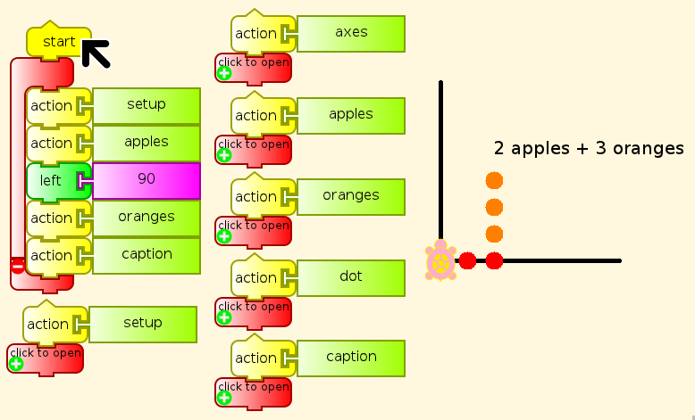

.. _adding-apples-and-oranges:

=========================
Adding Apples and Oranges
=========================

The saying “You can't add apples and oranges” is one of the casual
cruelties that adults unthinkingly perpetrate on children. If you asked
them in the best Socratic tradition, they would have to agree that you
can put two apples and three oranges into a bowl, and that this is a
form of addition that is particularly natural to children. What the
saying was intended to convey is that the sum

``2 apples + 3 oranges``

cannot be reduced or simplified to some number of apples or some number
of oranges, a very different fact from what it plainly says. Now it is
true that you cannot add two apples and three oranges in simple integer
arithmetic, but that is only one of many kinds of arithmetic. The
blanket prohibition without the context is false.

I say that this is casual, unthinking cruelty. It gets much worse when
we come back to the same children years later and demand that they add x
and y, in clear violation of this principle.

“Oh, but that's not what we meant! Besides, x and y are numbers, and of
course you can add numbers.”

No doubt, but it is what you said back then, with no further
explanation. Now you have offered an explanation. Let us see what it
explains. You say that x and y are numbers. What kind of numbers? “Well,
variable numbers, of course.” I'm sorry, but that won't do. Numbers do
not vary, as children well know, even if you erroneously think you know
otherwise.

Do you even know what you mean? I doubt it. The history of mathematics
has many examples of people talking confidently about things they have
no real understanding of, and denying the possibility of what turns out
to be whole new branches of mathematics. Irrational numbers, negative
numbers, imaginary numbers (notice the intended insults), non-Euclidean
geometry, infinities and infinitesimals...“All right, if you're so
smart, what are variables?” Glad you asked. It is not that I am so
smart, but that mathematicians share their ideas, and advance their art.
Computer Scientist Ken Iverson in particular has pointed out that the
function of variable names in much of mathematics and all of computer
programming is the same as the function of pronouns. They are names that
we can attach to something or someone temporarily in order to speak
without constant repetition, and to something or someone else at any
moment. Pronouns and variable names are not the same, having other
purposes that do not overlap, but it is possible and even desirable to
speak of variable names as pronouns in this specific context. It is even
legitimate to speak of variables as pronouns, even though there is no
such thing as a variable, only a variable name.

Where does Turtle Art come into this? Turtle art has variables, of
course, which it calls boxes to reduce confusion, and we can name one
“apples” and one “oranges”, and add them as vectors in a two-dimensional
space, the TA on-screen workspace. I don't want to take the trouble to
make the turtle draw apples and oranges, so I will use colored dots
instead, orange and red. (Feel free to improve on my work, as real
mathematicians, artists, and so on do.) Here you go.

The idea of the box in Turtle Art is that we have a box with a name on
it, and we can put a number or a bit of text inside to take out or make
copies of later. This model, like the model of pronouns, provides an
easy way for children to avoid being confused by adults talking in
nonsensical shorthand that would require an explanation that most adults
do not know how to give.
