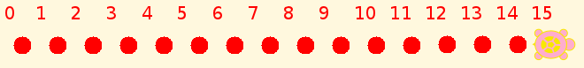

.. _counting:

========
Counting
========

Challenges
==========

How do you teach a turtle to count? In considerable detail. Try it, and
compare your program with :ref:`mine <ta-counting-program>`.

I told the turtle to start at 0, and then after every dot, to put down
the next counting number. 0 dot 1 dot 2...

-  You can change the size or color of dots and numbers, spacing,
   orientation, the number to count to...

-  How about counting by 2s or 3s? Put down a group of dots and then the
   next number.

-  Counting backwards should be easy. No, wait, how do you take away
   dots?

-  Can you count :ref:`two apples and three oranges<adding-apples-and-oranges>`?
   How do you do it?

Discussion
==========

What is counting? Think about it first before you go on reading.
Pre-school children can count up to some level, so there is a tendency
to think that counting is trivial. This turns out not to be the case.
Understanding counting, numbers, and numerals even as well as we do
today has taken us thousands of years, and mathematicians don't think we
are done.

We count by moving objects or pointing to them, or to representations of
them, and saying the names of numbers. Moving and pointing are not the
essence of counting, nor are the number names, which are different in
every language. What is essential?

One of the most essential things about counting is getting the same
number each time you count. This is not always the case. One of my
favorite little books in high school, *Statistics in a Nutshell*, said
that if you think counting always works, you should try counting a heap
of boiled peas the size of a dunce cap over and over until you get the
same number twice. That means that we have to think about what we are
counting, and try to count only what can be counted.

Another essential point is that we can count as many things as we
encounter, whether physical objects, or objects in mathematics that
exist only in our minds. We can always add in one more, or for that
matter, take one away, until we get to 0, where we have to stop.

Mathematicians took counting for granted until the 19th century, except
for the question of inventing bigger numbers, which Archimedes solved in
The Sand Reckoner more than 2,000 years ago. We use variations on his
method, such as

-  counting by thousands, millions, billions (US), and so on

-  using the metric/SI prefixes kilo, mega, giga, tera, peta...

-  scientific notation, such as 1e12 for a trillion/tera.

A light-year is about 10 trillion kilometers, or 10 petameters, or 1e13
m.

Going in the other direction, we have milli/1e-3, micro/1e-6, nano/1e-9,
pico/1e-12, femto/1e-15. A neutron is about a femtometer across, so
escaping neutrinos pass about 1e15 neutrons per meter of travel inside a
neutron star. Its density is something like 1e45 neutrons per cubic
meter. (At that density, physicists don't know whether they all remain
neutrons, or turn into something else, perhaps strange matter containing
strange quarks.)

Mathematicians have devised ways to write much bigger numbers than
these, but that would take us too far out of our way. You can look them
up if you are interested.

`Knuth's notation for really big
numbers <http://en.wikipedia.org/wiki/Knuth%27s_up-arrow_notation>`__.

All of this naming and creating notations for numbers is important to
counting, in a broad sense, but it does not bring us any closer to what
counting *is*. The problem did not become critical until Georg Cantor
started thinking seriously about infinite sets of different sizes. This
starts with the number of ordinary, finite counting numbers, which is
obviously bigger than any of them, or the number of points on a line,
which turns out to be larger still. Counting one number at a time is not
sufficient for dealing with such numbers. It turns out that there are
lots of infinite numbers, so many that we humans can't count them all.
Oh, we could give a name to the number of infinities, and we know that
it is bigger than any of the other infinities, but that's about all.

Cantor's solution to defining counting was to direct attention to the
connection we make in ordinary counting between the Nth object and the
number N. We make what is called a one-to-one mapping between numbers
and objects in ordinary counting, one number per object and one object
per number. This turns out to work for infinities, too. Cantor proved
many things about infinite numbers, but left many questions behind, some
of which were solved in the 20th century, and some of which are still
puzzles today. Nobody has come up with a better idea, so one-to-one
mappings still give us the standard definition of counting in
mathematics.

Notice that counting does not actually require numbers. We could count a
bag of pebbles against another bag of pebbles, with the result that one
has more pebbles than the other, or the reverse, or that the numbers are
equal. We can count the people in a theater or stadium that is full to
capacity by noticing that there is a one-to-one mapping between people
and seats defined by who is sitting in each one.

The Italian mathematician Giuseppe Peano did the most successful work on
`defining counting <http://en.wikipedia.org/wiki/Peano_axioms>`__, or
rather the counting numbers, also called the natural numbers. It turns
out that there is a hole in his definition that gives us the option of
counting beyond infinity, in what is called `Non-Standard
Arithmetic <http://en.wikipedia.org/wiki/Non-standard_model_of_arithmetic>`__.
But we can't do that with the Turtle, so I'll let it go for now.
