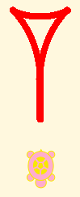
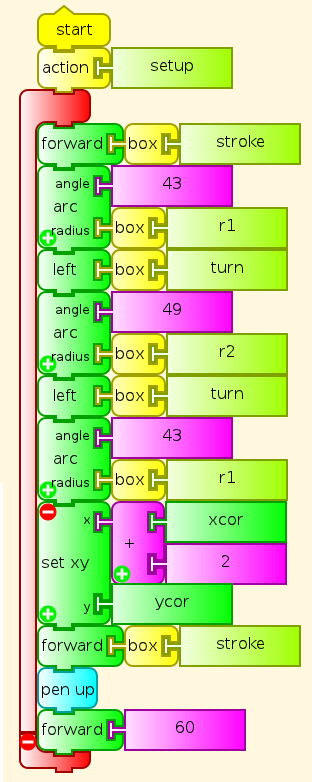
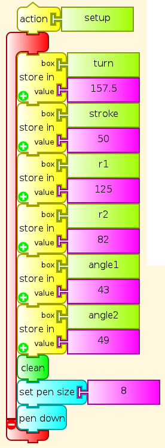

:orphan:

.. _cuneiform-wedge-glyph-program:

=============================
Cuneiform Wedge Glyph Program
=============================

The cuneiform wedge glpyh programmed here

is not defined mathematically. This program approximates it with
circular arcs, which have been fitted by eye and by experimenting with
values in the program. If this is not to your liking, you may be able do
design an element that suits you better, and then use it to program a
set of cuneiform visual numerals with it. We could compare various
versions, and as with fonts for any writing system, we might decide that
we like certain ones better than others.

