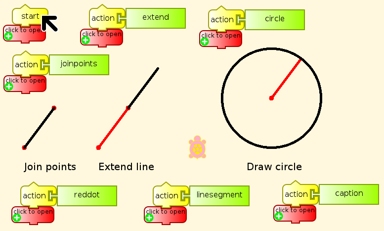
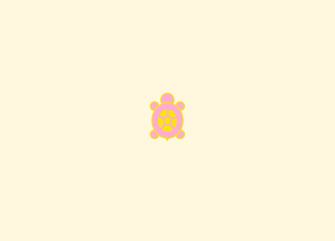
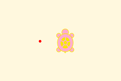
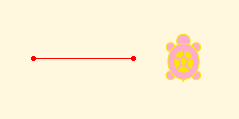
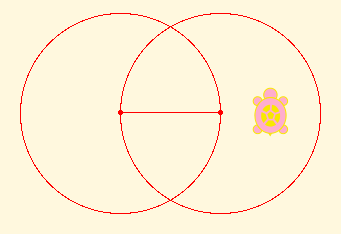
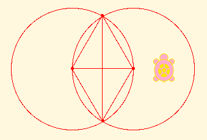
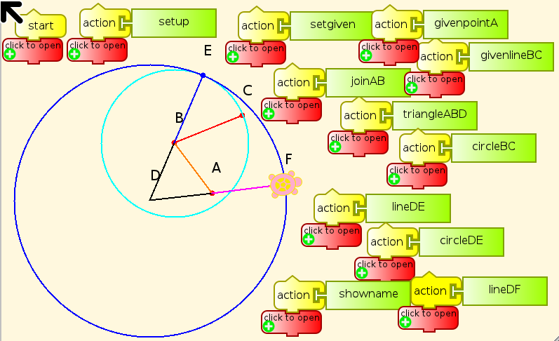

.. _euclid:

======
Euclid
======

Tortoise, dreamily: That beautiful first proposition of Euclid. You
admire Euclid?

Achilles: Passionately! So far, at least, as one *can* admire a treatise
that won't he published for some centuries to come!

Lewis Carroll, “What the Tortoise said to Achilles”

Euclidean geometry, specifically Euclid's Elements, asks a sequence of
questions with very definite answers about what can be constructed with
only straight lines and circles, with as few assumptions as possible. We
will examine that problem, from Euclid's point of view and some modern
points of view, and we will also ask some other questions, for which
there are no definite answers.

-  For example, why did Euclid do that? Other Greek mathematicians
   addressed significantly different questions in the various books that
   have survived from their time, and in fragments of books that have
   not survived, quoted in books that did.

-  Mathematics in other civilizations of the time was entirely different
   from Greek mathematics. Why is that?

-  Many important and fascinating questions were discovered later, well
   within the reach of Greek mathematics, that the Greeks apparently
   never asked, or in some cases asked and rejected as useless or
   meaningless. Why is that?

However, we cannot usefully ask ourselves those questions before we have
some understanding of Euclid's work.

The Essence of Euclidean Geometry
=================================

The Euclidean constructions are simply postulated, not explained in any
way. It turns out that you have to start somewhere, as Euclid was one of
the first to make clear. There are three things that Euclid gives
himself permission to do, without asking how they are done.

#. Join two given points with a straight line segment.
#. Extend a line segment as far as needed in either direction.
#. Given a line segment as radius, with one end designated as the
   center, draw a circle.

The given points and line segment are in red, and the constructed lines
and circles in black.

Examples
========

-  Suppose, since this is plane geometry, that we have a plane with no
   points in it “given”. Then we can perform none of these three
   constructions. We can, if we like, consider a geometry with 0 points
   and 0 lines as a trivial Euclidean geometry.

-  One point? Nope. We need two points or a line segment to do anything.
   Still trivial.

-  How about two points? Now we are getting somewhere. We can connect
   the two points with a straight line segment, and then extend the line
   segment.

We can't go anywhere in particular by doing so. But we can draw two
circles, one with each of the given points as center, and the line
segment joining them as radius.

Those two circles intersect in more points that are not on the original
line. We can mark them as given for future constructions, and join them
in pairs. Notice that we have two equilateral triangles, and that we
will be able to mark another point where two lines cross, and extend
several lines until they intersect both circles, and draw circles with
every new line segment as radius, and so on.

Some lines and angles in the diagram above are bisected in this
construction, and it turns out that we can bisect any given line and any
given angle, and then bisect the halves, and so on. So we can draw more
lines and more circles; we can mark more points; and so on and on
forever, with segments as long as we want and as short as we want. We
can also approximate any direction we want as closely as we want with
fractions of angles.

Carrying out this construction to the limit (an idea not in the range of
Greek thought, which rejected completed infinities) gives us the
smallest set of points that make up a complete non-trivial Euclidean
geometry. Pythagoras thought that it included every point in the plane,
but it was proved later on in Greek times that it omits infinitely many
points, such as the cube root of 2. In the 19th century, Georg Cantor
proved that point sets of this kind omit “almost all” points in the
plane, since the number of points omitted is vastly greater than the
number of points included. Infinitely greater, in fact. However, that is
a topic for another time, which requires a foundation not related to
Euclid's constructions. That should not prevent you from asking yourself
what it could mean for one infinite number to be infinitely larger than
another, a question that Greek mathematicians could not have dreamed of,
much less asked seriously.

-  If we started with just one given line segment, that would give us
   its two endpoints, with the same result as just above.

-  How about three points, or a line segment and a new point, not one of
   the endpoints? Well, it may be that we can construct one of these
   points starting from just the other two, giving the same result as
   before. Or it may not be so, in which case we can construct many
   other new points, again continuing on forever.

Back to Euclid
==============

Euclid did not proceed in the manner we just have, thinking about all of
the points, lines, and circles that can be constructed from the three
postulated operations without making any distinction among them. Euclid
aimed to construct specific kinds of figure made from very specific
points, lines, and circles. His goal in the Elements was the
construction of all of the regular polyhedra discovered by the
Pythagoreans (which are therefore ^\_^ called the Platonic solids).
However, at the very beginning, in Proposition 1 of Book I of the
Elements, the one that Lewis Carroll's Tortoise mentioned above, Euclid
did proceed much as we have done, because there was no alternative.
Until we get to this point, there is nothing else we *can* construct.
Proposition I,1 calls for constructing an equilateral triangle, as we
did above, and then proving that that is what we did. Proof falls
outside what we can do with Turtle Graphics, although at a much higher
level it is possible and even useful to program theorem provers that
work on propositions expressed in text, and not in images.

Euclid, I,2. At a given point (A) to construct a line equal to a given
line (BC).

Now, as you see, we have significantly greater scope, just from being
able to draw an equilateral triangle. Similarly, the ability to copy
lines will allow us to do vastly more again. This rapid expansion in
geometric abilities is very similar to the expansion of abilities in
programming as we define functions that we can use freely in further
programming. It is unusual to start from such a small base in
programming as Euclid does in geometry, but it can be done, as in Pure
LISP (car, cdr, cons) or Unlambda (S, I, K). This may be more
information than you require, but there will be some who are interested.

The construction is, beginning with the point A and the line segment BC
as given,

-  Join A and B (orange)
-  Construct the equilateral triangle ABD (black)
-  Draw the circle BC (cyan)
-  Extend the line DB to E (blue)
-  Draw the circle DE (blue)
-  Extend the line DE to F (violet)

Then we have to prove that BC = AF, so that AF is the desired copy of
BC, with one end at A.

More questions
==============

More fundamentally, what does it mean for a point to be “given”? No
comment from Euclid. But it turns out that the three assumed
constructions are all that we need to know about given points and line
segments. We don't have to know how to give one or the other at the
beginning of a problem, and we don't have to know how to do the three
constructions. It is sufficient, in a proof, to just say, “Do it.” What
matters is that all of the constructions and proofs in Euclid's elements
are built out of just those three constructions, and that we can take
intersections of previously constructed lines and circles as given for
doing further constructions.

This is often caller “ruler and compass” construction, but it is
important to understand that the ruler is unmarked, and the compass
maintains a radius only as long as the center is unchanged. So to begin
with, we cannot copy lengths from one place to another. Euclid addresses
that lack as quickly as possible, in Proposition 2 of Book 1, as we have
just seen.

The first and third of the Euclidean constructions are quite definite,
but “as far as needed” is rather vague. Usually it means “until the line
intersects some line or circle of interest”. This commonly means that we
have to prove that they will intersect before we can invoke this
construction, or that the fact of intersection is something previously
assumed.

Euclid made various assumptions. The most important, the Fifth
Postulate, is about when straight lines intersect. This is known as the
Parallel Postulate because it says when lines are not parallel, and is
then used to determine when they are. (This sort of thing is considered
perfectly ordinary in math.) However, he said nothing about other cases
that could be assumed to be obvious, such as when circles intersect.

Euclid for Turtles
==================

Before we can get to copying lengths, however, we have to determine how
to tell the turtle to do Euclid's three constructions. The starting
point in Turtle Art is of course quite different from Euclid's starting
point, with given points and lines. The Turtle has a position, some
graphics properties, and a set of blocks for movement.

-  Forward
-  Back
-  Left
-  Right
-  Arc
-  Set xy
-  Seth (heading)

There are blocks that give the Turtle's x and y coordinates, and there
are blocks to read the color of the current point. None of these defines
a way to join points drawn on the screen. We can certainly extend lines
if the Turtle is on the line and facing along its length. There is a
block for drawing circular arcs, but it wants us to give it numbers, not
a line and a point. We do not have a block for measuring a line drawn on
the screen. The Turtle has two coordinate systems that it can work in,
polar and rectangular, but Euclid's ruler and compass know nothing about
coordinates, which only came into mathematics about 1,900 years later.
Euclid can only measure distances by taking a given line as a unit, and
then can at best measure lengths constructible by the three given
functions, or can give approximations to the length.

So how do we give the Turtle points and lines to start out with? Does
that mean that we have to think about how the Turtle can find points in
the plane, including intersections of lines and ends of line segments?
It cannot see, and intersections may lie outside our finite workspace on
the screen. There seems to be a problem with that.

Then we have to think about what a Turtle knows about any point. The
Turtle knows nothing about any point other than the point where it is
currently located, unless we give it a memory for points. How we can
tell it to move to other points, and draw lines between them?

With all of these objections that I have been raising, you might wonder
how I got the Turtle to carry out the three Euclidean constructions in
the first illustration above. That's easy. I cheated. Take a look at the :ref:`program <euclid-cheating>` for these
postulated constructions to see how.

*The advantages of the method of postulation are great. They are the
same as the advantages of theft over honest toil.*

Bertrand Russell

In order to do these three postulated constructions without this level
of cheating, we have to tell the Turtle explicitly where points are in a
coordinate system that it understands, and do some high-school level
algebra and trigonometry in order to find out the direction to point the
Turtle in and the distance it should move, or the radius of the circle.
We have two relatively simple ways to tell the Turtle where a point is.
Assign its x and y coordinates to variables, or put the
values on the stack.

Euclidean Algebra
=================

It turns out that the three Euclidean constructions can give us new
points from older ones by combinations of addition, subtraction,
multiplication, division, and taking square roots, but cannot do
anything else.
