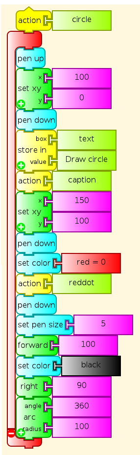

:orphan:

.. _euclid-cheating:

==============
Euclid Program
==============

-  To join two points with a line, I actually set the Turtle on a point,
   set its heading (the direction it was pointing) and sent it off in
   that direction both to draw the second point and to draw the line
   joining the points.

-  To extend a line, I drew it, and then told the Turtle to go forward
   in the same direction.

-  To draw a circle, I put the Turtle at the outer end of the line, and
   told it the radius length.

