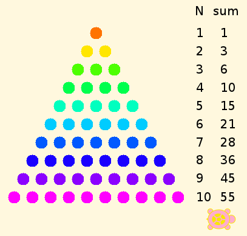

.. _figurate-numbers:

================
Figurate Numbers
================

Most of us are familiar with triangular numbers, such as the arrangement
of ten bowling pins in a triangle,

|    .
|   . .
|  . . .
| . . . .

or square numbers,

| .  .  .  .
| .  .  .  .
| .  .  .  .
| .  .  .  .

but we don't necessarily know how their arithmetic works, or whether we
can do the same with, say, pentagons. Pythogoras, the founder of Greek
mathematics, is said to have discussed these figures and their
relationships. We know that the triangle of 10 points, called the
tetractys in Greek, was a central element in the Pythagorean religion.

Can we learn something by telling a turtle how to make these numbers?
Let's try.

Linear numbers
==============

Before we get to triangles, squares, and so on, we need to have a few
tools, such as those provided in the :ref:`Counting <counting>` tutorial, so that
we can create figures and post notes about them. Then we can add a few
more things.

Triangles
=========

What should we add? How about making dots of different colors, and
providing notes about how many of each, plus the running total?
Easy-peasy. We just need to do the arithmetic to work out where to put
everything.

The :ref:`program to generate the triangular numbers <triangular-numbers-program>`
takes up a lot of space, so I am putting it on another page.

A problem that TA can't solve for us directly is the formula for
triangular numbers. Gauss figured it out on his own as a child, but the
rest of us need a hint, at least. Here is a big hint.

The area of a rectangle can be written Base × Height. The area of a
right triangle is half the area of a rectangle with the same Base and
Height. Can you do the rest?

Other Figurate Numbers
======================

Two-sided polygons may or may not be allowed in a particular geometry,
but they are not of interest here, because both sides are necessarily of
the same length in Euclidean geometry and Lobachevskian/hyperbolic
geometry, and of indeterminate length in Riemannian/elliptic geometry,
rather like cutting a great circle on a sphere into two pieces.

.. figure:: ../../images/TACounting.png
   :alt: TACounting.png
