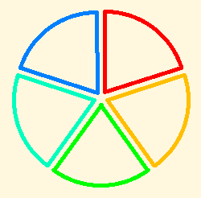

.. _fractions:

=========
Fractions
=========

This is the outline that will be fleshed out in Turtle Art.

-  Cut a pie in pieces, and color some of the pieces, as Tony did. That
   gives the basic idea of a fraction. Point out that when you cut a pie
   in, say, 5 pieces, you are doing 1 divided by 1/5.

-  Cut more than one pie in the same number of pieces each. This lets us
   talk about “improper” fractions and mixed fractions (integer plus
   fraction), and converting between them. We can also introduce
   rational numbers at some stage of child development.

-  Cut a pie in pieces, and cut the pieces into smaller pieces
   (multiplication of the simplest fractions, such as 1/2 times 1/3).
   Some fractions can be described using the bigger pieces, and some
   require the smaller pieces. Talk about reducing fractions to lowest
   terms. (You will need other materials in order to talk about Greatest
   Common Divisors. I'll do something on that.) Take some time on
   multiplying fractions. Then notice that, for example, if you divide a
   pie into sixths, three of the pieces make a half. 3 times 1/6 is 1/2,
   so 1/2 divided by 3 is 1/6, and 1/2 (= 3/6) divided by 1/6 is 3.
   (Assuming prior understanding that if the product of, say, 2 and 3 is
   6, then 6/3 = 2 and 6/2 = 3.)

-  Cut several pies. For example, cut two pies into three pieces each,
   and then color pairs of pieces. How many groups of two pieces make
   two pies? Congratulations, you have just divided 2 by 2/3.

-  Work other examples, dividing whole numbers by fractions, then
   fractions by other fractions, choosing cases that come out even to
   start with.

-  Now look at examples where one fraction does not go evenly into the
   other. What do you have to do to make sense of the remainder? Say you
   have a pizza cut into 8 pieces, and you have hungry pizza eaters who
   want three slices each. How many can you accommodate? Well, two, with
   two slices left over. Two slices is 2/3 of three slices, so that
   comes to 2 2/3 portions.

None of this requires Turtle Art. People have been learning fractions
for thousands of years. You can cut pies or cakes or plots of land or
the floor of the classroom or a tabletop or pieces of construction paper
to do all of this. Oh, yes. How many pieces do the local pizza parlors
cut pizzas of various sizes into? What fractions can you make from those
pieces? Can you find pictures of pizzas from directly above, so that
they appear as circles and you can print them and cut them up? (Yes.)
What else? Craters on the moon? The whole moon? Circular swimming pools,
fountains, ponds, coins, cups?

It remains an open question whether the children can discover the
invert-and-multiply rule for dividing fractions by themselves in a
sufficently rich environment, whether they will need broad hints, or
whether they will have to be told. It would be interesting to me to hear
how they would explain these ideas to each other. I will be interested
to hear your results.

.. note::
    You can help Sugar Labs by improving this article. Learn more at :doc:`/how_to_help`
