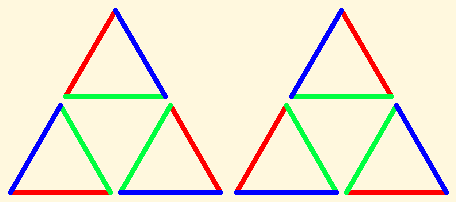

.. _groups-of-symmetries:

====================
Groups of Symmetries
====================

The idea of symmetry is one of the most powerful and beautiful in
mathematics, science, and art, and it is also one of the most accessible
to young children, even before they can talk, much less read. Block
sorting toys with differently shaped blocks and holes to put them
through are a huge favorite among toddlers, who soon grasp that blocks
can go into holes in different ways. Unfortunately, the toys leave the
matter there. But we don't have to.

Counting symmetries
===================

Let's ask children a question: How many ways can you turn an equilateral
triangle and put it back in the same space? Yes, you are allowed to flip
it over. We can present the same question with the block-sorting toy.
One of the blocks is a triangular prism in shape, and it goes into a
hole with the shape of an equilateral triangle. If you color the faces
of the block and the sides of the triangle, how many ways can you do
that and then match them up?

Using colors to distinguish the sides of a triangle, this is the answer.

Exactly the same options occur for the block and the hole. Why?

Any one of these positions can be taken as the original, and any as a
turned version. Of course, if we want to talk about turning one of them
to itself, we have to allow turning by 0°. This was once a contentious
notion, but the convenience of allowing 0 in many contexts has been
gradually reducing the discomfort people feel with the idea. That
convenience is easy to see here. With the 0 move allowed, the diagram
has a beautiful symmetry of its own. Removing one of the triangles on
the supposition that a 0 move isn't a move would destroy that symmetry.

Notice, please, that whether we allow 0 moves is not a matter of
mathematical fact. It is how we decide to define moving. Mathematicians
have been developing the idea for millennia that mathematical
convenience is more important in mathematics than our preconceived
notions of the fitness of things. The debate about definitions vs.
reality continues, particularly in set theory. But we do not have to
bother children with those questions, unless they ask.

I take a rather expansive view, separating the question of what we may
define (anything you like, as long as it is interesting) from what
exists (mathematical existence being an entirely different question from
physical existence). My son refuses to discuss vast infinities of
mathematical objects that go beyond our finite power of naming or
describing them. It is not that one of us is right and the other wrong.
Both of our views permit exactly the same sets of theories and proofs,
as do many other philosophical choices. It is a matter of taste, in
part. It is a question of what is fun, or what is useful for some other
purpose.

Putting these philosophical matters aside, we can ask our original
question about any shape, and we can classify shapes by the results.
Asymmetric shapes such as the letter 'P' can only be placed in the same
space in one way. A regular polygon of N sides can be placed in 2N ways.
There are many more options in three dimensions or more. For example, we
can place a cube on any of its six faces, and turn it like a square in
four ways after that, giving 24 rotations. You can't flip a cube over to
reverse its appearance in three dimensions, but we can imagine doing it
in four dimensions. Or we can just take a mirror image, which gives the
same result, and brings the total number of transformations to 48.

A circle can turn by any angle, giving an infinite number of ways to
place it. This particular infinity is named C, for Continuum or
continuous. Reflection doubles the number of options, but in this case
twice an infinity is the same infinity. (See Projective Geometry for an
explanation.) A sphere can turn by any angle around any axis. That also
does not increase the number of transformations beyond C. C × C = C.

Can you think of a shape that can be placed in exactly three ways?
Clearly that means that turning it over cannot result in a shape that
fits the original space, because that would give an even number of
moves. Can you think of such a shape that you can program in Turtle Art?

.. Note::

    You can help Sugar Labs by improving this article. Learn more at :doc:`/how_to_help`.
