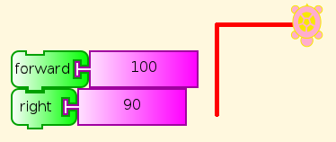
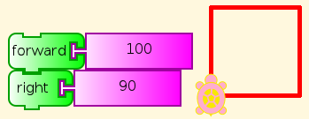

.. _mathematics-and-art:

===================
Mathematics and Art
===================

The advantages of the method of postulation are great. They are the same
as the advantages of theft over honest toil.

--Bertrand Russell

The same is true of art, where the saying is

Good artists borrow. Great artists steal.

and programming, where reusing code is one of the most important
elements of programmer productivity. Fortunately, we are not talking
about theft of personal property, but of ideas whose whole point is to
be shared. The theft is generally more than repaid by remixing the
stolen ideas to create something new.

Mokurai did not program this tutorial. He used three of the existing TA
examples, Square, Squares, and Flower, to create something more. Please
take note of the interweaving of direct hints and challenges to the
student to discover something.

Getting Started
===============

One of the first things a beginner in TA needs to do, after trying out
some blocks by themselves, is to connect two of them into a stack and
see what they do in combination. For example, (hint) you can read this,
and you can see by trying it what it does (discover).

What happens if we click this combination a few times (hint)? Watch.

A pre-schooler can understand this, and do what it says (See 
:ref:`You be the Turtle <you-be-the-turtle>`), although
help may be required to read the labels on the blocks here. (But see
:ref:`Turtle Art Programming Without Words <programming-without-words>`).
Of course, you can change the distance and angle. Which angles work? Do
you have to change anything else to make them work right?

Square
======

Let's add a few things: a repeat block and a start block. The start
block starts the main program. You might have noticed that clicking any
stack starts it running, so what is start needed for? (Hint: You click
something else. Do you know what?)

.. figure:: ../../images/TASquare.png
   :alt: TASquare.png

No mystery here, after our previous exercise.

Squares
=======

Fine then, we can add more.

Here is where the stealing (from ourselves) begins to get serious. How
much of this program do you recognize? What is different?

This time I'll give you the answer. Different size (300), and the
familiar block is surrounded by repeat 36 and right 10. Up until now, we
have ignored the 90 (degrees) in the right and left commands, but here
the student has to know a little about angle measure, at least that it
takes turns adding up to 360 degrees to go all the way around. And a
tiny bit of arithmetic. Which combinations of numbers work?

The result is rather more interesting than a simple, single square.
Wait, is that actually made of squares? Can you trace them? Does this
make sense? If you have any doubt about how it works, you can watch it
in slow motion using the tortoise (slow) or debug (really slow) icons,
or pull the program apart and run the pieces, as we did with our initial
forward-right stack.

Flower
======

Well, then, let's add a third repeat loop, but this time separate the
inner loops into separate actions. There are also some variables, for
color and size, and the student should at some point understand how
variables are set, to start off, and changed as the program runs. But
that is not necessary at first. Appreciating the result at the
pre-school level is enough to begin with. Making small changes and
seeing their effects is also good, as experience shows third-graders can
do. What if you replace the subtraction in setting the colors with
something else, or just change the starting number? Understanding all of
the pieces of the program can come later, and understanding how Turtle
Art makes each piece work, later still.

Two familiar parts with different numbers, including a variable box, and
a new loop.

.. figure:: ../../images/TAFlowerPicture.png
   :alt: TAFlowerPicture.png

Suddenly we have moved from basic geometry and programming to the
beginnings of art. Students who understands this much can read many of
the other examples provided with Turtle Art, and begin to understand how
the math, programming, and art fit together. Then they get to create
their own, and show them to everybody.
