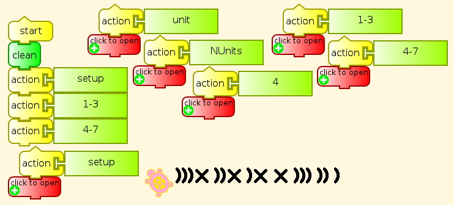
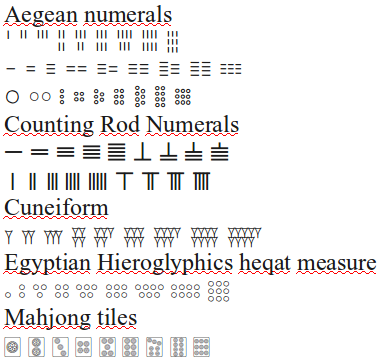
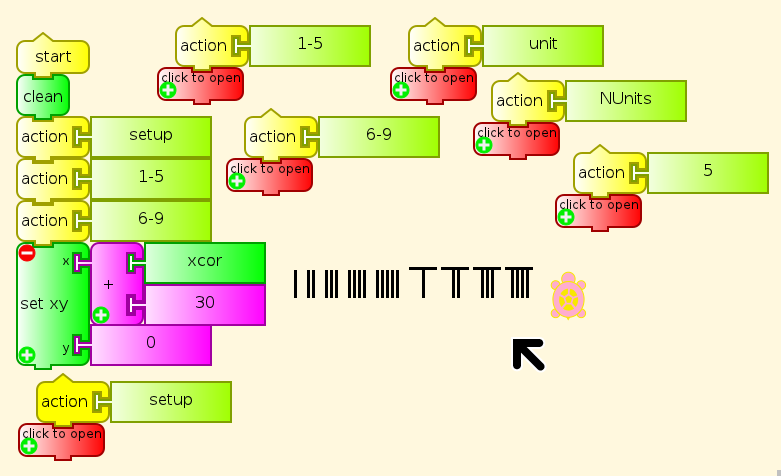
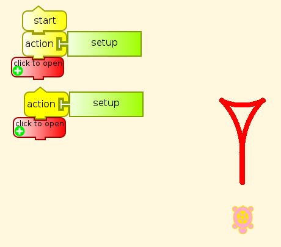
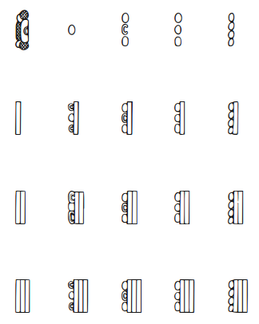
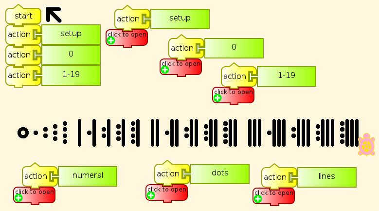
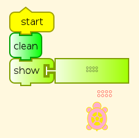
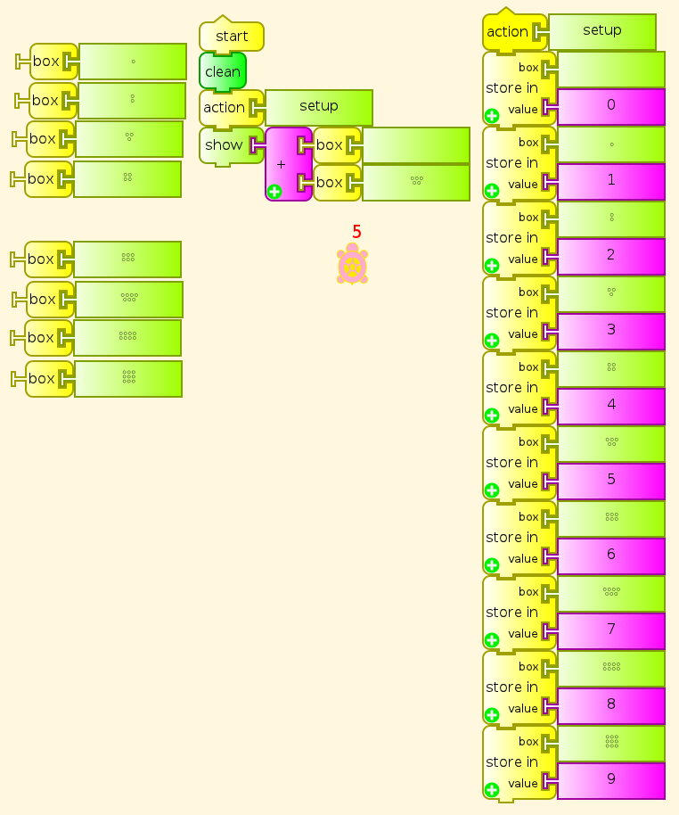
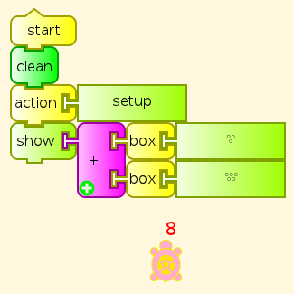

.. _numerals:

========
Numerals
========

There are several historical examples of systems for writing numbers
with numerals that show 1-9 copies of a basic visual unit, which can be
a line, a circle, a wedge-shaped cuneiform indentation, or other shapes.
Some of them add in an element representing four or five single units.
An advantage of any of these systems for us to consider is that
pre-literate preschoolers can deal with them by counting before they
have memorized the conventional digits. This makes arithmetic
particularly easy to demonstrate.

Origins of numerals
===================

The numerals used in various languages, living and extinct, show their
origins in stroke marks or scores (cuts), like the Chinese 一二三, and
the earliest forms of Hindu-Arabic-European numerals. The following are
Kharosthi numerals, among the earliest numeral forms known from India.
Kharosthi was written from right to left, like the source for its
writing, Aramaic, and the source for all alphabetic writing, Phoenician.
First we have an image, so that you don't need a Kharosthi font to view
it, followed by the numerals for 1–4 in Unicode text.

𐩀 𐩁 𐩂 𐩃

The first three of these are very similar to our modern numerals, except
that the 2 and 3 have been turned sideways during their migrations. The
numeral for 4 has been given a smaller turn, and a stroke added.

Kharosthi numerals exist for 5–9, but these are not of the visual type.
It was also possible to write numbers in Kharosthi in something like the
manner of Roman numerals, so that 2 would be 𐩀𐩀. However, Kharosthi uses
a numeral for 4 rather than 5 as in Roman numerals, indicating a custom
of counting on four fingers but not the thumb. The Kharosthi numeral for
4 is very similar to X, so 7 in Kharosthi can be approximated in ASCII
(right-to-left, again) )))X.

Naturally, we can teach a Turtle how to write this second form of
Kharosthi numerals.

The details of this program are on :ref:`another page <kharosthi-numerals-program>`.

The font for Kharosthi in Ubuntu Linux is in the package
ttf-mph-2b-damase, with the name damase.ttf. Package names in other
distributions may vary.

Visual numerals in Unicode
==========================

Here are many of the visual numerals that have made it into Unicode as
characters, appearing first as an image, so that you can see them even
if you do not have all of the fonts needed to display them. Then I have
provided them as text so that you can test which fonts you lack.

   UnicodeNumerals.png

| 𐄇 𐄈 𐄉 𐄊 𐄋 𐄌 𐄍 𐄎 𐄏
| 𐄐 𐄑 𐄒 𐄓 𐄔 𐄕 𐄖 𐄗 𐄘
| 𐄙 𐄚 𐄛 𐄜 𐄝 𐄞 𐄟 𐄠 𐄡

Counting Rod Numerals

| 𝍠𝍡𝍢𝍣𝍤𝍥𝍦𝍧𝍨
| 𝍩𝍪𝍫𝍬𝍭𝍮𝍯𝍰𝍱

Cuneiform

𒐕𒐖𒐗𒐘𒐙𒐚𒐛𒐜𒐝

Egyptian Hieroglyphics Heqat Measure

𓃉 𓃊 𓃋 𓃌 𓃍 𓃎 𓃏 𓃐 𓃑

Mahjong Tiles

🀙 🀚 🀛 🀜 🀝 🀞 🀟 🀠 🀡

Dice are also visual, but go up only to six, with no 0.

⚀ ⚁ ⚂ ⚃ ⚄ ⚅

Partitioning by fours and fives
===============================

Counting Rod Numerals show clear indications of counting on fingers up
to five, then with a whole hand for five plus fingers of the second
hand, as in Roman numerals.

I II III IIII V VI VII VIII VIIII

with the later abbreviations IV for IIII, and IX for VIIII.

Counting Rod Numerals and Roman numerals are of the same structure as
the Chinese and Japanese abacuses (abaci?) and the
Roman counting board with its little pebbles (Latin,
*calculus*/*calculi*, whence calculation and Differential and Integral Calculus).

Teaching the Turtle Visual Numerals
===================================

Here are the second form of Counting Rod Numerals drawn by a Turtle.

The details of this program are on :ref:`another page <counting-rod-numerals-program>`.

I leave the others as a programming challenge. You need to determine how
to draw the elements, and how to specify the layout of elements in each
numeral. For example, a program for the cuneiform wedge could go like
this.

The details of this program are on :ref:`another page <cuneiform-wedge-glyph-program>`.

Mayan base 20 numerals
======================

Mayan is also a candidate, notable because it is the only one of these
visual numeral systems with a numeral for zero, but Mayan has not yet
been added to Unicode. Mayan numerals go from 0 to 19. This is often
interpreted as counting on fingers and toes, with groupings of five for
hands and feet, although we have no other evidence for how they began.
The following is a schematic rendering of the Mayan numerals.

The actual numerals carved in stone are sideways from these, and
somewhat more elaborate.There are several variations on the shell glyph
for 0, and for its surroundings.

We can teach the Turtle to write numbers in Mayan style in base 20. I am
using an empty circle for 0 with these simplified forms rather than the
actual Mayan shell glyph. Feel free to program a shell glyph, if you
like, and add it here.

As usual, the :ref:`program details <mayan-numerals-program>`
appear on another page.

Visual Numerals in Turtle Art
=============================

It should be obvious that we can have a Turtle write out arithmetic
examples by drawing these numerals. Or we can tell the Turtle to display
these characters directly as text.

We can also put these numerals on Turtle Art boxes. In the following
illustration, each Hieroglyphic heqat measure numeral is used as a
variable name with the number it represents assigned as its value. As a
curiosity, the box with a blank name contains the value 0. It works fine
in arithmetic.

Another less trivial arithmetic example using variables with heqat
numeral names.

Unicode character ranges for visual numerals
============================================

The original Unicode code space ran from U+0000 to U+FFFF, a space of
65,636 code points. Since then 16 more spaces of that size have been
added, for a total of more than a million code points. Several writing
systems for dead languages have been put into this extra space, and so
have five-digit Unicode hex code point numbers.

-  Aegean Numerals

   -  Units U+10107–U+1010F
   -  Tens U+10110–U+10118
   -  Hundreds U+10119–U+10121
   -  Thousands U+10122–U+1012A
   -  Tens of thousands (myriad) U+1012B–U+10133

-  Counting Rod Numerals U+1D360–U+1D368; U+1D369–U+1D371

-  Cuneiform U+12415–U+1241D

-  Egyptian Hieroglyphics heqat measure U+130C9–U+130D1. Other
   hieroglyphic numerals U+13386–U+1338E; U+131BC–U+131C4

-  Mahjong Tiles U+1F019–U+1F021

-  Dice U+2680–U+2685

Fonts for Visual Numerals
=========================

The fonts listed here are available in Ubuntu Linux. Other distributions
may vary. There may be other fonts for these ranges for Windows or Mac
OS, either commercially or as freeware.

-  Aegean

   -  ttf-ancient-scripts/Aegean.otf
   -  ttf-mph-2b-damase/damase.ttf

-  Counting Rod

   -  ttf-ancient-scripts/Symbola.otf

-  Cuneiform

   -  ttf-ancient-scripts/Akkadian.otf

-  Egyptian Hieroglyphic

   -  ttf-ancient-scripts/Aegyptus.otf Private Use Area

-  Mahjong Tiles

   -  ttf-ancient-scripts/Symbola.otf

-  Dice (Miscellaneous Symbols)

   -  ttf-ancient-scripts/Symbola.otf
