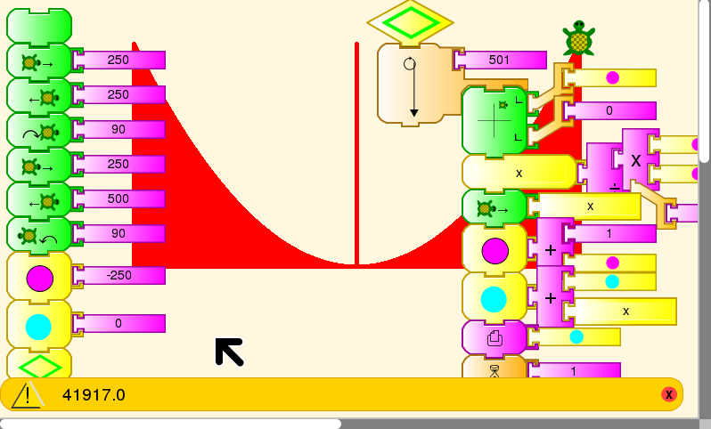
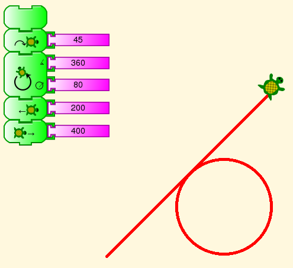
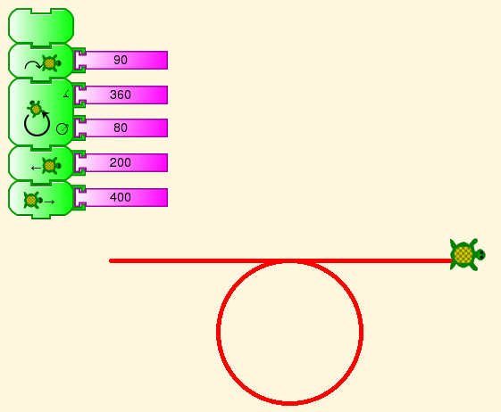
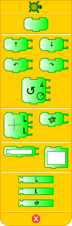
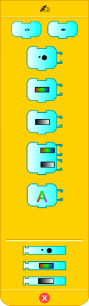
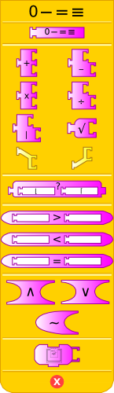
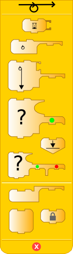
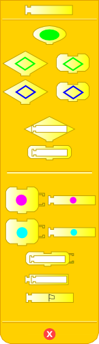
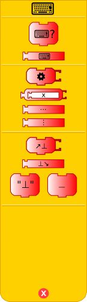
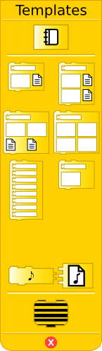

.. _programming-without-words:

=========================
Programming without words
=========================

Turtle Art blocks are named in the current language. Mokurai has created
an alternative language-independent “localization” for TA, using symbols
rather than words to name the blocks. He hopes that this will make TA
accessible to pre-schoolers, after some period working on
:ref:`You be the turtle <you-be-the-turtle>`. It has not
been made part of TA yet, but we are working on it.

Examples
========

Can you read these examples?

|Tangent to a curve| |Local maximum with level tangent|

Here is a more complicated one.

This example draws X and Y axes and graphs a function. Then it draws
lines from the X axis to the curve, and adds the area of the lines. This
approximates a Riemann integral. But never mind that. Can you read the
blocks?

Glossary
========

This is a listing showing English names for the blocks in the above
examples and their icons, either a Unicode character or a graphic. In
some cases the same symbol appears on two blocks of different shape,
where one is the definition of a subroutine stack or setting of a value
in a box, and the other calls the stack or accesses the value.

Turtle
------

-  **Forward** →
-  **Back** ←
-  **Right** ↷
-  **Left** ↶
-  **Arc** ↻

   -  **Angle** ∡
   -  **Radius** circle with arrow from center to edge

Pen
---

-  **Pen Up** ✑
-  **Pen Down** ✒

Numbers
-------

Some of these functions are named with math symbols +-×÷><=, which are
not changed.

-  **mod** \|
-  **random** ?
-  **not** ∼
-  **and** ∧
-  **or** ∨
-  **number** Not decided.

We are looking at various :ref:`visual numerals <numerals>` in Unicode.

Flow
----

-  **wait** ⌛
-  **if-then** Split arrow to Yes and Continue
-  **if-then-else** Split arrow to Yes and No, then rejoin to continue
-  **forever** ⥁ (In some cases, this will stop at a stop stack block
-  **repeat** ⥁ (This block requires a number of repeats to execute.)
-  **while** Circle with arrow leaving at top right
-  **until** Circle with arrow leaving at bottom left
-  **stop stack** Stop sign

Boxes
-----

-  **start** ↓
-  **store in box** Set variable; identified by colored dot
-  **box** Get value of variable; identified by colored dot
-  **action** Identified by colored lozenge for both definition and use
-  **text** ""

Sensors
-------

-  **read keyboard** ⌨
-  **keyboard** (value previously read) ⌨

Templates
---------

-  **print** Picture of printer

One of the Python programmable blocks has a drawing of a python on it.
We keep that, and several other blocks that have icons in Walter
Bender's original version.

Palettes
========

These are the block palettes from a different version of Mokurai's
implementation of Iconic Turtle Art. Can you make sense of them?

|TAIconsTurtle.png| |TAIconsPen.png| |TAIconsNumbers.png|
|TAIconsFlow.png| |TAIconsBox.png| |TAIconsMisc.png|
|TAIconsTemplates.png|

