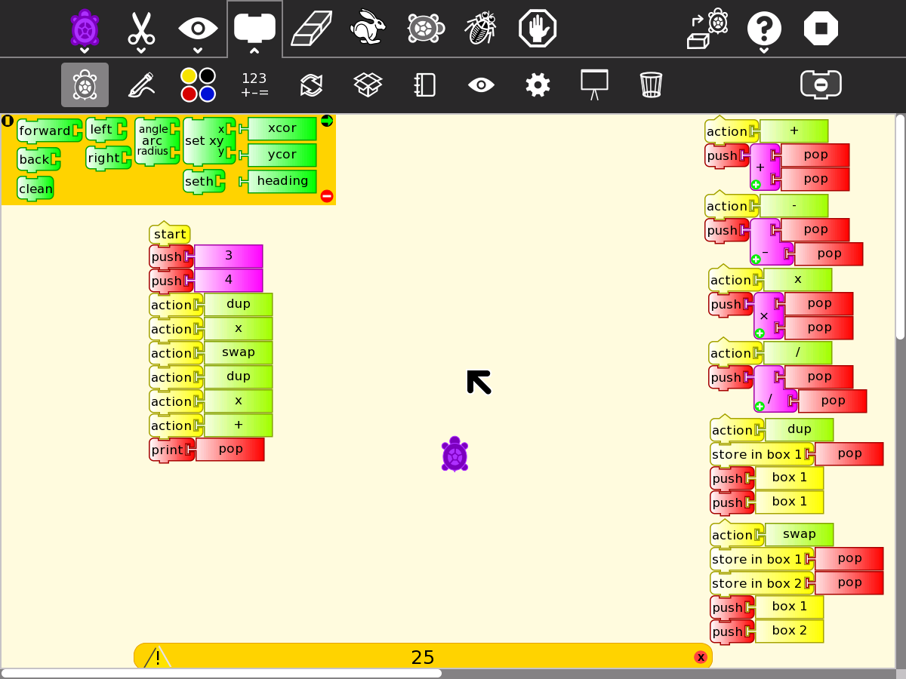

.. _stack-programming:

=================
Stack Programming
=================

The Forth programming language uses a stack for computations.

On the right of the screen, the Forth words + - x / DUP and SWAP are
implemented with blocks.

On the left, a Forth like program to compute 3^2 +4^2 = 25

`File:Turtle Art Activity forth.ta <../../images/Turtle_Art_Activity_forth.ta>`__

What computations can you make with this set of words?

Make additional words with Turtle blocks

The - and / words process the operands on the stack in the reverse order
to Forth, you can fix the word definitions on the right with SWAP
