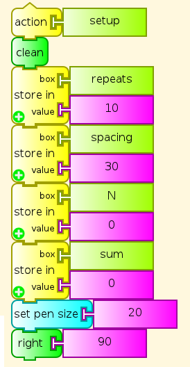

:orphan:

.. _triangular-numbers-program:

==========================
Triangular Numbers Program
==========================

Turtle Art program to generate and annotate triangular numbers.

| Main program
| |TATriangularNumbersSetup.png|

| Set up variables and place turtle
| |TATriangularNumbersCaption.png|

| Put captions above table of annotations
| |TATriangularNumbersTriangle.png|

| Create triangle of colored dots with annotations
| |TATriangularNumbersLine.png|

| Create one line of diagram, including annotations
| |TATriangularNumbersNote.png|

Write number of dots in line, and total number of dots so far in new row
of table

