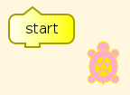
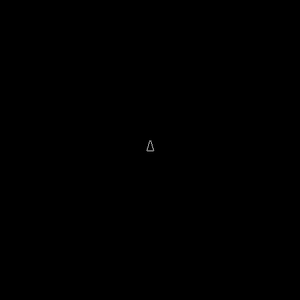
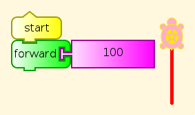
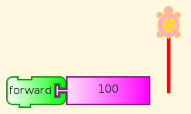
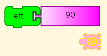
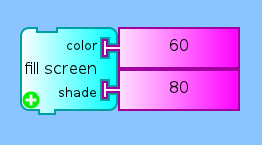

.. _turtle-art-and-logo:

===================
Turtle Art and Logo
===================

Turtle Graphics comes from Logo, but Turtle Art (TA) is written in
Python. However, you can save any TA program in Logo, even a single
block, and examine the code or run it in Brian Harvey's UCBLogo. Go to
the Journal tab and look for Save as Logo, with a turtle icon.

This allows another perspective on Turtle Art blocks, giving fine
details in some cases that are not obvious from experiment. So we can
start to teach Logo to students who have even modest proficiency in
Turtle Art, by constructing TA programs and saving as Logo, and then
gradually moving to composing Logo with the TA code as examples. At the
same time we can use the Logo translations to illuminate what TA is
doing.

The ability to go from TA to Logo is important because there are many
things about computer languages that are inherently not discoverable
without lots of hints. For example, TA provides all of its blocks on
palettes, so that you can't miss any. In text-based languages, including
Logo, you need to have a list somewhere outside the language
interpreter. Even with all of the blocks in front of you, some are going
to be mysterious. You don't know how they do what they do, or you don't
even see them do anything at all unless you know what other block to use
next. We discuss this further in `The
Undiscoverable <https://wiki.sugarlabs.org/go/The_Undiscoverable>`__. 
Of course, at some point, if you
really want to know what is going on, you have to read the source code.

Having a path from TA to Logo is valuable because Logo is a much fuller
programming language than TA. Although it is
:ref:`Turing-complete <turtle-art-turing-machine>`,
which means that it could in principle compute any computable function,
given enough space and time, it does not have many of the other
capabilities of programming languages that can call external libraries,
such as file handling and convenient UI design. Of course, you can do
that in Python, and you can call Python from Turtle Art, but that isn't
the subject of this lesson.

Let's see how it might start to work to learn Logo from TA, or use Logo
to illuminate TA.

Logo Code for TA Blocks
=======================

start
-----

A new TA session starts with just a start block. Click it, and nothing
visible happens. (In older versions, you will have to get a start block
from the Flow palette, the one with the two arrows going in a circle.

Any guesses as to what went on? Here you go.

::

    window
    to start
    
    end

This says to open a display window, and then uses “to” to define a
procedure named “start” with contents a blank line. The keyword “end”
ends the definition. So we were right. The start block all by itself
does nothing, but goes through a process to get that result.

Of course in TA we don't open display windows, because one is always
open. Here is what the window looks like in UCBLogo, with a triangle for
the turtle.

Start-Forward
-------------

All right, it's a start (haha) but that didn't tell us a lot. Maybe this
will help.

Well, that's better. Now the procedure actually has content, and the
content is exactly the meaning of the block we were looking at, forward
100. The only difference is the decimal point and following 0, meaning
that this is a floating point value, not an integer. We don't need that
distinction in Turtle Art, which takes care of the conversion for us.
Forward works fine with fractional distances, although you would have to
lay down several different ones side by side to see the difference. We
don't need to know all about numeric types yet, for what we are doing in
Logo.

::

    window
    to start
     forward 100.0
    end

No Start
--------

So what happens if we leave out the start block? This happens.

Instead of a start procedure, our Logo program defines a procedure named
turtleblocks\_0. Otherwise, there is no difference.

::

    window
    to turtleblocks_0
     forward 100.0 
    end

Left
----

No surprises.

::

    window
    to turtleblocks_0
     left 90.0 
    end

SetBackground
-------------

Oh. A lot more goes on here. Turtle Art told Logo about how it handles
colors. I won't explain everything in detail, but let's make a list of
bits of Logo we haven't seen yet.

-  

       for arguments to a function in the definition

-  "name is the name itself, not the value of the variable with that
   name
-  make to give a value to a variable
-  arithmetic including modulo (remainder on division)
-  ifelse condition [what to do]
-  first gets the first item from a list
-  butfirst drops the first item from a list
-  [data] makes a list
-  colors holds the numeric definition of the Turtle Art color palette

That's more features than fit comfortably in teaching a lesson, but
might not be too many in guided discovery over several sessions. With
the hints given above, you should be able to see what every part of this
Logo program is, but not necessarily how all of the parts fit together.
That will require careful reading, including comparing definitions with
their uses, and lots of experiments. For some learners, that's the best
part of all. For others, including many teachers, it is a useful lesson
in tolerating your own ignorance while you seek to discover something
you didn't know. Anyway, we don't have to require that everybody
discover everything. Students can share discoveries, which is another
particularly useful lesson in itself.

Once we get past those definitions, though, there is a procedure
definition for tasetbackground, corresponding to the block we are
testing. It is then called with the arguments 60.0 for color and 80.0
for shade, as we specified. And look! It's blue!

::

    window
    to tasetpalette :i :r :g :b :myshade
    make "s ((:myshade - 50) / 50)
    ifelse lessp :s 0 [
    make "s (1 + (:s *0.8))
    make "r (:r * :s) 
    make "g (:g * :s) 
    make "b (:b * :s) 
    ] [ make "s (:s * 0.9) 
    make "r (:r + ((99-:r) * :s)) 
    make "g (:g + ((99-:g) * :s)) 
    make "b (:b + ((99-:b) * :s)) 
    ] setpalette :i (list :r :g :b) 
    end 
    
    to rgb :myi :mycolors :myshade 
    make "myr first :mycolors 
    make "mycolors butfirst :mycolors 
    make "myg first :mycolors 
    make "mycolors butfirst :mycolors 
    make "myb first :mycolors 
    make "mycolors butfirst :mycolors 
    tasetpalette :myi :myr :myg :myb :myshade 
    output :mycolors 
    end 
    to processcolor :mycolors :myshade 
    if emptyp :mycolors [stop] 
    make "i :i + 1 
    processcolor (rgb :i :mycolors :myshade) :myshade 
    end 
    
    to tasetshade :shade 
    make "myshade modulo :shade 200 
    if greaterp :myshade 99 [make "myshade (199-:myshade)] 
    make "i 7 
    make "mycolors :colors 
    processcolor :mycolors :myshade 
    end 
    
    to tasetpencolor :c 
    make "color (modulo (round :c) 100) 
    setpencolor :color + 8 
    end 
    
    make "colors [
    99  0  0
    99  5  0
    99 10  0
    99 15  0
    99 20  0
    99 25  0
    99 30  0
    99 35  0
    99 40  0
    99 45  0
    99 50  0
    99 55  0
    99 60  0
    99 65  0
    99 70  0
    99 75  0
    99 80  0
    99 85  0
    99 90  0
    99 95  0
    99 99  0
    90 99  0
    80 99  0
    70 99  0
    60 99  0
    50 99  0
    40 99  0
    30 99  0
    20 99  0
    10 99  0
     0 99  0
     0 99  5
     0 99 10
     0 99 15 
     0 99 20
     0 99 25
     0 99 30
     0 99 35
     0 99 40
     0 99 45
     0 99 50
     0 99 55
     0 99 60
     0 99 65
     0 99 70 
     0 99 75
     0 99 80
     0 99 85
     0 99 90
     0 99 95
     0 99 99
     0 95 99
     0 90 99
     0 85 99
     0 80 99
     0 75 99
     0 70 99
     0 65 99
     0 60 99
     0 55 99
     0 50 99
     0 45 99
     0 40 99
     0 35 99
     0 30 99
     0 25 99
     0 20 99
     0 15 99
     0 10 99
     0  5 99
     0  0 99
     5  0 99
    10  0 99
    15  0 99
    20  0 99
    25  0 99
    30  0 99
    35  0 99
    40  0 99
    45  0 99
    50  0 99
    55  0 99
    60  0 99
    65  0 99
    70  0 99
    75  0 99
    80  0 99
    85  0 99
    90  0 99
    95  0 99
    99  0 99
    99  0 90
    99  0 80
    99  0 70
    99  0 60
    99  0 50
    99  0 40
    99  0 30
    99  0 20
    99  0 10] 
    
    make "shade  50 
    tasetshade :shade
    
    to tasetbackground :color :shade
    tasetshade :shade
    setbackground :color
    end
    
    to turtleblocks_0
    tasetbackground 60.0 80.0 
    end

Logo Code for TA Examples
=========================

This is the code generated for the examples in the 
:ref:`Mathematics and Art <mathematics-and-art>` tutorial for
Turtle Art, with line breaks and indents added for clarity. Square and
Squares are of little more difficulty than the Turtle Art they aer
derived from. Flowers has a substantial section on handling colors in
the manner of Turtle Art. The last three procedures, stack1, stack2, and
start, are very similar to the stacks in the Turtle Art version.

Square program
==============

::

    window
    
    to start
    
     repeat 4.0
      [ forward 100.0
        right 90.0 
      ]
    
    end

Squares program
===============

::

    window
    
    to start
    
     clean
     repeat 36.0
      [ repeat 4.0
       [ forward 300.0
         right 90.0
       ]
       right 10.0
      ]
    end

Flower program
==============

::

    window
    to tasetpalette :i :r :g :b :myshade 
     make "s ((:myshade - 50) / 50) 
     ifelse lessp :s 0 [ 
     make "s (1 + (:s *0.8)) 
     make "r (:r * :s) 
     make "g (:g * :s) 
     make "b (:b * :s) 
     ] [ make "s (:s * 0.9) 
     make "r (:r + ((99-:r) * :s)) 
     make "g (:g + ((99-:g) * :s)) 
     make "b (:b + ((99-:b) * :s)) 
     ] setpalette :i (list :r :g :b) 
    end
    
    to rgb :myi :mycolors :myshade 
     make "myr first :mycolors 
     make "mycolors butfirst :mycolors 
     make "myg first :mycolors 
     make "mycolors butfirst :mycolors 
     make "myb first :mycolors 
     make "mycolors butfirst :mycolors 
     tasetpalette :myi :myr :myg :myb :myshade 
     output :mycolors 
    end 
    
    to processcolor :mycolors :myshade 
     if emptyp :mycolors [stop] 
     make "i :i + 1 
     processcolor (rgb :i :mycolors :myshade) :myshade 
    end 
    
    to tasetshade :shade 
     make "myshade modulo :shade 200 
     if greaterp :myshade 99 [make "myshade (199-:myshade)] 
     make "i 7 
     make "mycolors :colors 
     processcolor :mycolors :myshade 
    end 
    
    to tasetpencolor :c 
     make "color (modulo (round :c) 100) 
     setpencolor :color + 8 
    end 
    
    make "colors [
    99  0  0\
    99  5  0\
    99 10  0\
    99 15  0\
    99 20  0\
    99 25  0\
    99 30  0\
    99 35  0\
    99 40  0\
    99 45  0\
    99 50  0\
    99 55  0\
    99 60  0\
    99 65  0\
    99 70  0\
    99 75  0\
    99 80  0\
    99 85  0\
    99 90  0\
    99 95  0\
    99 99  0\
    90 99  0\
    80 99  0\
    70 99  0\
    60 99  0\
    50 99  0\
    40 99  0\
    30 99  0\
    20 99  0\
    10 99  0\
     0 99  0\
     0 99  5\
     0 99 10\
     0 99 15\
     0 99 20\
     0 99 25\
     0 99 30\
     0 99 35\
     0 99 40\
     0 99 45\
     0 99 50\
     0 99 55\
     0 99 60\
     0 99 65\
     0 99 70\
     0 99 75\
     0 99 80\
     0 99 85\
     0 99 90\
     0 99 95\
     0 99 99\
     0 95 99\
     0 90 99\
     0 85 99\
     0 80 99\
     0 75 99\
     0 70 99\
     0 65 99\
     0 60 99\
     0 55 99\
     0 50 99\
     0 45 99\
     0 40 99\
     0 35 99\
     0 30 99\
     0 25 99\
     0 20 99\
     0 15 99\
     0 10 99\
     0  5 99\
     0  0 99\
     5  0 99\
    10  0 99\
    15  0 99\
    20  0 99\
    25  0 99\
    30  0 99\
    35  0 99\
    40  0 99\
    45  0 99\
    50  0 99\
    55  0 99\
    60  0 99\
    65  0 99\
    70  0 99\
    75  0 99\
    80  0 99\
    85  0 99\
    90  0 99\
    95  0 99\
    99  0 99\
    99  0 90\
    99  0 80\
    99  0 70\
    99  0 60\
    99  0 50\
    99  0 40\
    99  0 30\
    99  0 20\
    99  0 10]
    
    make "shade  50  
    
    to taminus :y :x
     output sum :x minus :y
    end
    
    to stack1
     repeat 4.0 [ forward :box1 right 90.0 ] 
    end
    
    to stack2
     repeat 10.0 [ stack1 right 36.0 ] 
    end
    
    to start
     clean
     make "box1 0.0
     repeat 300.0 [
      tasetshade taminus 100.0 :box1
      tasetpencolor quotient :box1 3.0 stack2
      make "box1 sum :box1 1.0 ] 
    end

See Also
========

-  `UCB Logo <http://www.eecs.berkeley.edu/~bh/logo.html>`__
-  `The Daily Papert <http://dailypapert.com/>`__
-  `Logo Foundation <http://el.media.mit.edu/logo-foundation/>`__

Further Reading
===============

-  *Mindstorms: Children, Computers, and Powerful Ideas*, by Seymour
   Papert. Where Logo and Turtle Graphics got started.
-  *LogoWorks: Lessons in Logo*, by Sheila Cory and Margie Walker
-  *Teaching With Logo*, by Molly and Daniel Watt
-  *Advanced Logo, A Language for Learning*, by Michael Friendly
-  *Computer Science Logo Style, Second Edition*, by Brian Harvey. Three
   volumes.

There are also many books on using Logo to teach various subjects,
mostly in math.
