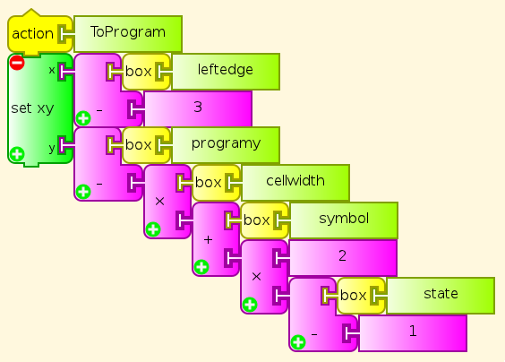
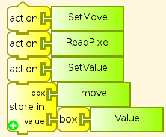

:orphan:

.. _turtle-art-code-for-turing-machine:

=====================================================================
Turtle Art code for :ref:`Turing Machine <turtle-art-turing-machine>`
=====================================================================

This is the turtle art code for Turing Machine. You can also compare this
with the :ref:`Logo code <logo-code-for-turing-machine>`
for the same Turing Machine, saved from Turtle Art and commented.

Start
=====

The Start action is the main procedure that clears all previous
computation and graphics, puts the Turtle in its default starting
position, and then calls for preparation (Setup, Program, Tape) and
execution of the Turing Machine.

Setup
=====

The Setup action defines and initializes variables, and sets the
orientation of the turtle

Program
=======

The Program action followed by the stack1 action writes the program
table line by line. This is divided in two so that the segments fit in
the Turtle Art workspace. Users who understand Turing Machine
programming, or have other example Turing Machines to test, can edit
this. For Turing Machine programs larger than this example, use a Python
block with a table, so that Program can read values and write symbols in
a simple loop, rather than having each individual value appear literally
in the code.

Tape
====

The Tape action writes the initial tape. User can change values in
repeat statements to change arguments. Longer and more complex tapes for
other Turing Machines can be written from Python tables.

Execute
=======

The Execute action repeats reading out the next program step until the
halt state is reached. It contains added Wait blocks to make the main
steps in execution clearer to someone watching. Removing them will of
course make the Machine run faster, but will make it much more difficult
to follow.

ToTape
======

The ToTape action moves the turtle to the current cell on the tape.
Startup default is cell 0.

ToProgram
=========

The ToProgram action moves the Turtle to the beginning of the current
program row to execute. Startup default is row 1

WriteCell
=========

The WriteCell action writes the current color to the current cell, and
moves to the next cell to the right. The Program and Tape actions use
this.

WriteSymbol
===========

The WriteSymbol action writes the current color in the current cell on
the tape without moving, as part of executing a line of instructions
from the program

ReadPixel
=========

The ReadPixel action reads the RGB values of the pixel under the Turtle,
and puts them on the stack. It then pops the results and stores them in
the variables R, G, and B. This is used for reading program instructions
and tape symbols.

SetValue
========

The SetValue action finds the value of the current cell's symbol from
RGB numbers provided by ReadPixel.

SetMove
=======

The SetMove action reads the next Move direction from a program table
entry in column 1.

SetSymbol
=========

The SetSymbol action reads the next Symbol to write, from a program
table entry in column 2.

SetState
========

The SetState action reads the next State from a program table entry in
column 3.

NewCell
=======

The NewCell action moves the head (the Turtle) left or right as directed
by the program, and sets the cell number for the new location

Log
===

At each program step, the Log action writes Step number, Symbol, Move,
State, Cell number on a new log line in black, saving and restoring the
current Symbol color.

