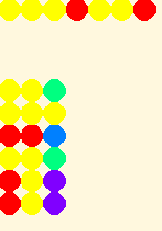
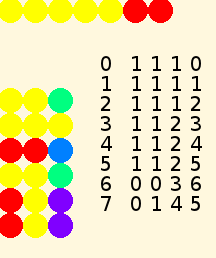

.. _turtle-art-turing-machine:

=========================
Turtle Art Turing Machine
=========================

One can do a surprising amount of Computer Science in Turtle Art.

|Initial state of Turing machine for simple addition adding 3+2| |Final
state of Turing machine for simple addition showing result 5|

This is an example of a universal computer designed by `Alan
Turing <http://en.wikipedia.org/wiki/Alan_Turing>`__ in order to
investigate problems in computability. As far as we know (`Church-Turing
Thesis <http://en.wikipedia.org/wiki/Church-Turing_Thesis>`__), any
function that can be computed by an effective algorithm can be computed
by a Turing Machine. A multitude of other systems has been proposed, and
all are equivalent to the Turing Machine and to each other. However,
there are `questions that we would like to
ask <http://en.wikipedia.org/wiki/Entscheidungsproblem>`__ that neither
a Turing Machine nor any of those other systems can answer.

Before we get to those undecidable questions, however, how is a Turing
Machine constructed, and what is our Turing Machine going to do?

Plan
====

This Turing Machine is the simplest kind of adding machine. It starts,
as in the first illustration, with two blocks of cells with a separator
in between. The number of cells in each block is our input, which the
user can change by editing the Setup action. The output will be a single
block containing as many cells as the sum of the two input numbers. It
will do this by replacing the separator with the color of the number
blocks, and erasing one number cell at the end of the second block,
giving a configuration as in the second illustration for its result.
This model Turing Machine also logs each of its actions in a table,
described below.

The Structure of a Turing Machine
=================================

A Turing Machine is not designed for efficiency, like commercial
microprocessors. It is designed to be easy to reason about, and so is
about as simple as Turing and a few other mathematicians could make it.

The essential elements of a Turing machine are

-  a tape that can be extended as much as needed, consisting of cells
   containing symbols; here, a line of colored dots
-  a program table, consisting of three columns and some number of rows
   of instructions; here, a rectangle of colored dots
-  a head that reads and writes symbols on tape, and follows
   instructions in the program table; here, the turtle with certain
   defined Actions

The machine can be in any of a finite number of states, represented here
by color values. One of the states is interpreted as Halt: the Machine
stops executing the program. The rows of the program table correspond to
combinations of the current state with the symbol read from the current
cell on the tape. For a three-state machine with two symbols, such as
our adding machine, the order of the program table is

+---------+----------+--------+
| State   | Symbol   | Line   |
+=========+==========+========+
| 1       | 1        | 1      |
+---------+----------+--------+
| 1       | 2        | 2      |
+---------+----------+--------+
| 2       | 1        | 3      |
+---------+----------+--------+
| 2       | 2        | 4      |
+---------+----------+--------+
| 3       | 1        | 5      |
+---------+----------+--------+
| 3       | 2        | 6      |
+---------+----------+--------+

This table starts counting at 1. In programming it is often more
convenient to start counting at 0. You will see examples of this
practice if you examine the code for this Turing Machine.

In operation, the starting point is a given tape with a finite sequence
of symbols prewritten on it, a given program, and the Turing Machine
head over the leftmost symbol on the tape in state 1. At each step, the
head reads the symbol in the current cell, then follows the instruction
in the row corresponding to that symbol and the current state. There are
three parts to the instruction:

-  A symbol to write in the current cell
-  An instruction to move one cell left or right
-  The state for the next step

The Structure of This Turing Machine
====================================

The actual program table in numerical symbols is

+---------+--------+---------+---------------------------------------------------------------------+
| Write   | Move   | State   | Interpretation                                                      |
+=========+========+=========+=====================================================================+
| 0       | 1      | 2       | If cell = 0 Write 0. Go right. State 2 End of first number          |
+---------+--------+---------+---------------------------------------------------------------------+
| 1       | 1      | 1       | If cell = 1 Write 1. Go right. State 1. Continue to end of number   |
+---------+--------+---------+---------------------------------------------------------------------+
| 0       | 0      | 3       | If 0 Write 0. Go left. State 3 End of second number                 |
+---------+--------+---------+---------------------------------------------------------------------+
| 1       | 1      | 2       | If 1 Write 1. Go right. State 2                                     |
+---------+--------+---------+---------------------------------------------------------------------+
| 0       | 1      | 4       | If 0 Write 0. Go right. State 4. Halt                               |
+---------+--------+---------+---------------------------------------------------------------------+
| 0       | 1      | 4       | If 1 Write 0. Go right. State 4. Halt                               |
+---------+--------+---------+---------------------------------------------------------------------+

Where

-  Symbols 0 and 1 are represented as Red and Yellow on the tape
-  Move 0 is Left and 1 is Right
-  States are really numbers, represented in the table as the color with
   number 20 times the state so that we can tell the differences among
   them. The Read Pixel block in Turtle Art pushes the RGB values of the
   pixel on the stack, not the Turtle Art color number, so we have to
   have special logic to translate back to states.

In addition to the essential workings of the Turing Machine, this
program logs each step in the process on the screen, showing the
numerical values of the step, symbol, move, state, and cell on each
pass. Students are encouraged to run the program in step mode (Turtle or
Bug), watching the process unfold.

The process proceeds in stages.

-  Lines 0-2 of log: We begin in state 1 with symbol 1 in cell 1, and
   execute line 2 in the program. This tells the Machine to write the
   symbol that is already there, move right, and continue in state 1.
   Repeat until the Turtle sees the other color, symbol 0.

-  Log 3: Go to line 1 of the program. Write color 1, move right, go
   into state 2

-  Log 4-5: As long as we see color 1, we execute program line 4, which
   tells us to rewrite it in the cell, go right, and stay in state 2.

-  Log 6: When we see color 0 for the second time, we execute line 3,
   which says to rewrite 0, go left, and go into state 3

-  Log 7: Now we arrive at line 6, which says to overwrite 1 on the last
   cell with color 0, go right, and go into state 4 (Halt).

Line 5 is never executed, but has to be there to complete the table.

In summary, move past the first number block, rewrite 0 to 1 (removing
the separator), move past the second number block, back up one step and
rewrite 1 to 0 to balance the extra 1 written earlier.

For complete details about the workings of this Turing Machine, see :ref:`Turtle Art Code for Turing Machine <turtle-art-code-for-turing-machine>` 
and :ref:`Logo Code for Turtle Art Turing Machine <logo-code-for-turing-machine>`.

Turing's Research
=================

Among others things, Turing

-  designed a program for a Universal Turing Machine, where the program
   of a regular Turing Machine would appear in a block on the tape along
   with an area for working storage, and the head would operate on the
   tape before and after it as if the two segments were connected
   together.
-  proved that no Turing machine can analyze the programs for all other
   Turing machines to decide which of them would ever halt. (If there
   were such a Halting Oracle, we could easily modify it into a program
   that would halt for programs that did not halt, and would not halt
   for programs that halt. When applied to itself, it would thus halt if
   and only if it did not halt, a contradiction.)
-  created an electromechanical cracker, the Bombe, to determine the
   settings on German Enigma cipher machines from transmitted messages,
   allowing all intercepted German message traffic to be read. (This
   Ultra Secret was the biggest British secret of World War II, bigger
   than the Double Cross System turning of German agents and the secret
   of the Normandy landing.)
-  invented the Turing Test for Artificial Intelligence, asking whether
   an AI could successfully pretend to be a person at the other end of a
   Teletype connection.
-  made important contributions to other branches of mathematics, to
   design of actual computers, and to mathematical biology.

2012 is **Alan Turing Year** - a centenary celebration of his life and
work. `www.turingcentenary.eu <http://www.turingcentenary.eu/>`__

