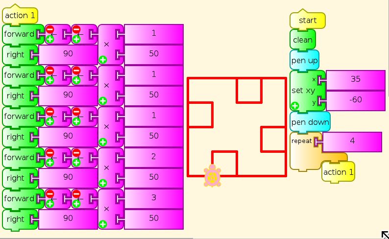
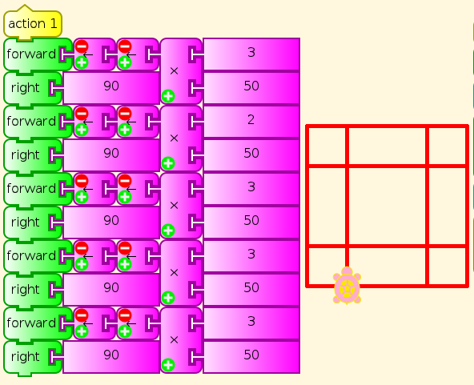
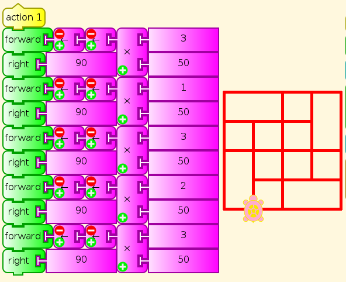

.. _you-be-the-turtle:

=================
You be the Turtle
=================

Long before children use written language or a computer keyboard, they
can do Turtle Art in the classroom on an open expanse of carpet, with a
set of colored ribbons and tacks/drawing pins or masking tape. One child
is the Turtle, others fix the ribbons in place, and someone gives
directions. Initially, this would be the teacher, but soon the children
will want to take over. The Turtle on one run should be given the
opportunity right after to be the direction-giver/programmer.

Start simply with Forward [number of steps], Right 90, Left 90. You can
draw a surprising variety of patterns with just these. In the following
examples, just changing the five multipliers within the range 1-6 gives
results ranging from great simplicity to surprising complexity.

|TASpirolateral1.png| |TASpirolateral2.png| |TASpirolateral3.png|

Gradually add commands, such as Back, Pen Up and Pen Down, SetColor
(change ribbon), Repeat (have one child keep the count), Right/Left
45/60/120/135, Store Value in Box (have a student keep track of that
value), and whatever else the children show readiness for.

Children can start by giving any sequence of directions they like, but
after a while, they should be challenged to make particular patterns and
to generalize. The patterns above and many more like them are provided
as challenges in the `Spirolaterals
activity <http://activities.sugarlabs.org/en-US/sugar/addon/4331>`__,
which then leads to the Turtle Machine activity. Peter Hewitt designed
them both as precursors to Turtle Art. Can you make a polygon of any
number of sides? How do you express the angles? Hint: Draw them on
construction paper, and put one at the feet of the Turtle, with one side
along the current path, and the other for the Turtle to turn to, left or
right.

-  Can you tell your Turtle to make star shapes? What angles work for
   that?
-  How can a child walk in an accurate circle? (Hint: string)
-  How about a quarter circle?
-  What happens if you let the Turtle decide how many steps to take, or
   how far to turn, on various instructions. Or use a die or game
   spinner to choose a random number. (This is known as a Random Walk,
   and is very important in probability and fractals.)

As we proceed, we are in a research project, specifically Seymour
Papert's project from the 1960s, which asks whether we can make it as
natural for children to learn math as language. You Be the Turtle has
not been done enough to know what preschool children can understand
immediately, what they need hints for, what they have to be shown, and
how far they can go. We do not know what levels of art or programming or
math they can achieve in Turtle Art or otherwise. We do know that it is
more than they have been given credit for or supported in doing so far.

